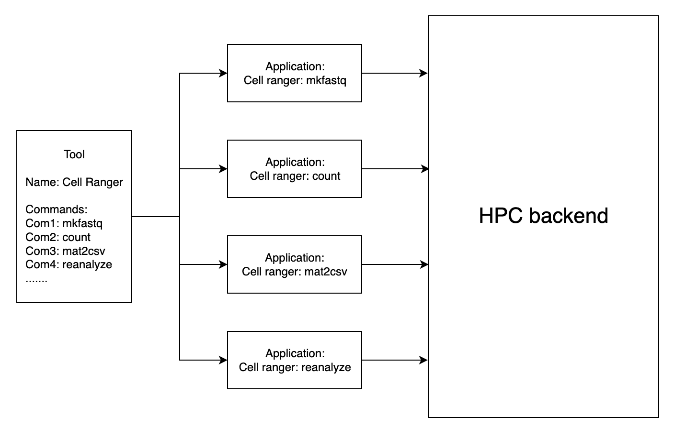

# SDUCloud

SDUCloud is a digital research environment. It provides an intuitive user
interface that improves the usability HPC environments or other computing
environments such as Kubernetes clusters. SDUCloud provides a way to access and
run [applications](#applications) regardless of users’ location and devices. It
also serves as a cloud [data storage](#storage), which allows users to
analyse and share their data.

<!-- TOOD Maybe talk about how this is an integrated platform. -->

## User Getting Started Guide

If you are a user and just want to know how to use SDUCloud, check out our
[getting started guide](https://escience.sdu.dk/index.php/sducloud/). 

## Storage

The users can access their data via the 'Files' tab in the web app. Storage is
presented to users in the form of a file system. 

This file system provides familiar operations on data to end-users. The file
system allows, e.g., users to read and write folders and files.

Access to the file system is provided through a common API interface which
enforces data management constraints and auditing.  The [storage
service](./storage-service) is responsible for the storage on SDUCloud.

SDUCloud keeps track and can create accounting reports for storage consumed by
each user. The [accounting services](./accounting-storage-service) are
responsible for accounting in SDUCloud.

### Metadata

In SDUCloud, it is possible to attach metadata to the data present in the
system. SDUCloud internally uses multiple types of metadata such as regular file
attributes (e.g. timestamps for creation and last modified at, access control
list, file size, etc) but also the following:

- **Sensitivity levels**   

  SDUCloud provide specific features for handling sensitive (research) data.
  All files have an attached sensitivity field used to clearly communicate to
  the user and systems the classification of a file. We currently use three
  different levels of security:

    - Private
    - Confidential
    - Sensitive

- **Favorites**   

  A user can [favorite](./file-favorite-service) a file, directory or app. For
  files and folders, the [file gateway service](./file-gateway-service) combines
  this attribute with the results from a list(ls) of a directory.   
  It is possible to get all favorites of a user across the entire file
  system, which is used for quick access to favorites.

Metadata is [indexed](./indexing-service) in the system and it is possible to
perform simple searches or advanced queries on it. SDUCloud uses an
[elasticsearch](https://www.elastic.co/products/elasticsearch) cluster to index
and query metadata.

The metadata system can be used to implement FAIR data principles and advanced
data management.

### Collaboration

Users are able to [share](./share-service) the files they own with other users.
When sharing a file, the owner specifies whether the receiving user only can
view the file or if he/she is able to edit the file as well. If the receiving
user chooses to accept the share, the file will be available in her/his home
folder with the correct permissions. The owner of the file can also revoke a
share. When revoking a shared file, the system automatically removes all
permissions to the receiver and the file will not be accessible anymore.

SDUCloud provides the possibility to create [projects](./project-service) for
research collaborations between users. When a project is created, the system
creates a shared file system among the specified collaborators. The shared file
system is separate from the users normal file system. To use the project
specific file system the user will have to switch context to their project. This
mechanism enforces a clear division between a users own files and those that
belong to the project.

### Searching

SDUCloud supports [searching of files](./filesearch-service). The search support
several different criteria such as date ranges, file extensions and, of course,
filename. Searching is powered by the internal
[elasticsearch](https://www.elastic.co/products/elasticsearch) cluster, which
contains the information for the files in the system.

### Events and Indexing

When a file is changed, moved, uploaded etc. events are generated in the system.
These events can trigger specific actions in different services. E.g. events
are generated to keep the elasticsearch index information up to date.

To make sure that the information is always up to date, even in the unlikely
event that system events are lost, the entire file system is
[indexed](./indexing-service) multiple times per day. 

## Applications

SDUCloud presents a collection of software packages to the users in the "Apps"
tab of the web app. The apps can be executed in batch (headless) mode or
interactive mode. The web GUI allows user to run apps on a supported backend
(HPC slurm, K8s). Applications are handled via the [app
service](./app-service). More computational backend can be supported (e.g.
OpenStack, commercial clouds).

Each app in SDUCloud is associated to a "tool" (Docker image) and gives the user
the ability to run a specific command of the tool. 

An app can use the files that are already located in SDUCloud as input data.
Folders can be made available read only or read/write. Each app is executed in a
root "work" folder, into which other folders from SDUCloud are mounted. Once an
app has finished, the output files in the "work" folder are transferred back to
the SDUCloud file system into job specific folders, according to the app
definition (e.g. apps can be defined to not copy back temporary files).

Just as with the storage, SDUCloud keeps an [account of the compute time
used](./accounting-compute-service). A user can see, via the web app, how much
compute time they have used on SDUCloud for any given time period. Again, it is
possible to create reports if billing is needed.

Both tools and apps are defined via YAML documents. The tools describes which
container image should be used by the apps associated to the tool. The app YAML
document describes how the tool should be invoked and the necessary parameters.
For more details on the tool and app format see:
 - [Tools](./app-service/wiki/tools.md)
 - [Applications](./app-service/wiki/apps.md)

## Technical Overview

TO DO:

- Link to the technical overview. (partially in app and storage service docs)

### CI/CD

For continuous integration we use [Jenkins](https://jenkins.io/). The CI is
responsible for building and testing the software. For more information on how
we use Jenkins, see [here](./infrastructure/JenkinsDoc.md)

We do not implement an automated delivery/deployment scheme after each code
change. The system can build docker images of all our services on demand. 

### Frontend
Read more about the frontend right [here](./frontend-web/README.md)

### Developer's Guide
If you are a developer, you might be interested in our [developer's
guide](./service-common/wiki/getting_started.md).
