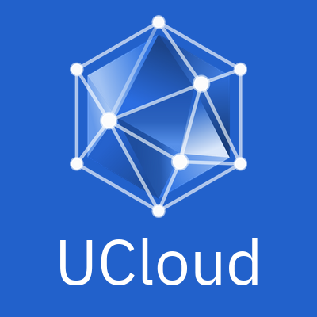
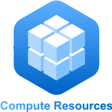

# UCloud

UCloud is a digital research environment. It provides an intuitive user
interface that improves the usability HPC environments or other computing
environments such as Kubernetes clusters. UCloud provides a way to access and
run [applications](#applications) regardless of users’ location and devices. It
also serves as a cloud [data storage](#storage), which allows users to
analyse and share their data.

<!-- TOOD Maybe talk about how this is an integrated platform. -->

## End-Users: Documentation

If you are a user and just want to know how to use UCloud, check out our
[getting started guide](https://escience.sdu.dk/index.php/sducloud/). 

## Application Developers: Getting Started

Interested in developing applications for UCloud? We have the guide for you
[here](./backend/app-store-service/README.md).

## UCloud Developers: Getting Started

Our getting started guide for backend developers is located
[here](./backend/service-common/wiki/getting_started.md). You can read more about the
frontend [here](./frontend-web/README.md).

You might also be interested in our [general
procedures](./infrastructure/wiki/README.md), [deployment
checklists](./backend/service-common/wiki/deployment.md) and
[CI/CD](./infrastructure/wiki/Jenkins.md) system.

## Release Notes

Internal release notes can be found [here](wiki/release-notes.md).

## Storage

UCloud provides storage resources to users in the form of a file system. This
file system provides familiar operations on data to end-users. The file
system allows, e.g., users to read and write folders and files. Access to the
file system is provided through a common API interface which enforces data
management constraints and auditing. The [storage
service](./backend/storage-service/README.md) is responsible for storage.

UCloud offers a vareity of features built on top of the storage, including:

- [Accounting](./backend/accounting-storage-service/README.md)
- [Data management features](./backend/storage-service/wiki/sensitivity.md)
- [Permission management](./backend/storage-service/wiki/permissions.md)
- [File sharing](./backend/share-service/README.md)
- [Explicit tagging of file sensitivity](./backend/storage-service/wiki/sensitivity.md)
- [File favoriting](./backend/file-favorite-service/README.md)
- [Indexing](./backend/indexing-service/README.md)
- [Search](./backend/filesearch-service/README.md)

### Collaboration

Users are able to [share](./backend/share-service/README.md) the files they own with other users.
When sharing a file, the owner specifies whether the receiving user only can
view the file or if he/she is able to edit the file as well. If the receiving
user chooses to accept the share, the file will be available in her/his home
folder with the correct permissions. The owner of the file can also revoke a
share. When revoking a shared file, the system automatically removes all
permissions to the receiver and the file will not be accessible anymore.

(PLANNED FEATURE NOT YET RELEASED) UCloud provides the possibility to create
[projects](./backend/project-service/README.md) for research collaborations between
users. When a project is created, the system creates a shared file system
among the specified collaborators. The shared file system is separate from the
users normal file system. To use the project specific file system the user will
have to switch context to their project. This mechanism enforces a clear
division between a users own files and those that belong to the project.

## Applications

UCloud presents a collection of software packages to the users in the "Apps"
tab of the web app. The apps can be executed in batch (headless) mode or
interactive mode. The web GUI allows user to run apps on a supported backend
(HPC slurm, K8s). Applications are handled via the [app store
service](./backend/app-store-service/README.md) and the [app orchestrator
service](./backend/app-orchestrator-service/README.md). More computational backend can be supported
(e.g. OpenStack, commercial clouds).

Each app in UCloud is associated to a "tool" (Docker image) and gives the user
the ability to run a specific command of the tool. 

An app can use the files that are already located in UCloud as input data.
Folders can be made available read only or read/write. Each app is executed in a
root "work" folder, into which other folders from UCloud are mounted. Once an
app has finished, the output files in the "work" folder are transferred back to
the UCloud file system into job specific folders, according to the app
definition (e.g. apps can be defined to not copy back temporary files).

Just as with the storage, UCloud keeps an [account of the compute time
used](./backend/accounting-compute-service/README.md). A user can see, via the web app, how much
compute time they have used on UCloud for any given time period. Again, it is
possible to create reports if billing is needed.

Both tools and apps are defined via YAML documents. The tools describes which
container image should be used by the apps associated to the tool. The app YAML
document describes how the tool should be invoked and the necessary parameters.
For more details on the tool and app format see:
 - [Tools](./backend/app-store-service/wiki/tools.md)
 - [Applications](./backend/app-store-service/wiki/apps.md)

