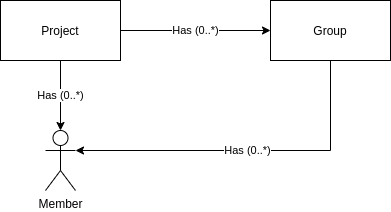

# Accounting and Project Management

.. toctree::
  :hidden:
  
  ./wiki/wallets.md
  ../grant-service/README.md

## Wallets and Credits

__Credits__ is the currency used for all payment of compute resources in UCloud. All prices in the UCloud system are
in an _integer_ amount of credits. Credits are always integer as this allow for more precise calculations. All
applications run on a specific machine template, these machine template have an associated price per hour. The system 
will _reserve_ credits from a wallet at the start of every job. We _charge_ the credits from the wallet at the end of
the job.

[Wallets](wiki/wallets.md) contain an integer amount of credits and can pay for any jobs running a specific
machine type. A wallet belongs to an entity, this is either a project, or a user (Personal project).

The __balance__ of a wallet describe the contents of a wallet (in credits). The system will remove credits from the 
balance when it is charged for X credits. A wallet can have 0 or more __reservations__ against it. A reservation will 
only succeed if the sum of all reservations is less than the balance.

### Granting Credits to Projects and Overbooking

Project administrators can _grant_ credits to any of its sub-projects. Overbooking is a technique used to improve 
utilization of the system. Concretely, it means that a project can give out more resources than it owns. 

Credits that have been granted to a sub-project do not count against the project's balance. Only the credits which have
been charged count against the project's balance. As a result, reservations and charges will apply recursively to their
parent's wallets.

A reservation action against a wallet performs limit checking, as described above. The check listed above, is not only
run for the local project but also for all the parent projects. If any parent project has run out of credits then
non of the descending projects can use any more credits.

## Project Management

The projects feature allow for collaboration between different users across the entire UCloud platform.

This project establishes the core abstractions for projects and establishes an event stream for receiving updates about
changes. Other services extend the projects feature and subscribe to these changes to create the full project feature.

### Definition

A project in UCloud is a collection of `members` which is uniquely identified by an `id`. All `members` are
[users](../auth-service/README.md) identified by their `username` and have exactly one `role`. A user always has exactly one
`role`. Each project has exactly one principal investigator (`PI`). The `PI` is responsible for managing the project,
including adding and removing users.

| Role           | Notes                                                                                              |
|----------------|----------------------------------------------------------------------------------------------------|
| `PI`           | The primary point of contact for projects. All projects have exactly one PI.                       |
| `ADMIN`        | Administrators are allowed to perform some project management. A project can have multiple admins. |
| `USER`         | Has no special privileges.                                                                         |

**Table:** The possible roles of a project, and their privileges within project
management.

A project can be updated by adding/removing/changing any of its `members`. Such an update will trigger a new message
on the event stream.

A project is sub-divided into groups:



Each project may have 0 or more groups. The groups can have 0 or more members. A group belongs to exactly one project,
and the members of a group can only be from the project it belongs to.

### Creating Projects and Sub-Projects

All projects create by end-users have exactly one parent project. Only UCloud administrators can create root-level
projects, that is a project without a parent. This allows users of UCloud to create a hierarchy of projects. The
project hierarchy plays a significant role in accounting.

Normal users can create a project through the [grant application](../grant-service/README.md) feature.

A project can be uniquely identified by the path from the root project to the leaf-project. As a result, the `title` of
a project must be unique within a single project. `title`s are case-insensitive.

Permissions and memberships are _not_ hierarchical. This means that a user must be explicitly added to every project
they need permissions in. UCloud administrators can always create a sub-project in any given project. A setting exists
for every project which allows normal users to create sub-projects.

---

__Example:__ A project hierarchy


__Figure 1:__ A storage hierarchy

Figure 1 shows a hierarchy of projects. Note that users deep in the hierarchy are not necessarily members of the
projects further up in the hierarchy. For example, being a member of "IMADA" does not imply membership of "NAT".
A member of "IMADA" can be a member of "NAT" but they must be _explicitly_ added to both projects.

None of the projects share _any_ resources. Each individual project will have their own home directory. The
administrators, or any other user, of "NAT" will not be able to read/write any files of "IMADA" unless they have
explicitly been added to the "IMADA" project.

### The Project Context

All requests in UCloud are executed in a particular context. The header of every request defines the context. For the
HTTP backend this is done in the `Project` header. The absence of a project implies that the request is executed in the
personal project context.


__Figure 2:__ The UCloud user interface allows you to select context through a dropdown in the navigation header.

---

__Example:__ Accessing the project context from a microservice

```kotlin
implement(Descriptions.call) {
    val project: String? = ctx.project // null implies the personal project
    ok(service.doSomething(project))
}
```

---