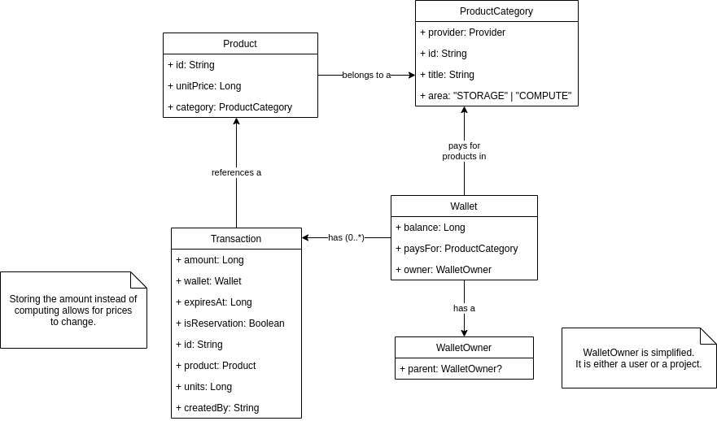

# Wallets and Products

The diagram above lays out the design for wallets and products in UCloud.

A `Wallet` contains credits, denoted by the `balance` in it. A single `Wallet` can be used to pay for products in a
`ProductCategory`. 

A `WalletOwner` has a `Wallet` for every `ProductCategory` they have paid for. The is either a user of the system 
(personal project) or a project.

A `ProductCategory` describes a set of products provided by a single `Provider`. Every `Product` has a price
per "unit". All prices in the UCloud system are in an _integer_ amount of credits. Credits are always integer as this 
allow for more precise calculations. Microservices should _always_ round up to the nearest unit when calculating the 
amount for a  _reservation_.

All `Transaction`s purchase an integer amount of units. As a result, it is important not to make the unit too small.
The table below defines the unit for each product areas:

| **Area**  | **Unit** |
|-----------|----------|
| `STORAGE` | GB/day   |
| `COMPUTE` | Minutes  |

Microservices, which provide a product, can _reserve_ credits from a wallet. This will create a `Transaction` entry
with `isReservation = true`. The system will check, during the reservation, that enough credits are available in the
local `Wallet`, as well as all parent `Wallet`s. Click [here](../README.html) for an example of limit checking. The 
`amount` from the `Transaction` is deducted from the `balance` when it is _charged_.

