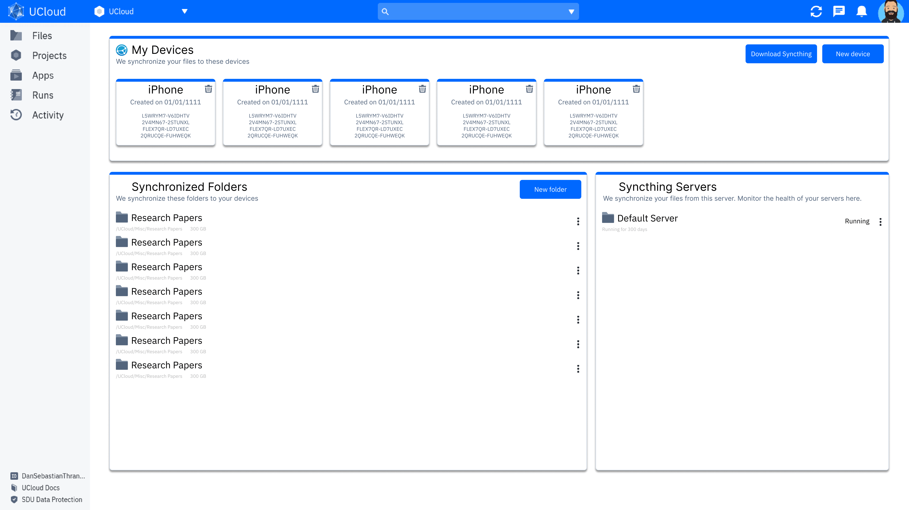

# Design Document: Syncthing



The user interface contains three different sub-interfaces. These are:

1. My Devices
2. Synchronized Folders
3. Syncthing Servers

We will go through these, describe the functionality and discuss implementation details.


My Devices
=======================================================================================================================

This section contains the devices of the end-user. These correspond to a (typically) physical device that the user
owns. This can, for example, be a laptop or a phone. Each of these devices have a syncthing device ID, which
identifiers them in the Syncthing network.

In this section, users are able to add new devices and delete existing devices. When a user adds a device one of two
things will happen:

1. This is the first device:
   - The user will be guided through a wizard
   - The wizard will help them install Syncthing on their device
   - And help them how to identify their device ID
2. This is an additional device:
   - The user is prompted for their device ID and a label to more easily identify their own device
   - The user can also ask for additional help (which will redirect them to the wizard above)

When a new folder is added to the system, then the active syncthing servers will be notified. If a syncthing server
isn't active yet, then one will be initialized (if the user has at least one folder synchronized).

Similarly, when a device is removed, syncthing servers will be notified accordingly.

Synchronized Folders
=======================================================================================================================

This section contains the folders which are synchronized by the end-user. Users can add a new folder, in which case
they are presented with a UI to select a folder. Similarly, users can select to synchronize a folder from within the
files table.

When a new folder is synchronized, then the active syncthing servers will be notified. If a syncthing server isn't
active yet, then one will be initialized (if the user has at least one device).

Users are able to perform the following operations on a synchronized folder:

- Open folder (redirects the user to the file table of this folder)
- Remove synchronization

Adding a new folder, might require a new folder to be mounted in the syncthing servers. If this is the case, then the
server should automatically restart (when it realizes that the folder is not available).


Syncthing Servers
=======================================================================================================================

This panel shows the active syncthing servers. These are created automatically on-demand. They are also automatically
shutdown when resources are no longer required (e.g. no devices/folders).

From the list of servers you are able to:

- Open interface
  - Opens the web-interface of the job
- Show device ID
  - Utility for showing the device ID (should be written to a file by the application)
- Factory reset
  - Deletes all configuration associated with this instance, including the job
- Restart
  - Restarts the syncthing server
- Pause
  - Suspends the syncthing server, such that it is no longer actively running
- View logs

Syncthing Application
=======================================================================================================================

The syncthing servers are powered by a syncthing application on UCloud. This is a wrapper application around the normal
syncthing application.

The application will be invoked in the following way:

```
/init $PATH_TO_CONFIG_DIR
```

In other words, the application in UCloud will expect that the entry point is a script located at `/init`. This script
will receive, as its first argument, the path to a folder. This folder will contain the configuration of Syncthing.
The script is expected to start the following two processes:

1. The configuration process
2. Syncthing

Syncthing is expected to place all relevant files in this directory. 


The configuration process has two responsibilities:

1. Extract the device ID (and other relevant information) from Syncthing's configuration
   - The device ID should be placed in the config dir in a file called `ucloud_device_id.txt`
2. Watch the configuration file

The configuration process should use this directory to watch the `ucloud_config.json` file. The format of this file can
be described by the `UCloudSyncthingConfig` as shown below.

```kotlin
@Serializable
data class UCloudSyncthingConfig(
    val folders: List<Folder>,
    val devices: List<Device>
) {

    @Serializable
    data class Folder(
        val path: String,
    )

    @Serializable
    data class Device(
        val deviceId: String,
        val label: String,
    )
}
```

The configuration process should repeatedly look in this file to detect changes in it. Whenever a change is detected it
should configure _validate_ the configuration and then _apply_ the configuration.

__Validating the configuration:__

```
val observedPreviously = readObservedPreviously(configDir)
var requiresRestart = false
for (folder in config.folders) {
    if (!File(folder.path).exists()) {
        if (observedPreviously.contains(folder.path)) {
            // Ignore, and do not apply to syncthing
        } else {
            observedPreviously.add(folder.path)
            requiresRestart = true
        }
    }
}

if (requiresRestart) {
    flushObservedPreviouslyToDisk(observedPreviously)
    exitProcess(0) // Trigger restart 
}
```

__Applying the configuration:__

The configuration should be applied by adding all devices to syncthing. Similarly all the folder should be added, all
folders are shared to all devices.

