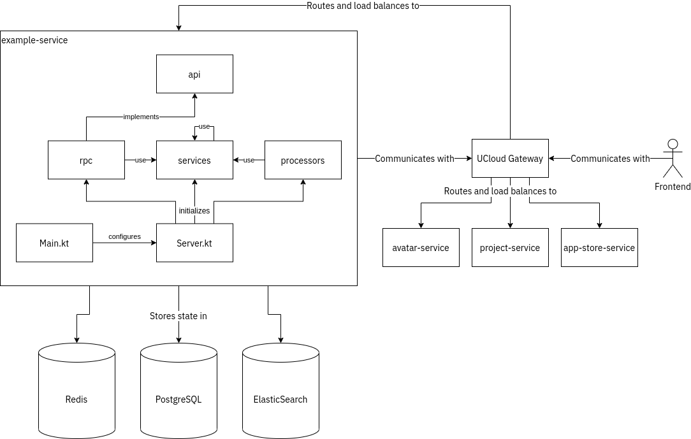

# Structure and Internals of a UCloud Micro-service

**Figure:** The overall structure and internal of a generic UCloud micro-service.

## Components of a Micro-service

| Component | Purpose |
|-----------|---------|
| `api` | Contains data models and interface descriptions (`CallDescriptionContainer`). Other micro-services consume these to perform remote procedure calls. |
| `rpc` | Implements the interfaces provided by `api`. Delegates work to the `services` component.  |
| `services` | Implements the business logic of a micro-service. Services in this component can depend on other services and make remote procedure calls to other micro-services. |
| `processors` | Consumes and processes events from the event stream. |
| `Main.kt` | TODO |
| `Server.kt` | TODO |

## Databases

UCloud stores state in a number of different general-purpose databases. We use the following databases for 
general-purpose data:

| Database | Purpose |
|----------|---------|
| [Redis](https://redis.io) | Event streams and distributed locking mechanism. |
| [PostgreSQL](https://postgresql.org) | General purpose data storage. |
| [ElasticSearch](https://www.elastic.co) | Storage of state which requires indexing of text. |

For the most part we recommend that you store state in `PostgreSQL`. Only if the data has a need to be indexed in a
special way should you use `ElasticSearch`. `Redis` is used to broadcast and load-balance messages among 
micro-services. `Redis` can also be used to perform distributed locking, for example, to ensure that only a single
micro-service instance is performing a certain task.

UCloud also stores state in other specialized 'databases'. Examples include a filesystem (we support optimizations
for `CephFS`) and Kubernetes.

## `Main.kt` and `Server.kt`

`Main.kt` provides an entry point to the micro-service. In this file you should do the following:

- Create an `object` which implements the `Service` interface
  - The `Service` interface is used to register with the `Launcher` module, used to run UCloud in development and in 
    integration tests
  - You can configure the `Micro` instance for additional functionality, such as `ElasticSearch`
  - You should parse the configuration in the `initializeServer` and pass it to `Server.kt
  
`Server.kt` receives the configuration from `Main.kt` and initializes the server:

- Initialize components from the `services`, `processors` and `controllers` component
- Pass `Controller`s to `configureControllers`

## UCloud Gateway

## Networking and RPC

## Event Streams
