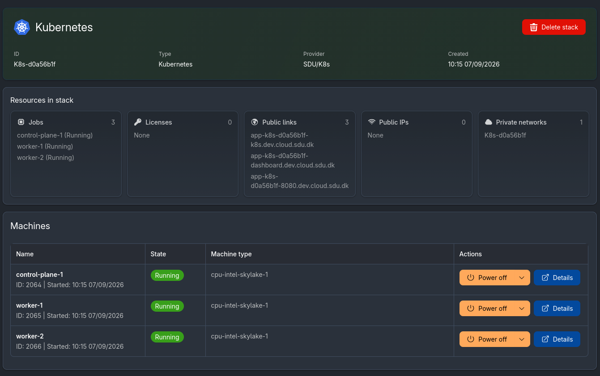
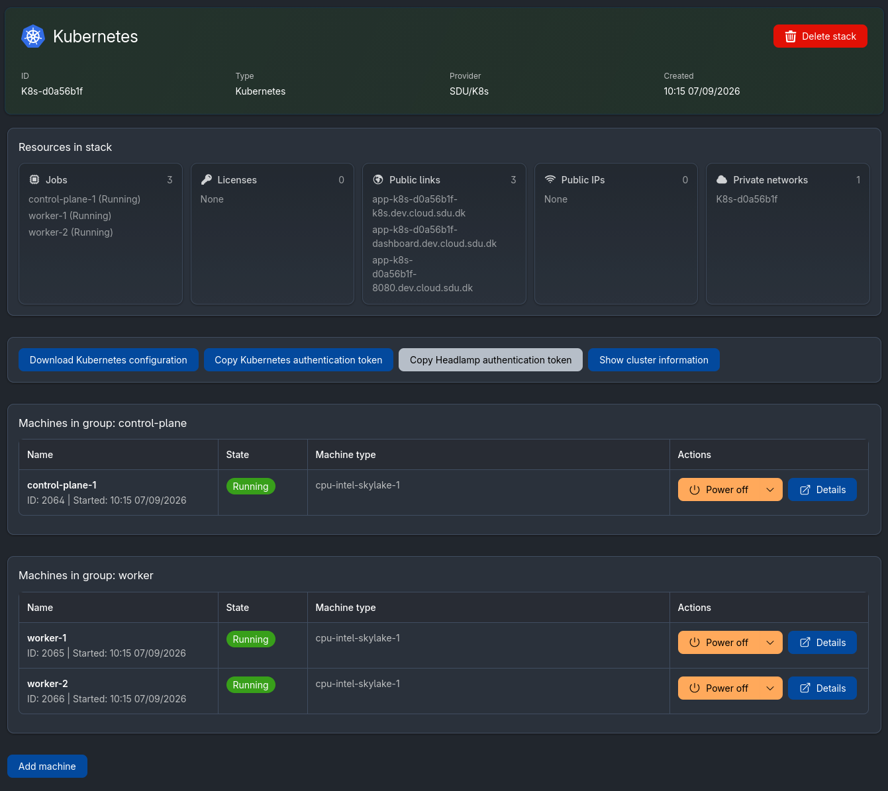
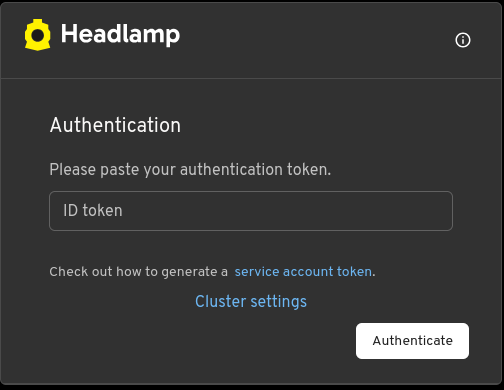

# User documentation for uCloud-k8s

## User guide

### Creating a cluster

To create a cluster, access the application under Applications → Development → Kubernetes.
Select the machine type and the number of worker nodes you wish to deploy.

Then, list the ports you wish to expose. Each of these ports will be exposed as a public link of the form `https://app-<cluster-id>-<port>.dev.cloud.sdu.dk`.
The ports must be listed separated by a comma (e.g. `8080,8081,8443,9090`).

Ports 6443 and 30500 cannot be reserved, as they are used by Kubernetes API and the Headlamp dashboard, respectively. 

The cluster takes a few minutes to be set up.

The following UI will be shown when the cluster is setting up:

While the following UI will be shown when the cluster is running:

### Accessing the dashboard

To access the dashboard, find its link under the "Public links" section in the UI.

The following form will be shown:

The token can be obtained either by logging into one of the VMs and checking the file `/etc/ucloud-stack/headlamp-token`, or by clicking the "Copy Headlamp authentication token" button in the UI.

### Accessing the cluster using kubectl

The Kubernetes cluster can be accessed using kubectl by downloading the Kubernetes configuration file and moving it to the `~/.kube/config` location on the local machine.

The file can be downloaded by clicking on the "Download Kubernetes configuration" button in the UI.

The authentication token used in the configuration file can also be obtained separately, using the "Copy Kubernetes authentication token" button in the UI.

### Using persistent storage

The Kubernetes cluster is based on k3s, and as such comes with Rancher's Local Path Provisioner.
The storage path for the cluster is `/etc/ucloud-stack/k3s/storage`, and by default Persistent Volumes will be created there.

To retrieve the files after the cluster is destroyed, go to your user's files on uCloud, and find the path `Jobs/Stacks/<Cluster ID>`. All files previously under `/etc/ucloud-stack` will be there.

For more information on k3s storage settings: https://docs.k3s.io/add-ons/storage.