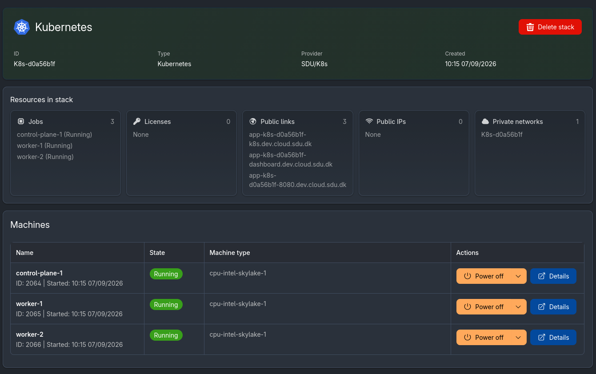
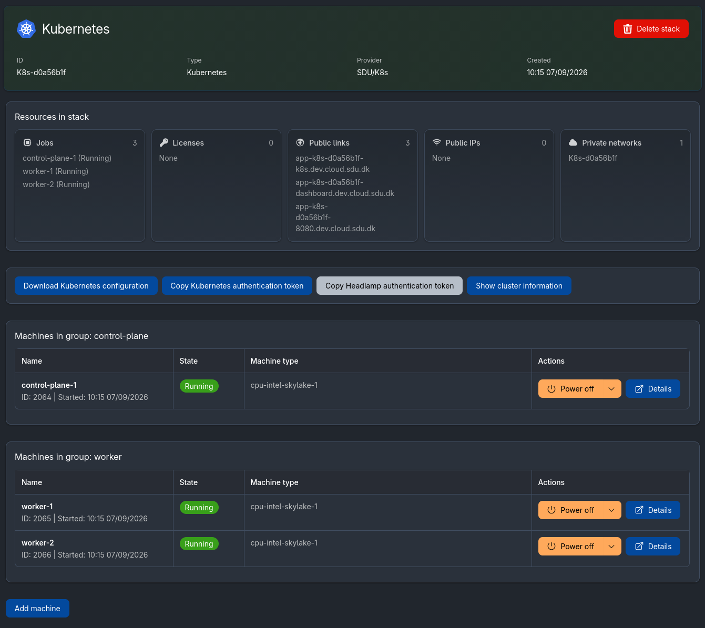
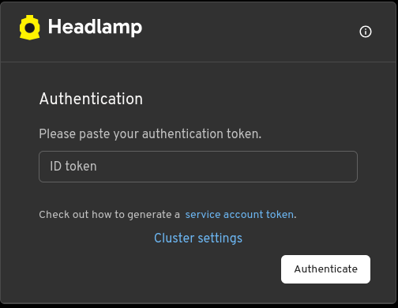

# User documentation for uCloud-k8s

## User guide

### Creating a cluster

To create a cluster, access the application under Applications → Development → Kubernetes.

Select the service provider. All machines in the cluster must come from this provider.
Select the Kubernetes version. Each option is an exact pinned patch release, for example Kubernetes `v1.36.4+k3s1`.

Select the machine type and number of nodes for the control plane. The control plane node count must be an odd number
from 1 to 7. Most users should use 1 (no high availability) or 3.

Add one or more worker pools. Each pool has its own name, machine type, node count and disk size. Pool names may only
contain a-z, 0-9 and dashes.

The cluster supports at most 256 nodes in total.

Use Kubernetes Ingress resources to expose applications. The cluster controller creates public links for
Ingress hosts that match the provider's supported public link domains.

The cluster takes a few minutes to be set up.

The following UI will be shown when the cluster is setting up:

While the following UI will be shown when the cluster is running:

### Accessing the dashboard

The dashboard link is available on the Home page of the cluster UI. Click "Open Headlamp" to open it.

A dialog appears where the cluster's admin token can be copied; click Continue to open Headlamp and paste the token into its login screen.

The following form will be shown:

The token can also be obtained by logging into one of the VMs and checking the file `/etc/ucloud-k8s/management/kube-api-token`.

### Accessing the cluster using kubectl

The Kubernetes cluster can be accessed using kubectl by downloading the Kubernetes configuration file and placing it at `~/.kube/config`. On the Home page of the cluster UI, expand "Use kubectl from your terminal" and follow the steps: click "Kubeconfig" to get the file, then run `mkdir -p ~/.kube && mv ~/Downloads/kubeconfig ~/.kube/config` (adjusting the source path to where your browser saved it) and verify with `kubectl get nodes`.

### Scaling the cluster

Open the "Add machine" page from the cluster view. Select the node pool, machine type and disk size (at least 10 GB), then submit. The machine list only shows machines from the provider that runs the cluster. The new node joins the cluster automatically.

### Using persistent storage

The Kubernetes cluster is based on k3s, and comes with Rancher's Local Path Provisioner configured for shared storage.
The storage path for the cluster is `/etc/ucloud-stack/k3s/storage`, and by default Persistent Volumes will be created there. Because the path is shared by all nodes, Persistent Volumes created there can be mounted by pods on any node.

To retrieve the files after the cluster is destroyed, go to your user's files on uCloud, and find the path `Jobs/Stacks/<Cluster ID>`. All files previously under `/etc/ucloud-stack` will be there.

For more information on k3s storage settings: https://docs.k3s.io/add-ons/storage.
