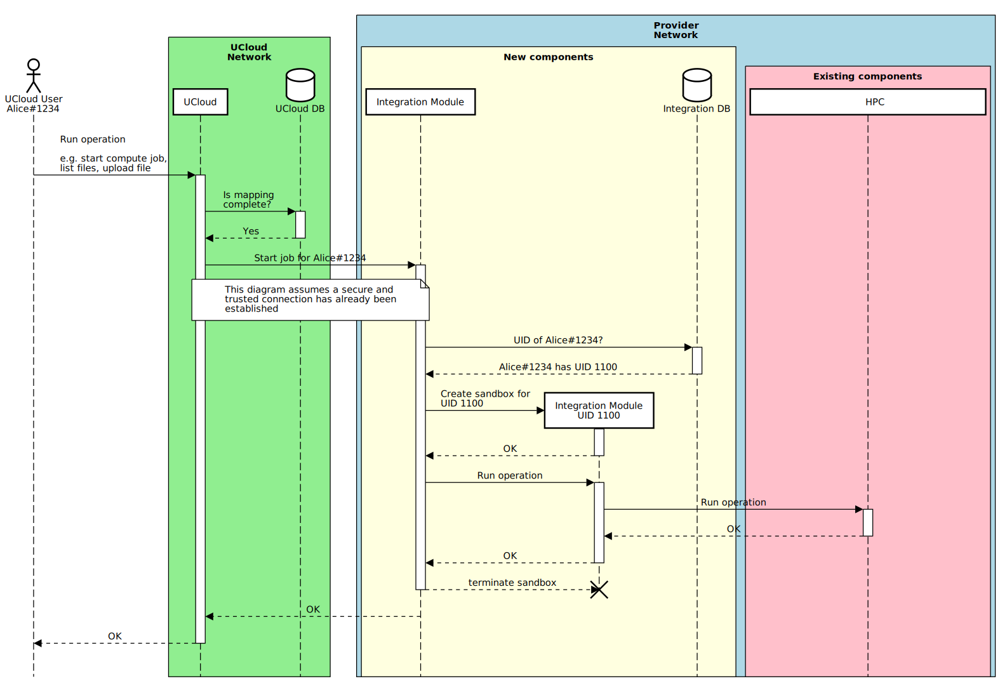
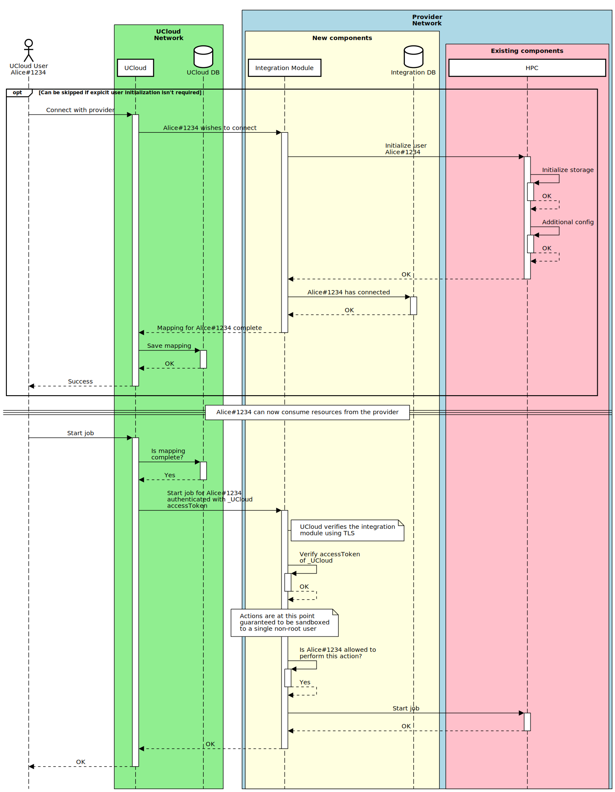

# Integration Module Scenarios: Users

In this document we will describe various scenarios limited to the subject of user-mapping between UCloud and local
users at the provider.

You can about communication between UCloud and the provider
[here](/backend/app-orchestrator-service/wiki/provider.md#communication). A summary is presented below:

- UCloud communicates with the provider through the integration module (using the UCloud provider API)
- The UCloud provider API is HTTP based
    - TLS is required in both directions for production use
- All requests, in both directions, are verified using short-lived [JWTs](https://jwt.io)
- JWTs are verified using asymmetrical cryptography
    - JWT algorithm: `RS256` (`RSASSA-PKCS1-v1_5` with `SHA-256`)

## Terminology

| Name | Description |
|------|-------------|
| UCloud | The [UCloud](https://docs.cloud.sdu.dk) software |
| UCloud DB | The database(s) used by UCloud |
| UCloud network | The network on which the UCloud software is running |
| Integration module | A server which implements the UCloud provider API |
| Integration DB | The database(s) used by the integration module |
| HPC | The existing provider system. This is used as a catch-all for the storage and compute system |
| Existing components | The software and hardware components which already exist in the provider's system |
| New components | New software components which are introduced into the provider's system |

## One-to-One

In the one-to-one mapping scenarios we will look at how UCloud users can be mapped to a single local user. Every local
user will have at most one UCloud user associated with it. Similarly, every UCloud user will have at most one local user
associated with them at the provider.

All one-to-one approaches assume that the system assigns a single UID to every user (along with any potential groups).
As a result, these share the same structure for command execution which is shown later.

### Existing Users

In this scenario, we show how a provider can choose to map every unique UCloud user to a single user at the provider.
The integration module will in this scenario provide instructions on how to authenticate with the provider. We could
provide multiple ways for users to authenticate, in this case we show how it could be done by establishing a
connection to the HPC using SSH. If a UCloud user isn't already a user at the provider, then the instruction set can
describe how to apply for resources at the provider. This would follow existing procedures at the provider and would
occur entirely out-of-band.

### Automatic Creation of New Users (Optional)

In this scenario, we show how a provider can deal with new users of the system. This would be an optional feature that
providers are not forced to use. This will simplify the overhead at the provider site by allowing UCloud to
automatically create a user on their system.

### Command Execution

Both approaches for one-to-one depend on a system mapping the UCloud user to a UID (and GIDs). UCloud uses this mapping
to create a sandbox which runs in the context of the user. It works by receiving, verified, requests from UCloud and
using the user, embedded in the request, to change context. At this point anything done by the integration module will
be executed with the same permissions as the user. This approach is _very similar_ to how an SSH daemon performs
authentication and switch context to an authenticated user.

---

__📝 NOTE:__ The integration module only needs enough permissions to create the sandboxes. An effort will be made to
ensure that all other privileges are dropped. Details around sandbox creation will be described later.

---

## Many-to-One Mapping

In this scenario, we show how a provider can choose to map _all_ UCloud users to a single, non-privileged, local user.
Note that UCloud still needs privileged access, see below, for short durations of time to create a jail for
compute-jobs.

### Limitations of the Many-to-One Scenario

Pushing the security of your system to UCloud produces a number of limitations to your system. We highly recommend that
we avoid this scenario. UCloud will, at least, need to deal with the following issues:

1. UCloud must perform all file-permission checks
2. UCloud must perform all auditing of operations
3. UCloud must perform all checks related to starting compute jobs
4. UCloud must perform all accounting of operations

This will, at least, result in the following limitations on your UCloud partition:

- No users can access their files directly via SSH
  - This would compromise the security of all three points
- Users cannot submit Slurm scripts directly
  - This would circumvent all permission checks and not enforce auditing
  - Accounting would not be possible since UCloud won't know who performed this action
- UCloud must be able to create file mounts directly on the compute-nodes
  - UCloud will need to create a jail for the compute-jobs. Only the folders which have passed the permission check
    should be available inside the job's environment.
  - __NOTE:__ This would require parts of UCloud to run with __privileged access__! (will require, at least, 
    `CAP_SYS_ADMIN` and `CAP_SYS_CHROOT` for `mount(2)` and `chroot(2)`)
- System administrators will have limited control over access by specific UCloud users

__In summary, UCloud takes over _all_ aspects of your platform for the UCloud partition.__

### Many-to-One Scenario

