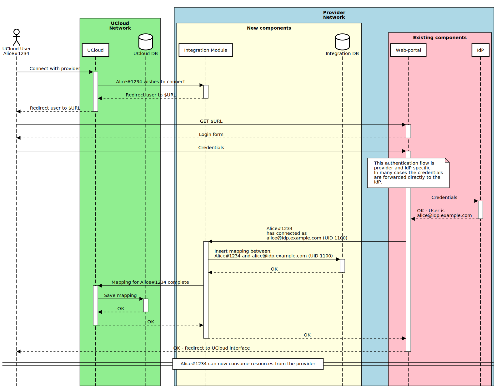
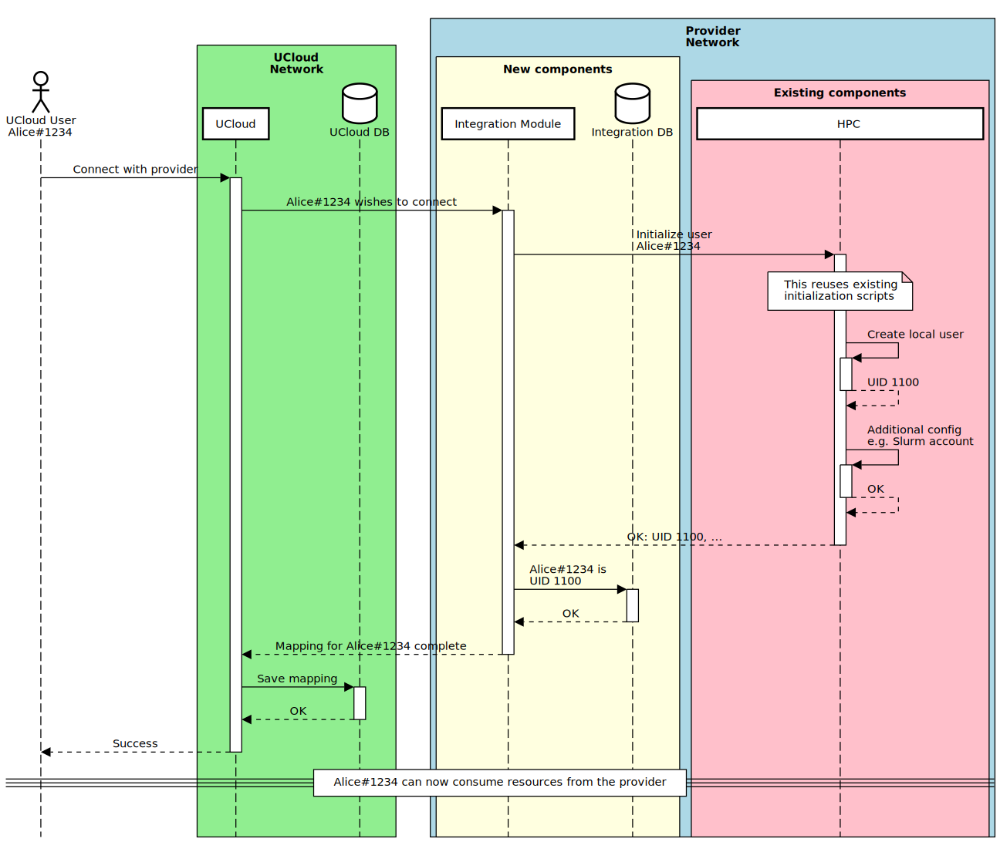

# Integration Module Scenarios: Users

In this document we will describe various scenarios limited to the subject of user-mapping between UCloud and local
users at the provider.

You can about communication between UCloud and the provider
[here](/backend/app-orchestrator-service/wiki/provider.md#communication).
A summary is presented below:

- UCloud communicates with the provider through the integration module (using the UCloud provider API)
- The UCloud provider API is HTTP based
  - TLS is required in both directions for production use
- All requests, in both directions, are verified using short-lived [JWTs](https://jwt.io)
- JWTs are verified using asymmetrical cryptography
  - JWT algorithm: `RS256` (`RSASSA-PKCS1-v1_5` with `SHA-256`)

## Terminology

| Name | Description |
|------|-------------|
| UCloud | The [UCloud](https://docs.cloud.sdu.dk) software |
| UCloud DB | The database(s) used by UCloud |
| UCloud network | The network on which the UCloud software is running |
| Integration module | A server which implements the UCloud provider API |
| Integration DB | The database(s) used by the integration module |
| HPC | The existing provider system. This is used as a catch-all for the storage and compute system |
| IdP | Identity provider used by the provider |
| Web-portal | An existing web-portal used by the provider for accessing the system |
| Existing components | The software and hardware components which already exist in the provider's system |
| New components | New software components which are introduced into the provider's system |

## One-to-One

In the one-to-one mapping scenarios we will look at how UCloud users can be mapped to a single local user. Every local
user will have at most one UCloud user associated with it. Similarly, every UCloud user will have at most one local user
associated with them at the provider.

All one-to-one approaches assume that the system assigns a single UID to every user (along with any potential groups).
As a result, these share the same structure for command execution which is shown later.

### With Existing Users and Web-portal

In this scenario, we show how a provider can choose to map every unique UCloud user to a single user at the provider.
This depends on an existing web-portal and IdP which is already in use by the provider. This assumes that this
web-portal is actively used by users of the provider already. We assume that the _current_ workflow at the provider is:

1. A user wishes to use the provider's services
2. They open the _existing_ web-portal and login through their IdP (e.g. WAYF)
3. The first time a user logs in, they are also registered as a 'local' user on the HPC system
    - Local refers to any kind of user on the system. For example, this might use yellow pages, LDAP or some other means
      of authenticating. The important part is that this user can now use the system with their user.
4. User requests resources in the system (e.g. email, online application or any other existing procedure)
5. Resources are assigned to this user

In this scenario, UCloud expands and use this web-portal to allow _existing_ users of the provider's system to use
UCloud. Specifically, the web-portal needs to be expanded to send a callback to the UCloud integration module after a
connection attempt has completed successfully.

### With No Portal

In this scenario, we show how a provider can choose to map every unique UCloud user to a single user but without
depending on an existing workflow. This has the drawback that existing users _cannot_ connect their UCloud user with
their existing user. Rather, they will need to have two separate users at the provider. This can be a significant
annoyance for the users of the system.

### Command Execution

Both approaches for one-to-one depend on a system mapping the UCloud user to a UID (and GIDs). UCloud uses this mapping
to create a sandbox which runs in the context of the user. It works by receiving, verified, requests from UCloud and
using the user, embedded in the request, to change context. At this point anything done by the integration module will
be executed with the same permissions as the user. This approach is _very similar_ to how an SSH daemon performs
authentication and switch context to an authenticated user.

---

__📝 NOTE:__ The integration module only needs enough permissions to create the sandboxes. An effort will be made
to ensure that all other privileges are dropped. Details around sandbox creation will be described later.

---

## Many-to-One Mapping

In this scenario, we show how a provider can choose to map _all_ UCloud users to a single, non-privileged, local user.
This approach has some security benefits, in that the integration module does not need to run with any special
privileges. However, it is important to note that this pushes _all_ security and auditing onto the UCloud integration
module and away from the operating system. The one-to-one approach has the benefits of mostly relying on the operating
system's security, which can be managed by the provider through ordinary means. UCloud only needs privileged access for
the very small window in which it needs to change context. In the many-to-one approach, UCloud is responsible for
performing all authentication, authorization and auditing which needs to be managed through UCloud specific methods.

