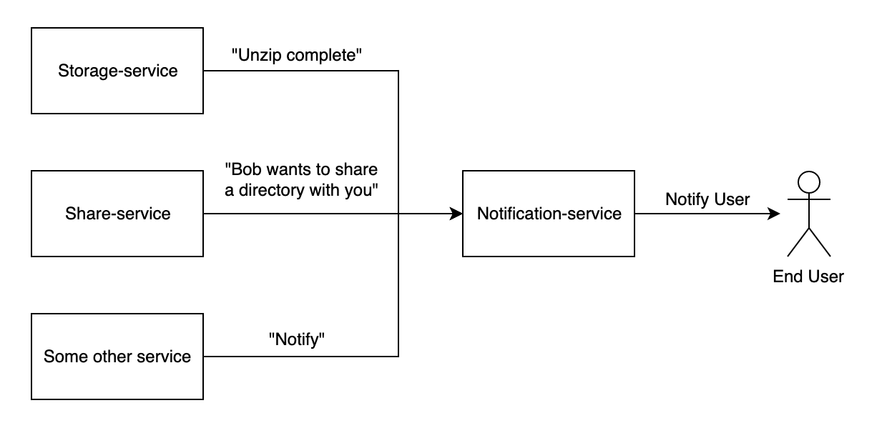

# notification-service

Powers the notification feature of UCloud. Other services can call this
service to create a new notification for users. Notifications are
automatically delivered to any connected frontend via websockets.

