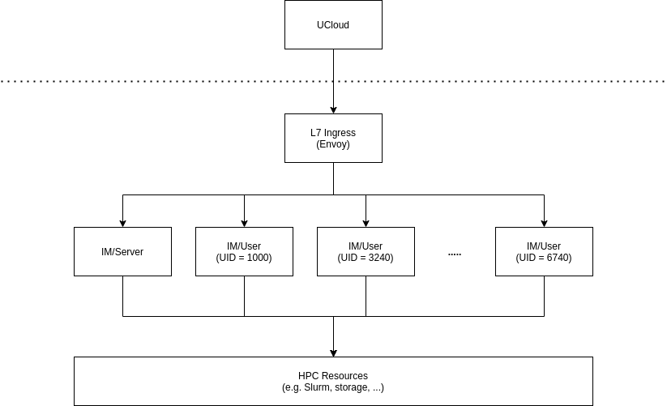
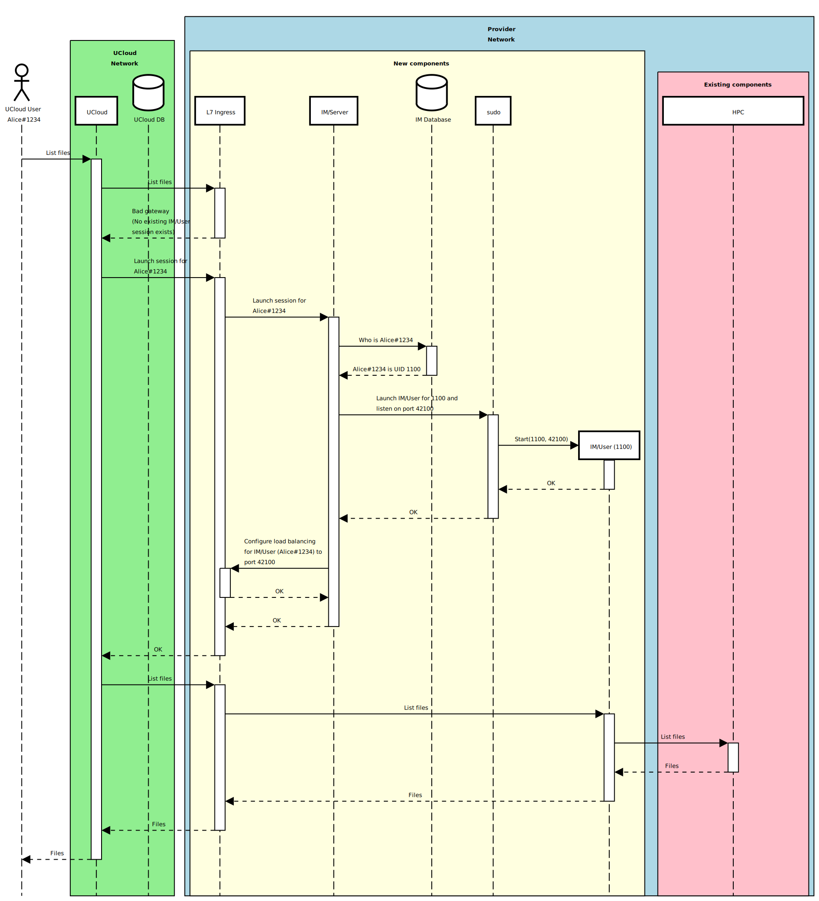
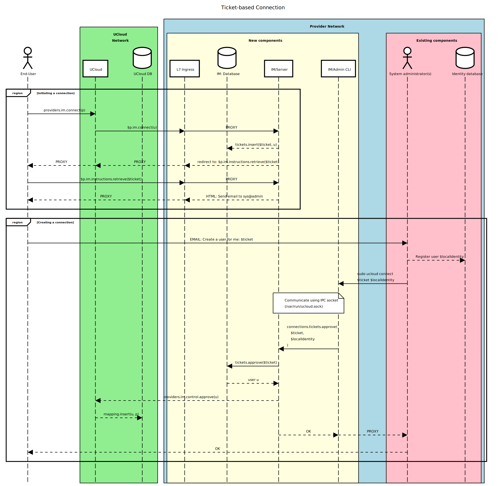

# UCloud Integration Module

In this document, we will provide an overview of how the integration module (IM) of UCloud works. This document will
only provide an overview. We encourage that you read up on the related concepts.

## High-level architecture

At a high-level, an integration module deployment consists of a few different components:

Below, we summarize the components, their role and their special privileges.

| Component    | Run as (User)        | Notes                                                               | Extra privileges                                           |
|:-------------|:---------------------|:--------------------------------------------------------------------|:-----------------------------------------------------------|
| `L7 Ingress` | `ucloud`             | Load balancer of HTTP traffic                                       | None (Certain configs will require `CAP_NET_BIND_SERVICE`) |
| `IM/Server`  | `ucloud`             | The integration module server                                       | Able to launch IM/User instances (through limited `sudo`)  |
| `IM/User`    | End-user (see notes) | Accepts requests that need to run in the context of a specific user | None                                                       |

## External communication and authentication

The integration module receives all traffic through an HTTPS and WebSocket API. The module listens on a configurable
interface on a configurable port (pending #3270). It is not currently possible to bind to a privileged port (< 1024)
since the IM refuses to launch as root.

The full API documentation, including the provider APIs implemented by the integratino module, is available here:
https://docs.cloud.sdu.dk/dev/index.html.

UCloud requires TLS from all providers running in a production environment. The certificate must be valid and signed by
a recognized Certificate Authority (CA). We encourage providers to follow best practices. For inspiration, Mozilla
hosts an online [SSL configuration generator](https://ssl-config.mozilla.org). Additionally,
[this document](https://github.com/ssllabs/research/wiki/SSL-and-TLS%20Deployment-Best-Practices) from SSL Labs can 
provide a good starting point.

Most communication received by the provider is coming directly from UCloud. In some cases the integration module will
receive communication directly from the end-user. This is the case for uploads, downloads and other interactive
applications.

UCloud uses three different mechanisms for authenticating communication:

1. Through TLS certificates. This applies to outgoing communication in both directions between UCloud and the provider.

2. Through JSON Web Tokens (JWT). This applies to incoming communication in both directions between UCloud and the
provider. More information can be found [here](../backend/auth-service/README.md) and
[here](https://docs.cloud.sdu.dk/dev/docs/developer-guide/core/users/authentication/providers.html#authentication-and-authorization).

3. Through short-lived one-time tokens. This applies only to communication between the end-user and provider. An
example can be found [here](https://docs.cloud.sdu.dk/dev/docs/developer-guide/orchestration/compute/jobs.html#example-starting-an-interactive-terminal-session).

## Internal communication and authentication

The IM/User and IM/Server instances bind to ports starting at 42,000 on the loop-back interface (pending #3271). These
instances receive traffic only from the L7 ingress. The L7 ingress does not change the request semantics. It is only
responsible for forwarding the traffic to the correct instance. The IM instances verify all authentication tokens them
selves.

An IM/User instance can communicate with an IM/Server instance through IPC. The integration module implements
inter-process communication through a unix socket. The IM/Server creates the socket at `/var/run/ucloud/ucloud.sock`.
The socket is set to be usable by all users and communication. The server uses the authentication mechanisms of the
kernel (i.e. UID, GID and PID through `SO_PEERCRED`). 

## Authorization

The integration module re-uses the authorization mechanisms already in place at the HPC system. The IM/User instances
handle user-generated traffic. The instances which receives the traffic of a user, always runs as their own user on the
system. As a result, the IM/User instance is only capable of performing operations which the user can perform.

On top of this, UCloud also performs authorization before forwarding requests. You can read more about this step
[here](https://docs.cloud.sdu.dk/dev/docs/developer-guide/accounting-and-projects/providers.html).

## Launching IM/User instances

In the diagramt below, we show how UCloud receives a request from the user and forwards it to the integration module.
It takes us through a number of important steps, such as mapping users and launching a new IM/User instance.

This process depends on a generic "user mapper" function. It takes as input the UCloud user and returns the local user
identity. How this function is defined depends entirely on the configuration of the system, the only important part of
this procedure is that the function exists.

__NOTE:__ To limit the scope we recommend only granting limited access to sudo from the `ucloud` service user.

## Creating a mapping between UCloud users and local users

A "user mapping" function is critical for the integration module. It does not work without it. At the moment we
implement only a single mapping function, and it is rather simple in its design.

## Independent verification of user requests

Pending issue #3273, the integration module will be able to verify independently that the request was made by the real
user. This protects against the case of a malicious takeover of the UCloud service affecting other providers of the
system. The concrete design is yet to be designed, but we believe that the following steps should take place:

1. During the connection the end-user will generate a public-private key pair. 
   - The private key will be transferred to the provider. It will remain accessible to the user's IM/User instance. 
   - The public key will be stored in the user's browser and be available during communication with UCloud. 
   - The key pair must be generated in such a way that the private key is never seen by the UCloud backend.

2. When the end-user communicates they must sign the request.
   - This will involve creating a message which describes the request they are making.
   - This message is then digitally signed with the public key.
   - As part of the message, the user must include a timestamp.

3. When UCloud receives the communication... 
   - UCloud cannot verify that this signature is valid. They do not know the private or public key.
   - Instead, UCloud will forward this as part of the request to the provider.

4. When the provider receives the communication...
   - The provider knows the private key of the user and begins verification.
   - Both the message and the signature must match the actual request.
   - If any parts do not match, then the request must be rejected by the provider.

This "cryptographic" parts of the procedure is essentially just describing how JWTs with one of the `RSXXX` algorithms
work. The critical part of the procedure is creation and distribution of the keys during the connection process.
