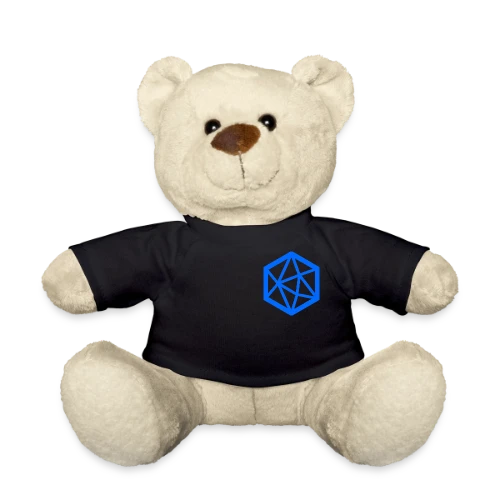
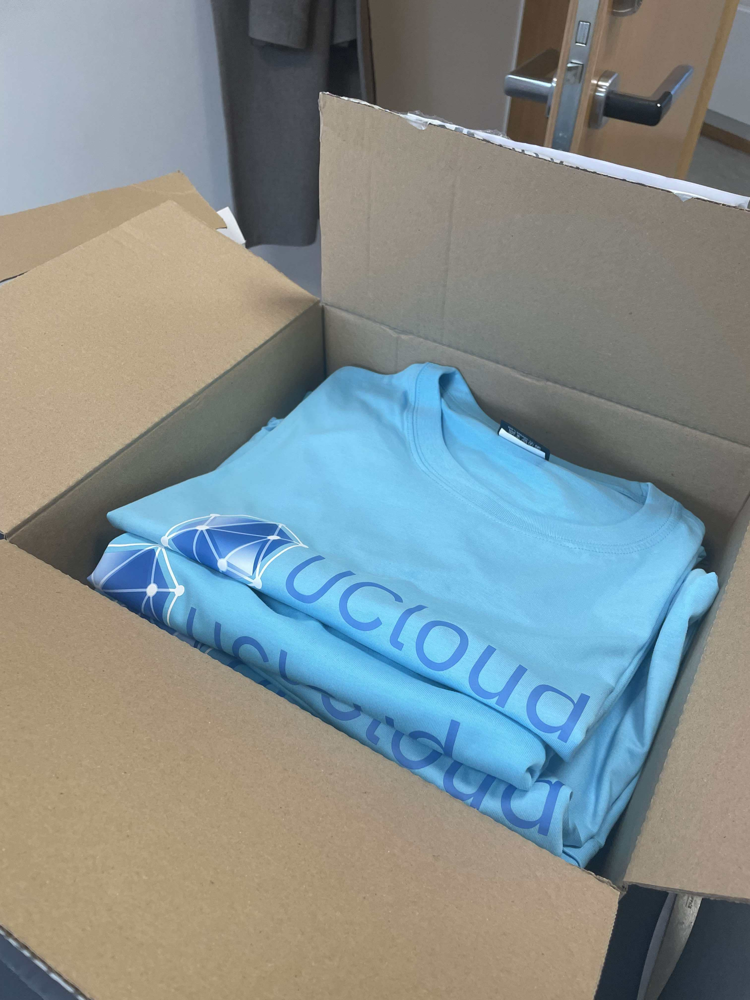

# UCloud branding

A short overview for the branding and visual identity for the UCloud platform.

## Stylizing

The platform name is stylized "UCloud", with uppercase U and C, and lowercase for the remainder.

Correct: UCloud

Incorrect: Ucloud, uCloud

## Logo

The UCloud logo is a hexagon shape with a node graph surrounding it. 
The nodes are white, unless a contrast is needed, in which case the outer nodes and edges are rendered in blue.

| Image name                                                                         |                                         | Uses                                                                 |
|------------------------------------------------------------------------------------|-----------------------------------------|----------------------------------------------------------------------|
| [favicon](./favicon.ico)                                                           |              | Used for the UCloud-site and associated documentation                |
| [Icon logo, white nodes](./logo_esc.svg)                                           |             | Usually used when the UCloud logo is presented on a blue background  |
| Icon logo, blue nodes, with text ([svg](./ucloud-blue.svg), [png](./ucloud.png))   |          | Used on the login page                                               |
| [Icon logo, blue nodes, no text](./ucloud-blue-no-text.svg)                        |  | Default logo to use <!-- maybe? Used on LinkedIn. -->                |

<!-- We should probably have rules set regarding which icon to use. The blue edge/node one should work for both light and dark backgrounds, so maybe go for that one. -->

<!-- We also have favicon_color.png, but I don't think it's in use -->

## Colors

The main accent color for the UCloud platform is a blue color, with a different level of darkness for light and dark themes.

The color variable names and their associated hex-values can be seen in [Colors.css](https://github.com/SDU-eScience/UCloud/tree/master/frontend-web/webclient/app/Assets/Colors.css).

<!-- We are not following the rules in the following table. See MembersUI.tsx -->

| Notable color variable name (without prefix)                        | Uses                                                                      |
|---------------------------------------------------------------------|---------------------------------------------------------------------------|
| primaryMain                                                         | The accent color used for default buttons, checkboxes                     |
| successMain                                                         | Used for creation, approving, accepting, etc.                             |
| errorMain                                                           | Used for cancelling, dismissing, deleting, removing, etc.                 |

<!-- Could add more, not sure which would make sense. -->

## Typography

The UCloud platform uses multiple fonts for different purposes:

| Font                                                                | Uses                                                                      |
|---------------------------------------------------------------------|---------------------------------------------------------------------------|
| [Inter](https://fonts.google.com/specimen/Inter)                    | The default font for UCloud, used for non-monospaced text.                |
| [JetBrains Mono](https://fonts.google.com/specimen/JetBrains+Mono)  | The font used for monospaced text, e.g. code samples, editor, etc.        |

## Merchandise

Two teddy bear plushies are available to lend for employees at the eScience Center for work-related events. <!--Maybe just events in general, I shouldn't decide, I don't own them. Need them for a birthday party? Why not.-->

T-shirts have been made with expos and conferences in mind, and can be purchased for anyone needing one for an upcoming expo/conference. (See introduction on how to insert image)

