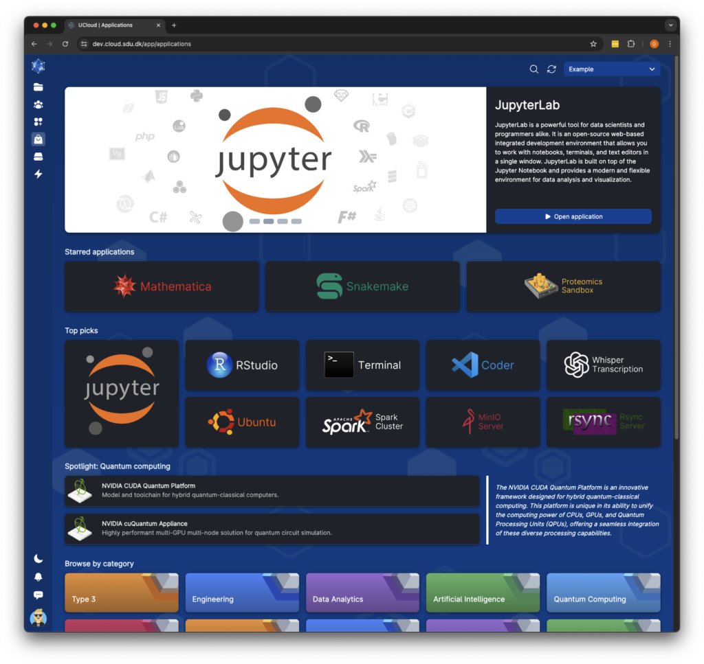
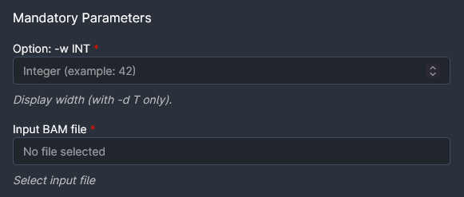

# Application management

This chapter will contain a description of how to upload and manage applications for a service provider. UCloud provides
a catalog of applications which a service provider can subscribe to, assuming that they live up to certain
infrastructure requirements.

## The Application Catalog

The UCloud application catalog enables users to browse a comprehensive list of available software. Each application
within the catalog is a UCloud abstraction that defines a piece of software, its parameters, and its startup process.

UCloud maintains an up-to-date catalog of applications commonly used in high-performance computing systems.
The entire application catalog is automatically available when using the Kubernetes integration. You do not need to
configure the service provider for this. Images will automatically be pulled from the UCloud Docker registry.

<figure class="mac-screenshot">




<figcaption>

The UCloud application catalog showing a selection of applications available at a service provider.

</figcaption>
</figure>

## The Structure of an Application

UCloud applications describe how to obtain, load and invoke a piece of software. This information is supplied in a YAML
document which has several sections. These sections are illustrated in the diagram below.

<figure class="diagram">


<figcaption>

An application describes how to obtain, load and invoke a piece of software. This also includes a list of input parameters,
both optional and mandatory which can be fed into the application.

</figcaption>
</figure>

### Metadata

All applications contain a small section of metadata. This metadata includes an application name and version. These
together form a unique identifier, which is transmitted to the service provider letting it know which application is
being started.

The UCloud user-interface allows users to quickly swap between versions of the same application, as shown in the
screenshot below. This also means that the name of an application should be considered stable. The name of an
application is generally not shown directly to end-users.

Versions are ordered in UCloud based entirely on when they are uploaded to the platform. Thus the newest version is
always considered to be the most recently uploaded version.

<figure>


<figcaption>

The version selector allows users to quickly switch between versions of an application.

</figcaption>
</figure>

### Input Parameters

The input parameters of an application describe the input which a user can feed into it. Each input parameter type has
an associated widget in UCloud specialized for that type of input. The exact types supported are listed in the
[reference](#parameters). Input parameters can be either optional or mandatory. Their values are partially validated by
UCloud before being forwarded to the service provider.

The values of the input parameters are fed into the invocation sections.

<figure>




<figcaption>

A selection of input parameters shown in the UCloud user-interface.

</figcaption>
</figure>

### Invocation

The invocation sections accept the user input and produce output in the job submission script. This includes changes to
the sbatch directives, binding environment variables and finally invoking the actual software. The invocation sections
are written using [Jinja2](https://jinja.palletsprojects.com/en/3.0.x/templates) templates. Refer to the reference and
examples for details on how to write these.

### Interactive Properties

Applications can also declare support for various interactive application backends. This includes web-based applications
and remote desktop applications. These are shown in some of the examples below, but are not covered in this chapter.

## Examples

<div class="tabbed-card">

<div data-title="Non-customizable">

This is an example application showing a non-customizable application using most of the features available in the
application system.

<figure>

````yaml
{{#include app_example.yaml}}
````

</figure>
</div>

</div>

## Reference

### Metadata

The metadata section provides basic metadata about the document and the application contained within. This section
is mandatory and placed at the top-level.

<div class="table-wrapper no-code-wrap">
<table>
<thead>
<tr>
<th>Property</th>
<th>Type</th>
<th>Description</th>
</tr>
</thead>
<tbody>

<tr>
<td><code>application</code></td>
<td>&mdash;</td>
<td>

Must be equal to `v2`.

</td>
</tr>

<tr>
<td><code>name</code></td>
<td><code>string</code></td>
<td>

The name of an application. This name must be unique, for a given application and remain stable across different
versions of the application. By convention, this name should be written using lower-kebab-case. The name must not
contain any type of whitespace.

</td>
</tr>

<tr>
<td><code>version</code></td>
<td><code>string</code></td>
<td>

The version of an application. There can only be one application with a given `(name, version)` tuple. Attempting to
re-create an application with the same version is not allowed.

</td>
</tr>

</tbody>
</table>
</div>

### Parameters

The parameters section contains the input parameters for a given application. Parameters are supplied in the
`parameters` top-level section. The top-level section has a type of `map<string, parameter>` where the key is the name
of the parameter. The `parameter` type is defined in this section.

<div class="table-wrapper no-code-wrap">
<table>
<thead>
<tr>
<th>Property</th>
<th>Type</th>
<th>Valid for</th>
<th>Description</th>
</tr>
</thead>
<tbody>

<tr>
<td><code>type</code></td>
<td><code>string</code></td>
<td><i>All</i></td>
<td>

The type of parameter. This controls the widget used in the UCloud user-interface along with validation logic. The type
supplied controls how some properties of a parameter works. See the "Valid for" column in this table. The following
types are available:

| Type            | Description                                                                                  |
|-----------------|----------------------------------------------------------------------------------------------|
| `File`          | Displays a file selector widget. Only a single file can be selected with this parameter.     |
| `Directory`     | Display a folder selector widget. Only a single folder can be selected with this parameters. |
| `Integer`       | An integer widget. Optional minimum and maximum values can be selected.                      |
| `FloatingPoint` | A floating point number widget. Optional minimum and maximum values can be selected.         |
| `Boolean`       | A boolean (on/off) widget.                                                                   |
| `Text`          | A text input field which can contain a single line of text.                                  |
| `TextArea`      | A text input field which can contain multiple lines of text.                                 |
| `Enumeration`   | An input field which allows the user to select from a number of pre-defined options.         |
| `License`       | Displays a widget for selecting a license to attach to the job.                              |
| `Job`           | Displays a job selector widget. This allows a user to select a companion job.                |
| `PublicIP`      | Displays a widget for selecting a public license to attach to the job.                       |

</td>
</tr>

<tr>
<td><code>title</code></td>
<td><code>string</code></td>
<td><i>All</i></td>
<td>

A human-readable title used for this parameter. This property should be short (less than 120 characters) and be
limited to a single line.

</td>
</tr>

<tr>
<td><code>description</code></td>
<td><code>string</code></td>
<td><i>All</i></td>
<td>

A human-readable description used for this parameter. The description can use limited markdown for markup, but it
cannot use any HTML tags or references to external resources. The first-line is always shown without further interaction
from the user. Lines beyond the first might require user interaction to show.

</td>
</tr>

<tr>
<td><code>optional</code></td>
<td><code>boolean</code> (optional)</td>
<td><i>All</i></td>
<td>

Default value: `true`

This property controls if a parameter is mandatory or not. If this property is not supplied or if
it is supplied with a value of `true`, then the parameter is considered optional. Otherwise, it is considered to be
mandatory and a job cannot be submitted with this application without supplying a value for the parameter.

</td>
</tr>

<tr>
<td><code>defaultValue</code></td>
<td><i>Varies</i> (optional)</td>
<td><i>All</i></td>
<td>

Default value: `null`

This property controls the default value of a parameter. The default value is used _only_ if a
parameter is optional and no value is supplied for the parameter. The type of the property should match the type of
parameter. It is not possible to set default values for files or directories.


</td>
</tr>

<tr>
<td><code>min</code></td>
<td><code>int/float</code> (optional)</td>
<td><code>Integer</code>, <code>FloatingPoint</code></td>
<td>

Default value: `null`

This property controls the minimum value (inclusive) a numeric type can have.

</td>
</tr>

<tr>
<td><code>max</code></td>
<td><code>int/float</code> (optional)</td>
<td><code>Integer</code>, <code>FloatingPoint</code></td>
<td>

Default value: `null`

This property controls the maximum value (inclusive) a numeric type can have.

</td>
</tr>

<tr>
<td><code>step</code></td>
<td><code>int/float</code> (optional)</td>
<td><code>Integer</code>, <code>FloatingPoint</code></td>
<td>

Default value: `null`

This property controls the step size of clicking increment/decrement buttons in the user-interface for numeric inputs.

</td>
</tr>

<tr>
<td><code>options</code></td>
<td><code style="white-space: wrap">{ title: string, value: string }[]</code></td>
<td><code>Enumeration</code></td>
<td>

This property controls the options to show in the user-interface for an enumeration. Only options present in this
property can be selected by the user.

If a `defaultValue` is also defined then this must match the `value` of a valid option.

</td>
</tr>


</tbody>
</table>
</div>

### Software

The software section contains information about how to retrieve the required software. This is supplied in the
`software` top-level section.

<div class="table-wrapper no-code-wrap">
<table>
<thead>
<tr>
<th>Property</th>
<th>Type</th>
<th>Description</th>
</tr>
</thead>
<tbody>

<tr>
<td><code>type</code></td>
<td><code>string</code></td>
<td>

Must be `"Container"` for application used in the UCloud/IM for Slurm integration.

</td>
</tr>

<tr>
<td><code>image</code></td>
<td><code>string</code></td>
<td>

Reference to the container image used for the application.

</td>
</tr>


</tbody>
</table>
</div>

#### Variables

All input parameters submitted to the job are available at the top-level using the same name as described in the
`parameters` section of the application. If a variable has a default value and none was supplied, then the default value
is made available. It is not possible to detect directly if a user supplied no value if a default is available. Normal
variables can be accessed with the following snippet:

```text
{{ myParameter }}
```

Optional parameters for which the user did not supply a value, and the parameter has no default, will not be made
available in the template. It is possible to detect if no value is supplied with the following snippet:

```text

The optional parameter was not supplied

The optional parameter is {{optionalParameter}} 

```

Metadata about the job is made available through the `ucloud` top-level property. The properties in the `ucloud`
property are also automatically bound to environment variables using the same name but in `UPPER_SNAKE_CASE`. Thus
`ucloud.machine.memoryInGigs` becomes `UCLOUD_MACHINE_MEMORY_IN_GIGS`. The contents of the `ucloud` property is defined in
the table below:

<div class="table-wrapper">
<table>
<thead>
<tr>
<th>Property</th>
<th>Type</th>
<th>Description</th>
</tr>
</thead>
<tbody>

<tr>
<td><code>ucloud.jobId</code></td>
<td><code>string</code></td>
<td>

The UCloud job ID. Note that this is supplied as a string, even though most job IDs are numeric. You should not depend
on the IDs being numeric. The IDs are unique and do not change. An ID is never re-used at a given provider.

**Example:** `"51239184"`

</td>
</tr>

<tr>
<td><code>ucloud.machine.name</code></td>
<td><code>string</code></td>
<td>

The name of the machine slice used for the reservation.

**Example:** `"u1-standard-64"`

</td>
</tr>

<tr>
<td><code>ucloud.machine.category</code></td>
<td><code>string</code></td>
<td>

The name of the machine type (product category) used for the reservation.

**Example:** `"u1-standard"`

</td>
</tr>

<tr>
<td><code>ucloud.machine.cpu</code></td>
<td><code>int</code></td>
<td>

The number of (v)CPUs available to the machine slice. This is retrieved from the product configuration and not from the
actual compute nodes.


**Example:** `64`

</td>
</tr>

<tr>
<td><code>ucloud.machine.cpuModel</code></td>
<td><code>string</code> (optional)</td>
<td>

The model of the CPU available to the machine type used in the reservation. This is retrieved from the product
configuration and not from the actual compute nodes.

**Example:** `"AMD EPYC 7742"`

</td>
</tr>

<tr>
<td><code>ucloud.machine.memoryInGigs</code></td>
<td><code>int</code></td>
<td>

The amount of memory available to the machine reservation in gigabytes. This is retrieved from the product configuration
and not from the actual compute nodes.

**Example:** `512`

</td>
</tr>

<tr>
<td><code>ucloud.machine.memoryModel</code></td>
<td><code>string</code> (optional)</td>
<td>

The model of the memory available to the machine type used in the reservation. This is retrieved from the product
configuration and not from the actual compute nodes.

**Example:** `"DDR4-2400"`

</td>
</tr>

<tr>
<td><code>ucloud.machine.gpu</code></td>
<td><code>int</code></td>
<td>

The amount of GPUs made available to the machine type used in the reservation. This is retrieved from the product
configuration and not from the actual compute nodes.

**Example:** `4`

</td>
</tr>

<tr>
<td><code>ucloud.machine.gpuModel</code></td>
<td><code>string</code> (optional)</td>
<td>

The model of the GPUs available to the machine type used in the reservation. This is retrieved from the product
configuration and not from the actual compute nodes.

**Example:** `"NVIDIA H100"`

</td>
</tr>

<tr>
<td><code>ucloud.webPort</code>/<code>ucloud.vncPort</code></td>
<td><code>int</code> (optional)</td>
<td>

If the application has requested a dynamic port allocation for a vnc/web-interface, then this property will contain a
port which the application is expected to use. The dynamic port will be allocated such that it is highly unlikely to be
in use on the node.

Note that UCloud/IM cannot guarantee that this port is not in use. But UCloud/IM will attempt to not generate duplicates
directly. This won't stop users from, at random, running work listening on the same port. Applications should attempt to
exit immediately in case such a conflict occurs.

Ports are generated in the range between `TODO` and `TODO`.

**Example:** `52382`

</td>
</tr>

<tr>
<td><code>ucloud.nodes</code></td>
<td><code>int</code></td>
<td>

The number of nodes dedicated to the job.

**Example:** `4`

</td>
</tr>

<tr>
<td><code>ucloud.application.name</code></td>
<td><code>string</code></td>
<td>

The name of the application being submitted.

**Example:** `"quantum-espresso"`

</td>
</tr>

<tr>
<td><code>ucloud.application.version</code></td>
<td><code>string</code></td>
<td>

The version of the application being submitted.

**Example:** `"7.3"`

</td>
</tr>

</tbody>
</table>
</div>

#### Filters

The standard built-in filters of Jinja2 are supported along with the following custom filters:

<div class="table-wrapper">
<table>
<thead>
<tr>
<th>Filter</th>
<th>Description</th>
</tr>
</thead>
<tbody>

<tr>
<td><code>flag</code></td>
<td>

**Signature:**

```
boolean_expression | flag(onFlag[, offFlag]) -> string
```

If the value passed into the filter is `True` then the `onFlag` will be produced. Otherwise the `offFlag` will be
produced. If `offFlag` is not specified then `""` is returned instead.

**Example:**

```python
{{ True | flag("--yes", "--no") }}            -> "--yes"
{{ False | flag("--yes", "--no") }}           -> "--no"
{{ True | flag("--yes") }}                    -> "--yes"
{{ False | flag("--yes") }}                   -> ""
```

</td>
</tr>

<tr>
<td><code>option</code></td>
<td>

**Signature:**

```
expression | option(optionFlag[, addSpace]) -> string
```

If the expression is not `None` then a non-positional option is added to the output. If `addSpace` is `True` then a
space is added between the `optionalFlag` and the value. If it is `False` then no space is added. If it is omitted then
a value is automatically chosen based on the option flag. Specifically, if the optionFlag ends in `=` then no space is
added, otherwise a space is added.

This function will always escape the value part for use in bash. Even when bound to an environment variable. If
`addSpace` evaluates to `False` then the option itself is also escaped. The option is _not_ escaped if `addSpace`
evaluates to true.

**Examples:**

```python
{{ None | option("--an-optional-option") }}   -> ""
{{ 42 | option("--count") }}                  -> "--count '42'"
{{ 42 | option("--count=") }}                 -> "'--count=42'"
{{ 42 | option("--count", false) }}           -> "'--count42'"
{{ 42 | option("--count=", true) }}           -> "--count= '42'"
{{ "/path/with spaces" | option("--file") }}  -> "--file '/path/with spaces'"
```

</td>
</tr>

</tbody>
</table>
</div>

#### Methods

The standard built-in methods Jinja2 are supported along with the following custom methods:

#### Control Structures

The templating engine supports the control structures of Jinja2, with the following exceptions:

- `` has been disabled
- `` has been disabled
- `` has been disabled
- `` has been disabled

### Web Applications

The web-based interactive applications can be configured in the `web` top-level property. It has the following options available to it:

<div class="table-wrapper no-code-wrap">
<table>
<thead>
<tr>
<th>Property</th>
<th>Type</th>
<th>Description</th>
</tr>
</thead>
<tbody>

<tr>
<td><code>enabled</code></td>
<td><code>boolean</code></td>
<td>

If `true`, then this application exposes a web-application. If `false`, then all other properties in this section are ignored.

</td>
</tr>

<tr>
<td><code>port</code></td>
<td><code>int</code></td>
<td>

The port on which the web-application will listen.

</td>
</tr>

</tbody>
</table>
</div>

### Remote Desktop Environments (VNC)

Remote desktop environments (via VNC) can be configured through the `vnc` top-level section. It has the following
properties available to it:

<div class="table-wrapper no-code-wrap">
<table>
<thead>
<tr>
<th>Property</th>
<th>Type</th>
<th>Description</th>
</tr>
</thead>
<tbody>

<tr>
<td><code>enabled</code></td>
<td><code>boolean</code></td>
<td>

If `true`, then this application exposes a web-application. See [interactive applications](./interactive-jobs.md) for
more information. If `false`, then all other properties in this section are ignored.

</td>
</tr>

<tr>
<td><code>port</code></td>
<td><code>int</code></td>
<td>

The port on which the web-application will listen.

</td>
</tr>

<tr>
<td><code>password</code></td>
<td><code>string</code></td>
<td>

The password to the VNC server. This password is not used for security purposes.

</td>
</tr>


</tbody>
</table>
</div>

### Features

Various optional features can be enabled through the `features` top-level section. These properties are described
by the table below. All properties in the `features` section have a default value.

<div class="table-wrapper no-code-wrap">
<table>
<thead>
<tr>
<th>Property</th>
<th>Type</th>
<th>Description</th>
</tr>
</thead>
<tbody>

<tr>
<td><code>multiNode</code></td>
<td><code>boolean</code> (optional)</td>
<td>

Default value: `false`

This feature allows a user to add multiple nodes to a single job. This must be explicitly enabled for all applications
which are capable of doing multi-node processing.

</td>
</tr>

<tr>
<td><code>links</code></td>
<td><code>boolean</code> (optional)</td>
<td>

This feature allows a user to add public links to a job. 

</td>
</tr>

<tr>
<td><code>ipAddresses</code></td>
<td><code>boolean</code> (optional)</td>
<td>

This feature allows a user to add public IPs to a job.

</td>
</tr>

<tr>
<td><code>folders</code></td>
<td><code>boolean</code> (optional)</td>
<td>

This feature allows a user to additional folders to a job.

</td>
</tr>

<tr>
<td><code>jobLinking</code></td>
<td><code>boolean</code> (optional)</td>
<td>

This feature allows a user to link with other jobs on the same provider, allowing them to communicate with each other.

</td>
</tr>

</tbody>
</table>
</div>