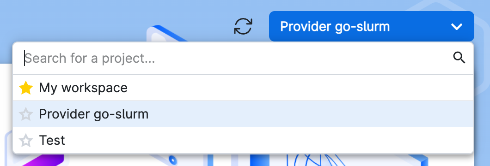

# Installation

This document will guide you through the process of obtaining and installing UCloud/IM for Kubernetes. By the end of
this document you will be connected to UCloud's sandbox environment.

## Prerequisites

The UCloud Integration Module should be deployed on Kubernetes cluster running on a node, which does not run any
user-jobs. We recommend that the Integration Module itself has the following minimum requirements available to it:

- __OS:__ Linux (any distribution)
- __CPU:__ x86_64 with at least 8 vCPU
- __Memory:__ 32GB

Cluster minimum requirements:

- **Kubernetes:** UCloud supports the most recent three minor releases of Kubernetes.
  See [the Kubernetes release history](https://kubernetes.io/releases/) for more information.
- **Filesystem:** A distributed filesystem exposing a standard POSIX interface.
- **K8s Networking:** UCloud does not depend on non-standard K8s networking. It is actively developed and tested
  against [Cilium](https://cilium.io/).

In addition, the integration module must be deployed in a namespace which allows:

- Must allow inbound and outbound Internet connectivity
- Must have at least one node which should accept UCloud jobs

## Obtaining the Software

UCloud/IM for Kubernetes can be installed using Helm. You can use the following commands to install it.

```terminal
$ helm repo add sdu-escience https://sdu-escience.github.io/charts
$ helm repo update
$ helm show values sdu-escience/ucloud-im > values.yaml

# NOTE: At this point you MUST modify the values (see below)

$ helm install ucloud-im \
    sdu-escience/ucloud-im \
    --namespace ucloud-im \
    -f values.yaml
```

There are some prerequisites that must be manually configured before using the Helm chart to install UCloud/IM.

* **Two namespaces must exist**, one for running the UCloud/IM software and one for running all the user jobs. In the
  following example we call these two namespaces `ucloud-im` and `ucloud-apps` respectively.
* **Both namespaces must have a `PersistentVolumeClaim` with the same name**, pointing to the same shared storage. This
  shared storage is used for storing user data. The volume must be configured with `accessMode` set to `ReadWriteMany`.

The following is an example of Kubernetes manifests that create the two namespaces and the required volumes. Here we
assume that there is a shared filesystem mounted on all nodes and we can simply access this via the `HostPath` option.
Adjust this based on the local storage system and installed CSI provisioners.

```yaml
apiVersion: v1
kind: Namespace
metadata:
  name: ucloud-im
---
apiVersion: v1
kind: PersistentVolume
metadata:
  name: ucloud-im-user-data
spec:
  storageClassName: manual
  capacity:
    storage: 1Ti
  accessModes:
    - ReadWriteMany
  hostPath:
    path: /example/path
    type: Directory
---
apiVersion: v1
kind: PersistentVolumeClaim
metadata:
  name: ucloud-user-data
  namespace: ucloud-im
spec:
  volumeName: ucloud-im-user-data
  storageClassName: manual
  accessModes:
    - ReadWriteMany
  resources:
    requests:
      storage: 1Ti
```

```yaml
apiVersion: v1
kind: Namespace
metadata:
  name: ucloud-apps
---
apiVersion: v1
kind: PersistentVolume
metadata:
  name: ucloud-apps-user-data
spec:
  storageClassName: manual
  capacity:
    storage: 1Ti
  accessModes:
    - ReadWriteMany
  hostPath:
    path: /example/path
    type: Directory
---
apiVersion: v1
kind: PersistentVolumeClaim
metadata:
  name: ucloud-user-data
  namespace: ucloud-apps
spec:
  volumeName: ucloud-apps-user-data
  storageClassName: manual
  accessModes:
    - ReadWriteMany
  resources:
    requests:
      storage: 1Ti
```

### Chart configuration

The following is a minimal example of a Helm values file that can be used for installing UCloud/IM. For a full list of
all configuration options, see the next section.

```yaml
serviceAccount:
  create: true

ingress:
  enabled: true
  hosts:
    - "example.com"
    - "*.example.com"

provider:
  storage:
    size: 1Gi
    storageClass: example

apps:
  namespace: ucloud-apps
  storage:
    existingClaim: ucloud-user-data
```

Some general comments about the configuration.

* UCloud/IM requires a service account with permissions to manage user jobs in the `ucloud-apps` namespace. This service
  account, including the required RBAC rules, is automatically created when `serviceAccount.create` is enabled.

* UCloud/IM requires some storage for the provider configuration. A volume can automatically be provisioned, as in the
  example above, or you can provide an `existingClaim` to use an existing volume. Be aware that the volume used for the
  configuration files _cannot_ be the same volume used for the user data.

* UCloud/IM must be accessible via https on a public address. An ingress resource can automatically be provisioned.

* Finally, some configuration is needed for the user jobs. In the `apps` section we specify the namespace for running
  user jobs and the name of an existing volume for storing user data.

Use the following Helm command for installing the software.

```terminal
$ helm install myrelease ./ucloud-im -n ucloud-im -f values.yaml
```

### Helm Values

Reference for all available Helm values.

| Name                               | Description                                                            | Value                          |
|------------------------------------|------------------------------------------------------------------------|--------------------------------|
| `serviceAccount.create`            | Specifies whether a ServiceAccount should be created                   | `true`                         |
| `serviceAccount.annotations`       | Additional custom annotations for the ServiceAccount                   | `{}`                           |
| `serviceAccount.name`              | The name of the ServiceAccount to use                                  | `""`                           |
| `netpol.enabled`                   | Create network policies for the deployments                            | `true`                         |
| `netpol.ingress.http.allowed`      | Allow ingress traffic to the http endpoint                             | `true`                         |
| `netpol.ingress.http.namespace`    | Allow only ingress traffic to the http endpoint from this namespace    | `""`                           |
| `netpol.ingress.metrics.allowed`   | Allow ingress traffic to the metrics endpoint                          | `true`                         |
| `netpol.ingress.metrics.namespace` | Allow only ingress traffic to the metrics endpoint from this namespace | `""`                           |
| `ingress.enabled`                  | Specifies whether an Ingress should be created                         | `false`                        |
| `ingress.annotations`              | Additional custom annotations for the Ingress                          | `{}`                           |
| `ingress.hosts`                    | List of hosts used for the Ingress                                     | `[]`                           |
| `ingress.tls`                      | TLS configuration the Ingress                                          | `[]`                           |
| `provider.revisionHistoryLimit`    | The number of retained replica sets to allow rollback                  | `2`                            |
| `provider.nodeSelector`            | Node selector labels for provider pods                                 | `{}`                           |
| `provider.annotations`             | Annotations for provider pods                                          | `{}`                           |
| `provider.tolerations`             | Tolerations for provider pods                                          | `[]`                           |
| `provider.affinity`                | Affinity for provider pods                                             | `{}`                           |
| `provider.strategyType`            | Strategy type for replacing provider pods                              | `""`                           |
| `provider.command`                 | Overrride the command for the provider container                       | `["/usr/bin/ucloud"]`          |
| `provider.storage.size`            | Persistent Volume size                                                 | `1Gi`                          |
| `provider.storage.storageClass`    | Persistent Volume storage class                                        | `""`                           |
| `provider.storage.accessModes`     | Persistent Volume access modes                                         | `["ReadWriteMany"]`            |
| `provider.storage.existingClaim`   | Use an existing PVC which must be created beforehand                   | `""`                           |
| `provider.storage.subPath`         | The subdirectory of the volume to mount in the containers              | `""`                           |
| `provider.storage.selector`        | Additional labels to match for the PVC                                 | `{}`                           |
| `provider.storage.dataSource`      | Custom data source for the PVC                                         | `{}`                           |
| `provider.image.repository`        | Provider image repository                                              | `dreg.cloud.sdu.dk/ucloud/im2` |
| `provider.image.pullPolicy`        | Provider image pull policy                                             | `IfNotPresent`                 |
| `provider.image.tag`               | Provider image tag                                                     | `""`                           |
| `provider.service.type`            | Provider service type                                                  | `ClusterIP`                    |
| `provider.service.annotations`     | Provider service annotations                                           | `{}`                           |
| `envoy.revisionHistoryLimit`       | The number of retained replica sets to allow rollback                  | `2`                            |
| `envoy.nodeSelector`               | Node selector labels for envoy pods                                    | `{}`                           |
| `envoy.annotations`                | Annotations for envoy pods                                             | `{}`                           |
| `envoy.tolerations`                | Tolerations for envoy pods                                             | `[]`                           |
| `envoy.affinity`                   | Affinity for envoy pods                                                | `{}`                           |
| `envoy.strategyType`               | Strategy type for replacing envoy pods                                 | `""`                           |
| `envoy.image.repository`           | Envoy image repository                                                 | `envoyproxy/envoy`             |
| `envoy.image.pullPolicy`           | Envoy image pull policy                                                | `IfNotPresent`                 |
| `envoy.image.tag`                  | Envoy image tag                                                        | `v1.23-latest`                 |
| `envoy.service.type`               | Envoy service type                                                     | `ClusterIP`                    |
| `envoy.service.annotations`        | Envoy service annotations                                              | `{}`                           |
| `apps.namespace`                   | Namespace for running user jobs                                        | `ucloud-apps`                  |
| `apps.storage.existingClaim`       | Use an existing PVC which must be created beforehand                   | `""`                           |
| `apps.storage.subPath`             | The subdirectory of the volume to mount in the containers              | `""`                           |
| `apps.netpol.enabled`              | Create network policies for the apps namespace                         | `true`                         |
| `apps.netpol.egress.allowed`       | Allow egress traffic from the apps namespace                           | `true`                         |
| `apps.netpol.egress.blockPrivate`  | Block egress traffic to private IPv4 subnets                           | `true`                         |
| `apps.netpol.egress.toRules`       | Custom rules for allowing egress traffic                               | `[]`                           |

## Registering as a Provider

<div class="info-box info">
<i class="fa fa-info-circle"></i>
<div>

This section will create a secret file containing your credentials. By default, it will be located at
`/etc/ucloud/server.yml`. Please keep this file safe and keep a backup of it. In case of a re-installation, you
should aim to re-use this file.

</div>
</div>

Before you can start UCloud/IM, you must register as a service provider. This only needs to be done
once. You may receive a test provider in UCloud's sandbox environment by contacting the [support
team](https://support.cloud.sdu.dk).

Once the registration is complete, you now have a provider on UCloud's sandbox environment. From the UCloud interface,
you should now be able to select your provider project from the project switcher. You can add other UCloud users to help
manage your provider by inviting them through the interface. See the [end-user documentation](https://docs.cloud.sdu.dk)
for more details.

<figure>



<figcaption>

You will be able to manage parts of your provider through UCloud's interface. To do this, you must first select the
provider project which you are automatically added to.

</figcaption>
</figure>
