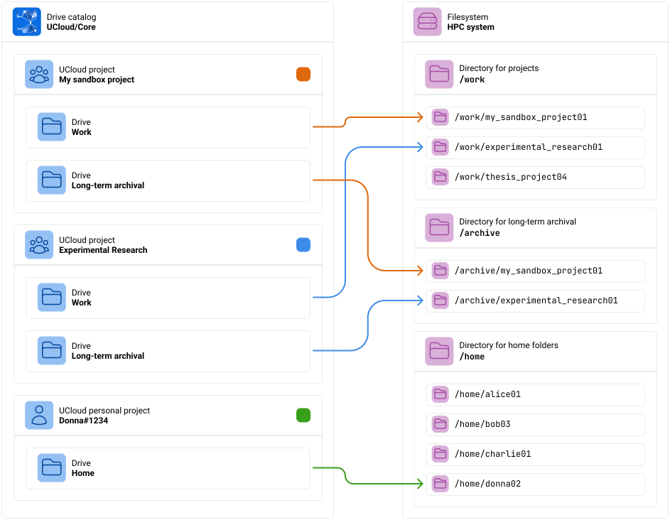
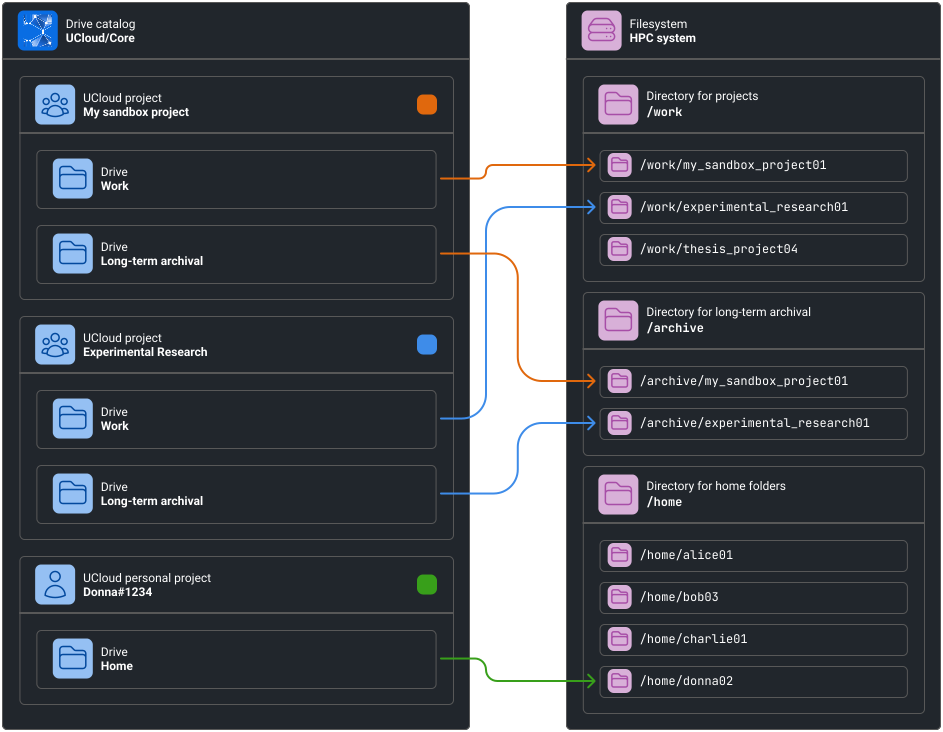

# Filesystem Integration

In this chapter we are going to cover how UCloud/IM for Kubernetes integrates with your local distributed filesystem. We
will start by covering the concept of UCloud drives and how these are mapped to your local environment.

## Software and Hardware Requirements

UCloud/IM for Kubernetes targets POSIX-compliant distributed filesystems. It will use the standard APIs to open, close,
read and write to both files and directories. In other words, any normal filesystem on which you can run your normal
command line tools should be compatible with UCloud/IM.

<figure>

```terminal
$ cd /home/donna01
$ echo 'Hello' > file.txt
$ cat file.txt
Hello
$ ls -la
total 2
drwxr-x---  2 donna01 donna01 4096 Jul 12 10:38 .
drwx------ 15 donna01 donna01 4096 Jul 12 10:38 ..
-rw-r-----  1 donna01 donna01    6 Jul 12 10:38 file.txt
$ rm file.txt
$ ls -la
drwxr-x---  2 donna01 donna01 4096 Jul 12 10:38 .
drwx------ 15 donna01 donna01 4096 Jul 12 10:38 ..
```

<figcaption>

UCloud/IM targets POSIX-compliant filesystems. If you can use the normal command-line tools to interact with it, then
it should work.

</figcaption>

</figure>

UCloud/IM for Kubernetes do not utilize local users for enforcing authorization. Instead, it relies entirely on the
mechanisms implemented in the integration module itself. As a result, it is critical that end-users are never given
direct access to the file-system. Users must only be able to access this part of the file-system through UCloud.

## Virtual Drives

UCloud has a concept of (virtual) drives. A drive in UCloud is simply a named entrypoint to your files, UCloud itself
does not impose any requirements on what a drive is specifically backed by, only that it is a meaningful entrypoint.

In most HPC environments, we commonly find a few different entrypoints. For example, you might have a `/home`
folder containing your own personal files. On top of that, you usually have a different entrypoint when you are
collaborating with others. This could, for example, be one or more shared project workspaces stored in different
folders.

In order to explain this better, we will be looking at an example from the point-of-view of our test user
`Donna#1234`. Donna is currently a member of three projects: "My sandbox project", "Experimental research" and a
personal project (a special type of project containing exactly one member).

<figure class="diagram">




<figcaption>

Donna is a member of three different projects. Each project has its own set of drives. Each drive is mapped to a
specific folder on the system's filesystem. 

The colored square next to each project indicate the color of the corresponding arrows.

</figcaption>
</figure>

UCloud/IM for Kubernetes utilize the following structure for root-directories:

1. `/home`: A directory for personal workspaces. These are created by default when a user is granted a storage allocation.
2. `/projects`: A directory for projects. These are created by default when a project is granted a storage allocation.
   1. `/projects/$ID/Members' Files`: A directory containing member files. Automatically created when a user joins a project (which has an allocation).
3. `/collections`: A directory for drives created manually by users. These are identified by the UCloud ID.

## Configuring the file system

The filesystem must be configured in both the Helm chart as well as the configuration. The configuration between these
must also be consistent.

In the Helm chart, the file system is referenced through two separate PVCs:

- `ucloud-user-data` (namespaced with the integration module)
- `ucloud-apps-user-data` (namespaced with user apps)

Both PVCs must map to the same distributed file-system as described above. The `ucloud-user-data` PVC is automatically
mounted by the Helm chart into the deployment at `/mnt/storage`. The mount location must be reflected in the
configuration file as well. By default, we recommend that you use the following configuration snippet to configure
the file-system, you can read the [reference](./config-reference.md) for more information on how to tweak it.

<figure>

```yaml
services:
  type: Kubernetes
  
  fileSystem:
    name: "storage"
    mountPoint: "/mnt/storage"
    trashStagingArea: "/mnt/storage/trash"
    claimName: "ucloud-user-data"
    scanMethod:
      type: Walk

```

<figcaption>

Default configuration of the file-system matching the Helm chart.

</figcaption>

</figure>
