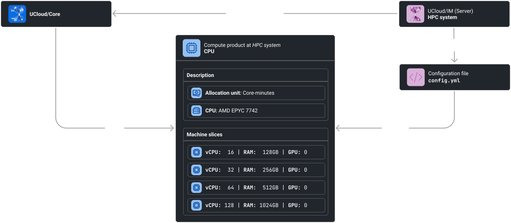

# Accounting and Resource Management

UCloud's accounting and allocation model is designed to do three things: control access to provider services, track
consumption at the workspace level, and support reporting and historical usage views. 

Access to compute and storage is granted through allocations. A workspace (personal workspace or project)
must generally hold a valid allocation before UCloud will allow requests for a given product category to be forwarded to
a provider. 

An allocation implies:

- **Scope:** It applies to a specific product category (e.g., one class of compute vs another). 
- **Validity window:** It has a start and end date; outside that window it is invalid. 
- **Quota:** It carries a quota that bounds consumption. 

UCloud's role is to check that an appropriate allocation exists and to help providers stay informed about quota status.
Enforcement is ultimately the provider's responsibility, since the provider has the most accurate view of the underlying
resources and runtime conditions. 

Allocations are also hierarchical: a root allocation can be subdivided into child allocations, enabling projects (and
sub-projects) to delegate budgets to smaller efforts. UCloud allows over-allocation in sub-allocations, but ensures the
combined usage within an allocation tree cannot exceed the quota defined at the root. 

## Requesting and granting allocations

In practice, users obtain allocations via grant applications, which act as the primary workflow for allocating resources
to a workspace or project. The user-facing form captures the same fundamentals developers need to understand: which
workspace/project should receive resources, the allocation period, and which providers/products are being requested. 

<figure class="diagram">

<figcaption>

UCloud has an advanced system for managing resource allocations. This system used in combination with UCloud/IM allows
for fully automatic management of users, projects and resource allocations.

</figcaption>
</figure>

The process is as follows:

1. **A user submits a grant application.** The application describes the project and along with it a
   request for resources at one or more service providers. At this point, because the user has no resources
   at `HPC system` they cannot consume any of the resources. Not until a user has been granted a resource allocation can
   they use a service provider.

2. **A grant-approver decides to accept the application.**  Who can approve application is up to the service provider. A
   service provider can decide to manage all applications themselves, or they can delegate this responsibility to
   someone else.

3. **The resources created from the successful application are registered in UCloud/Core.**

4. **UCloud/Core notifies the service provider.** Whenever a workspace is updated with respect to their resource
   allocations, a notification is sent to the service provider. The message is intercepted and
   handled by UCloud/IM (Server). A user mapping is not yet established.

5. **The user connects with the provider.** Once a user has received at least one resource allocation at a provider,
   they are allowed to connect to it. The user connects to the provider by clicking the appropriate button in the UCloud
   user-interface. This will send a message to the service provider (authenticated by UCloud/Core).

6. **The service provider synchronizes the UCloud identity with the local identity database.** The result of this is
   dependent on the concrete integration running at the service provider.

## Products

UCloud models products as the concrete resources that service providers make available through the platform. Products
categories are the units that users request through grants, that are allocated to personal workspaces or projects, and
that are later consumed when running applications or storing data. Each product is identified within the context of the
provider and the category it belongs to, which allows multiple providers to offer similar kinds of resources without
conflict.

Products are grouped into categories that define the overall behavior of a class of resources. Categories determine how
usage is measured and accounted for, whether resources can be subdivided across projects, and whether consumption
requires an explicit allocation. This separation allows providers to evolve their offerings over time while keeping
accounting and policy rules stable.

UCloud supports the following product types:

- **Compute products** represent execution capacity. They typically describe machine resources such as processing power
  memory and optional accelerators.
- **Storage products** represent data capacity. They are usually constrained by quotas and may be allocated as a fixed
  amount or accounted for over time depending on provider policy.
- **Public link products** represent access to DNS entries.
- **License products** represent access to licensed software.
- **Network IP** products represent networking resources such as public IP addresses.

Accounting is defined at the category level rather than per product. Each category specifies the unit used to measure
consumption and whether usage is charged once or over time. This makes it possible to support time based resources
capacity based resources and fixed assets within a single accounting framework.

Products are best illustrated by taking a concrete example for compute products. A product category or, as we will refer
to them in this context, a machine type is the unit for which you can receive a resource allocation. Machine types
bundle together machines that have similar hardware. For example, if a system have three types of nodes in the HPC
system then at least three different machine types are required. A machine type defines several machine slices, also
known as a _product_ in the rest of UCloud. Such a slice describes the concrete specification of the slice which
includes the number of cores, the amount of RAM and the number of GPUs connected to it.

<figure class="diagram">

<figcaption>

Machines types (`ProductCategory`) and machine slices (`Product`) define the services of a provider. 

</figcaption>
</figure>

## Glossary and developer quick-start

The relevant code can be found in the Core and in the shared project. We recommend you start here:

- **API and models:**
    - **Products:** `shared/accounting/products.go`
    - **Accounting:** `core2/accounting/accounting.go`
    - **Grants:** `core2/accounting/grants.go`
- **Implementation:**
    - **Products:** `core2/accounting/products.go`
    - **Accounting:** `core2/accounting/accounting_internal.go`
    - **Grants:** `core2/accounting/grants.go`

**Glossary:**

| Term              | Description                                                                                                                                |
|-------------------|--------------------------------------------------------------------------------------------------------------------------------------------|
| Product category  | Logical grouping of products. Used as the target of resource allocations and usage reporting.                                              |
| Product           | A concrete service offered by a service-provider. Products are bundled together into categories.                                           |
| Allocation        | An allocation grants a workspace access to consume a service from a provider. Allocations are hierarchical and point to a parent _Wallet_. |
| Allocation group  | A set of allocations in a _Wallet_ all pointing to the same _parent_.                                                                      |
| Wallet            | An abstraction collecting all allocations that are scoped to a specific product category and belonging to a specific workspace.            |
| Grant application | An application sent to a grant approver which requests that certain sub-allocations are created.                                           |
