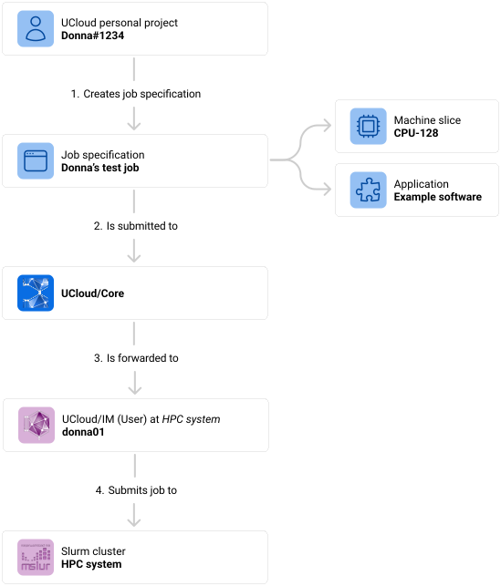

# Orchestration

UCloud orchestrates provider functionality by treating almost everything the user can create or manage as a resource. A
resource is a platform level record that represents some provider backed capability, such as _a job, a storage drive, a
public link, a public IP, or a software license_. UCloud uses this abstraction to coordinate work between UCloud/Core
and a service provider, so users can interact with different providers through the same concepts and the same kind of
lifecycle. 

The key ideas are:

- **A stable identity is attached to all resources.** Even when the provider also has its own internal identifier for
  the same thing. This makes it possible to browse, audit, and reference resources consistently across providers. 
- **Resources are tied to a provider specified product.** That product choice determines what the provider is expected
  to supply and what accounting rules apply. This is how UCloud connects orchestration to allocations and quotas without
  baking provider details into the user experience. 
- **UCloud keeps a catalog of resources.** This catalog allows many read and listing operations to be served by
  UCloud/Core without contacting the provider every time, while still keeping the provider in the loop for changes and
  execution. 
- **Resources have ownership and permissions.** Ownership is always a single workspace context, either personal or a
  project. Permissions are role based and are typically managed through project groups, which supports collaboration
  without requiring provider specific access control models. 
- **Resources evolve over time through updates.** Providers can report changes, and those changes are reflected
  back to users through a consistent status model rather than provider specific state machines. 

The job submission flow in the user interface is a concrete example of this orchestration model in action. Users start
from an application entry and configure a run, but the orchestration hinges on selecting a machine type that maps to
products available in the active workspace and on the chosen provider. 

UCloud extends orchestration beyond the core job itself by letting users attach additional provider backed
resources to a run when the app and provider support it. Examples include custom public links for interactive web
interfaces and public IP addresses for externally reachable services. These are separate resources with their own
lifecycle and permissions, but they can be associated with a job to compose a complete runnable environment. 

The diagram below summarizes the significant steps involved in the submission of a job.

<figure class="diagram">

<figcaption>

Figure showing the flow from a user submitting a job, going through UCloud/Core, and ending up at the service provider
(UCloud/IM).

</figcaption>
</figure>

1. **The end-user creates a job specification.** This step is typically done through the UCloud user-interface where
   the user can select from an application catalog. Once selected, the user will be selected with a variety of input
   parameters. These input parameters can be specific to the software, while others are related to how it should be
   scheduled.
2. **The job specification is submitted to UCloud/Core.** Once the specification has been created, a network call is
   made to UCloud/Core. This call is authenticated as the user's UCloud identity. Along with the request is also
   information about which project it should be executed as.
3. **UCloud/Core validates the request and forwards it to the relevant provider.** UCloud/Core will validate,
   authenticate and authorize all parts of the request. Once done, it will find the appropriate service provider based
   on the request and forward the message.
4. **UCloud/IM accepts the job and passes it along to the underlying compute infrastructure.**

## Glossary and developer quick-start

| Term                  | Description                                                                                                                                               |
|-----------------------|-----------------------------------------------------------------------------------------------------------------------------------------------------------|
| UCloud/Core           | The central component hosting the UCloud platform. This is the primary contact point for UCloud's user-interface. Start in `core2/`.                      |
| Service-provider (SP) | A provider of compute or storage resources to UCloud. Usually implemented via UCloud/IM.                                                                  |
| UCloud/IM             | The software implementing the provider API. Responsible for implementing storage and compute services.                                                    |
| Resource              | A resource, often backed by a service provider, implements the core abstraction for managing a shared entity. Start in `core2/orchestrator/resources.go`. |
| Orchestration         | Term used to describe the communication between UCloud/Core and UCloud/IM. Start in `core2/orchestrator/resources_orchestration.go`.                      |
