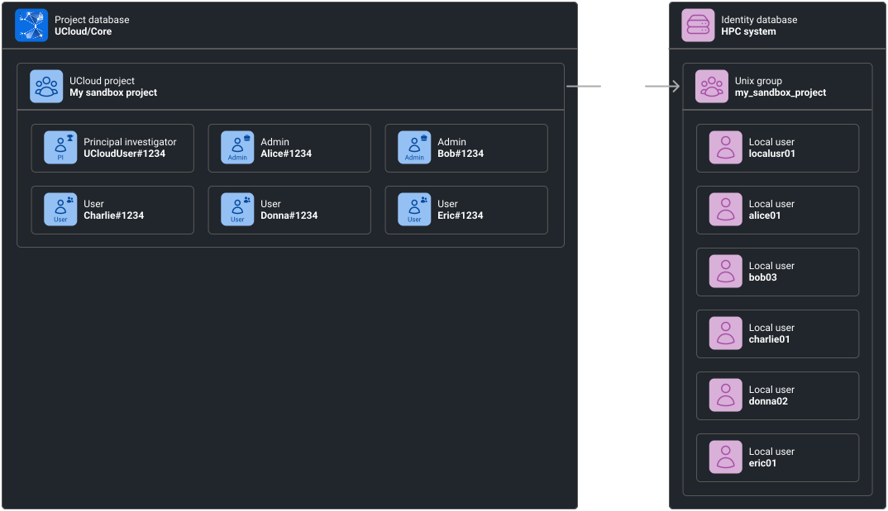

# Projects

UCloud's project model is the foundation for collaboration, resource allocation, accounting, and access control across
the platform. From a developer perspective, projects act as logical workspaces that group users, define resource
boundaries, and provide contextual scope for operations. Each request in UCloud is executed within the context of a
particular project, which determines the resources and permissions available for that action. If no project context is
specified, operations run in the user's personal scope, known as the personal workspace.

A project consists of a collection of members with defined roles. Every project includes exactly one Principal
Investigator (PI) who is responsible for managing the project, adding and removing members, and approving grant
applications for resources. Projects can also include administrators and regular members, each with progressively
limited management privileges.

Within a project, users can organize collaborators into groups, which serve as finer-grained permission units.
UCloud automatically maintains special groups (such as “All Users”) that providers use when registering and resolving
resource access.

Projects are also the core target for accounting and resource allocation. When a project is approved, it is allocated
products such as compute, storage, software licenses, or public IPs. The PI and project administrators can view and
manage these allocations through UCloud's management interface, and statistics about usage over time are available for
monitoring and reporting.

Projects are, in some cases, also synchronized with service providers. For example, using the UCloud/IM for Slurm-based
HPC integration, users and projects are mapped directly to their Unix equivalent. This is illustrated below and
explained more in-depth in the corresponding documentation.

<figure class="diagram">

<figcaption>

UCloud projects are sometimes mapped into corresponding Unix groups.

</figcaption>
</figure>

Projects are primarily created through grant applications, as explained in the [next chapter](./accounting.md).

## Glossary and developer quick-start

The relevant code can be found in the Core and in the shared project. We recommend you start here:

- **API and models:** `shared/foundation/projects.go`.
- **Implementation:** `core2/foundation/projects.go`.

**Glossary:**

| Term           | Description                                                                                            |
|----------------|--------------------------------------------------------------------------------------------------------|
| Project        | Shared collaboration space. Consists of project groups and members.                                    |
| Project member | A member of a project. Each member has a role (PI, admin or user). Each project has exactly 1 PI.      |
| Project group  | A sub-division of members in a project. Members of a group must be a member of the associated project. |
| Invite         | An invitation sent directly to a user to participate in a project collaboration.                       |
| Invite link    | A link usede to join a project. Preferred over direct project invites due to ease of use.              |
