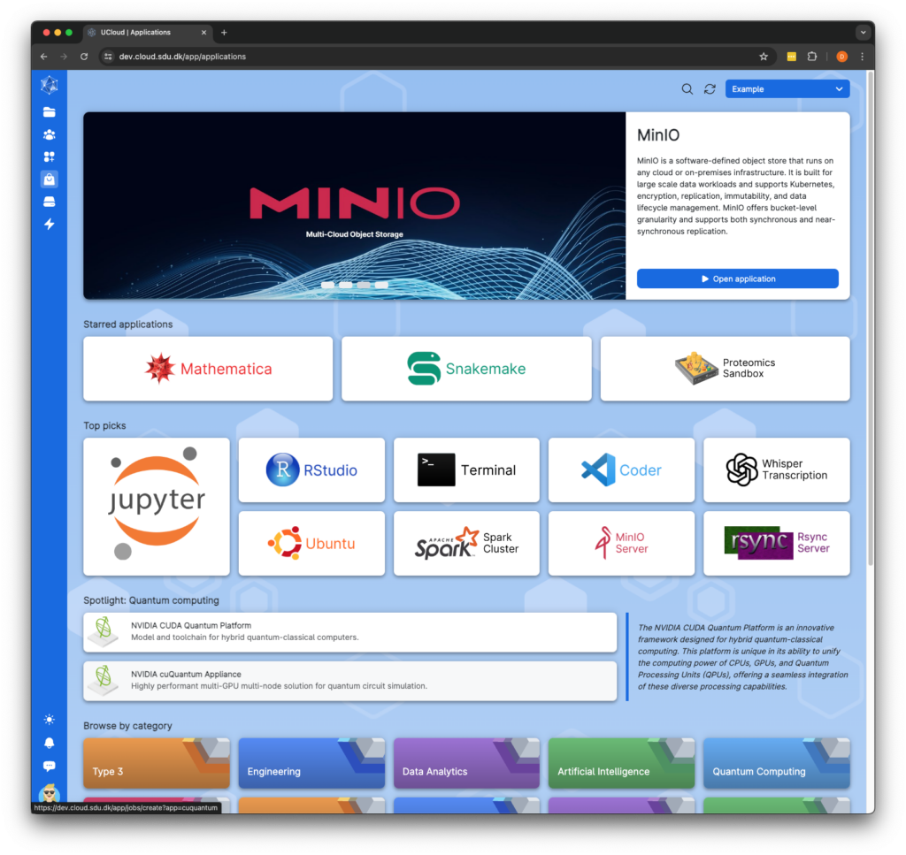
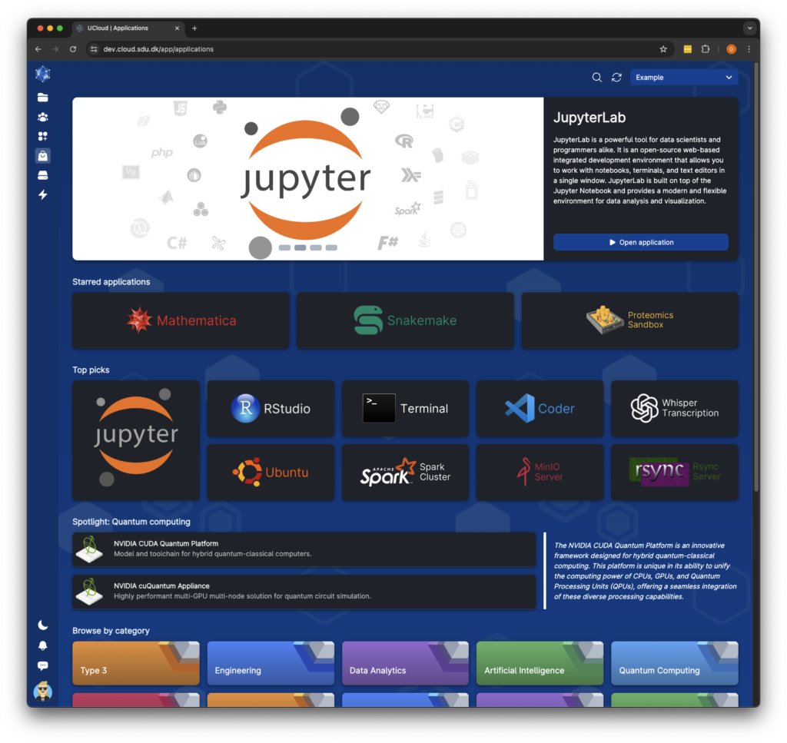
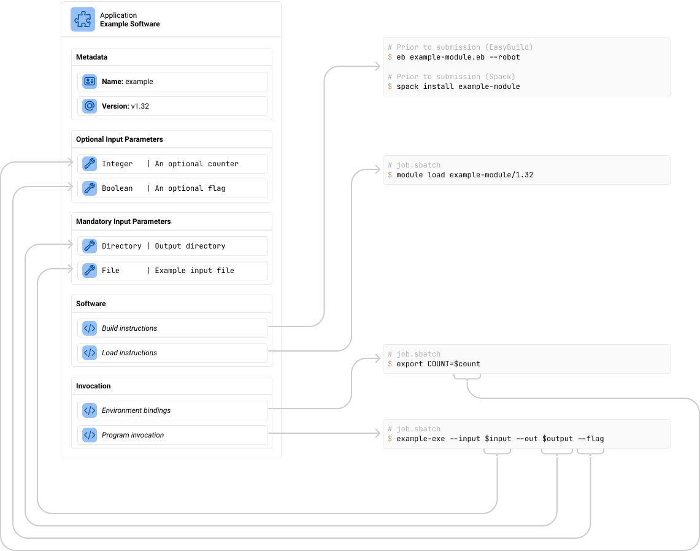
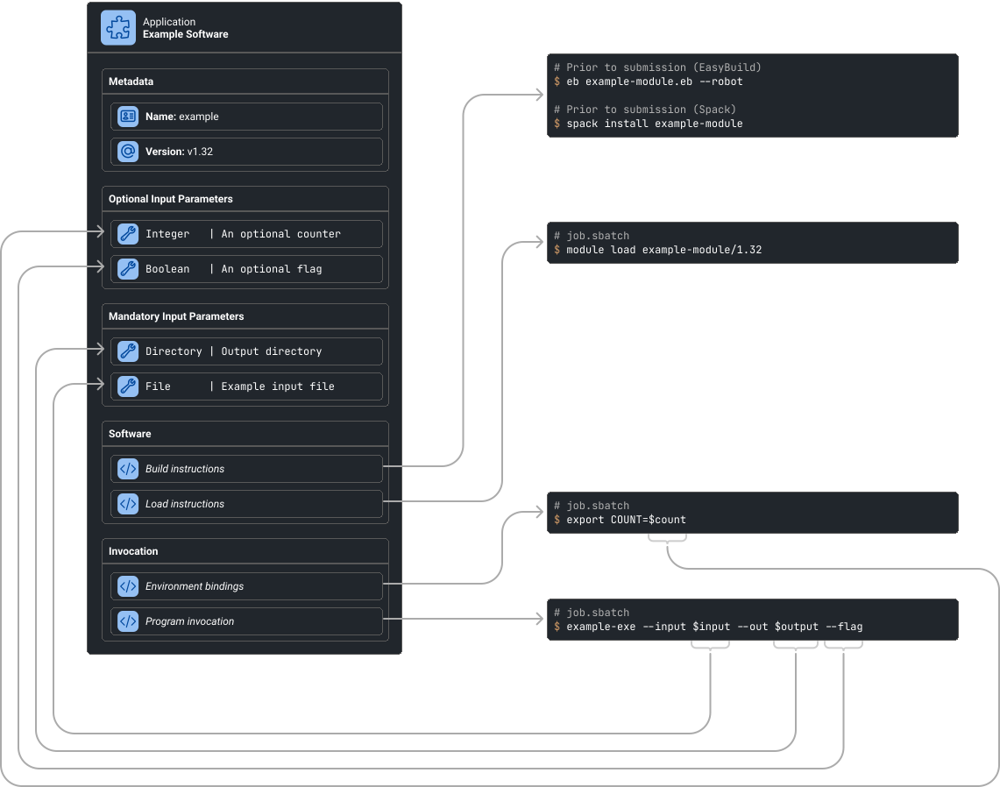
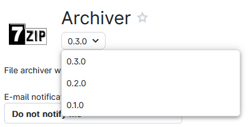
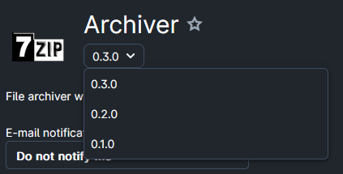
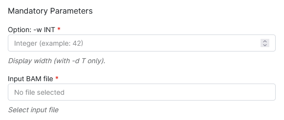
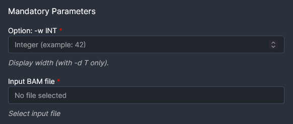

# Application management

This chapter will contain a description of how to upload and manage applications for a service provider. UCloud provides
a catalog of applications which a service provider can subscribe to, assuming that they live up to certain
infrastructure requirements.

## The Application Catalog

The UCloud application catalog enables users to browse a comprehensive list of available software. Each application
within the catalog is a UCloud abstraction that defines a piece of software, its parameters, and its startup process.
Service providers have dedicated storefronts where they can upload applications compatible with the UCloud system. These
storefronts are customizable, allowing providers to organize applications into categories, post announcements about new
applications, and highlight important applications. For more information, refer to the 
[Application Catalog documentation](../ops/app-catalog.md).

UCloud maintains an up-to-date catalog of applications commonly used in high-performance computing systems.
Detailed instructions on configuring these applications are available [here](./built-in-apps.md).

<figure class="mac-screenshot">




<figcaption>

The UCloud application catalog showing a selection of applications available at a service provider.

</figcaption>
</figure>

## The Structure of an Application

UCloud applications describe how to obtain, load and invoke a piece of software. This information is supplied in a YAML
document which has several sections. These sections are illustrated in the diagram below.

<figure class="diagram">




<figcaption>

An application describes how to obtain, load and invoke a piece of software. This also includes a list of input parameters,
both optional and mandatory which can be fed into the application.

</figcaption>
</figure>

### Metadata

All applications contain a small section of metadata. This metadata includes an application name and version. These
together form a unique identifier, which is transmitted to the service provider letting it know which application is
being started.

The UCloud user-interface allows users to quickly swap between versions of the same application, as shown in the
screenshot below. This also means that the name of an application should be considered stable. The name of an
application is generally not shown directly to end-users. Instead, a title is used which can be managed independently
via the [management interface](../ops/app-catalog.md).

Versions are ordered in UCloud based entirely on when they are uploaded to the platform. Thus the newest version is
always considered to be the most recently uploaded version.

<figure>




<figcaption>

The version selector allows users to quickly switch between versions of an application.

</figcaption>
</figure>

### Build Systems and Software Loading

TODO

### Input Parameters 

The input parameters of an application describe the input which a user can feed into it. Each input parameter type has
an associated widget in UCloud specialized for that type of input. The exact types supported are listed in the
[reference](#parameters). Input parameters can be either optional or mandatory. Their values are partially validated by
UCloud before being forwarded to the service provider.

The values of the input parameters are fed into the invocation sections.

<figure>




<figcaption>

A selection of input parameters shown in the UCloud user-interface.

</figcaption>
</figure>

### Invocation

The invocation sections accept the user input and produce output in the job submission script. This includes changes to
the sbatch directives, binding environment variables and finally invoking the actual software. The invocation sections
are written using [Jinja2](https://jinja.palletsprojects.com/en/3.0.x/templates) templates. Refer to the reference and
examples for details on how to write these.

### Interactive Properties

Applications can also declare support for various interactive application backends. This includes web-based applications
and remote desktop applications. These are shown in some of the examples below, but are not covered in this chapter.
Instead please refer to the [dedicated chapter](./interactive-jobs.md).

## Examples

<div class="tabbed-card">

<div data-title="Hello world">

<figure>

````yaml
{{#include app_example.yaml}}
````

</figure>
</div>

<div data-title="Minimal">


<figure>

````yaml
{{#include app_minimal.yaml}}
````

<figcaption>

This example shows the absolute minimum required to create an application. This example is intended to show which
section are mandatory and which are optional.

</figcaption>
</figure>
</div>

<div data-title="MPI">
<figure>

````yaml
{{#include app_mpi.yaml}}
````

<figcaption>

An example showing how to launch an MPI program with through a UCloud application.

</figcaption>
</figure>
</div>

<div data-title="Web">
<figure>

````yaml
{{#include app_web.yaml}}
````

</figure>
</div>

<div data-title="Dynamic loading">
<figure>

````yaml
{{#include app_dynamic.yaml}}
````

</figure>
</div>

<div data-title="Template injection">

UCloud/IM for Slurm allows for injecting templates from the service configuration into any Jinja2 template. In this
example, we show how to use this to configure a global preamble and postamble for applications. These have to be
configured in each application which require them.

Assume that the following template snippets are defined in the configuration:

<figure>

```yaml
# /etc/ucloud/config.yaml
slurm:
  applications:
    templates:
      myGlobalPreamble: >
        
        module load extra-packages
        

        
        module load gpu-packages
        
      
      myGlobalPostamble: >
        echo "This is the postamble!"
```

</figure>

These can be consumed from any application requiring them by using the syntax: `{- templateId -}`.

<figure>

````yaml
{{#include app_injection.yaml}}
````

</figure>
</div>


</div>


## Reference

### Metadata

The metadata section provides basic metadata about the document and the application contained within. This section
is mandatory and placed at the top-level.

<div class="table-wrapper no-code-wrap">
<table>
<thead>
<tr>
<th>Property</th>
<th>Type</th>
<th>Description</th>
</tr>
</thead>
<tbody>

<tr>
<td><code>application</code></td>
<td>&mdash;</td>
<td>

Must be equal to `v2`.

</td>
</tr>

<tr>
<td><code>name</code></td>
<td><code>string</code></td>
<td>

The name of an application. This name must be unique, for a given application and remain stable across different
versions of the application. By convention, this name should be written using lower-kebab-case. The name must not
contain any type of whitespace.

</td>
</tr>

<tr>
<td><code>version</code></td>
<td><code>string</code></td>
<td>

The version of an application. There can only be one application with a given `(name, version)` tuple. Attempting to
re-create an application with the same version is not allowed.

</td>
</tr>

</tbody>
</table>
</div>

### Parameters

The parameters section contains the input parameters for a given application. Parameters are supplied in the
`parameters` top-level section. The top-level section has a type of `map<string, parameter>` where the key is the name
of the parameter. The `parameter` type is defined in this section.

<div class="table-wrapper no-code-wrap">
<table>
<thead>
<tr>
<th>Property</th>
<th>Type</th>
<th>Valid for</th>
<th>Description</th>
</tr>
</thead>
<tbody>

<tr>
<td><code>type</code></td>
<td><code>string</code></td>
<td><i>All</i></td>
<td>

The type of parameter. This controls the widget used in the UCloud user-interface along with validation logic. The type
supplied controls how some properties of a parameter works. See the "Valid for" column in this table. The following
types are available:

| Type            | Description                                                                                                                      |
| --------------- | -------------------------------------------------------------------------------------------------------------------------------- |
| `File`          | Displays a file selector widget. Only a single file can be selected with this parameter.                                         |
| `Directory`     | Display a folder selector widget. Only a single folder can be selected with this parameters.                                     |
| `Integer`       | An integer widget. Optional minimum and maximum values can be selected.                                                          |
| `FloatingPoint` | A floating point number widget. Optional minimum and maximum values can be selected.                                             |
| `Boolean`       | A boolean (on/off) widget.                                                                                                       |
| `Text`          | A text input field which can contain a single line of text.                                                                      |
| `TextArea`      | A text input field which can contain multiple lines of text.                                                                     |
| `Enumeration`   | An input field which allows the user to select from a number of pre-defined options.                                             |
| `License`       | Displays a widget for selecting a license to attach to the job.                                                                  |
| `Job`           | Displays a job selector widget. This allows a user to select a companion job. This option is not used for the Slurm Integration. |
| `PublicIP`      | Displays a widget for selecting a public license to attach to the job. This option is not used for the Slurm integration.        |

</td>
</tr>

<tr>
<td><code>title</code></td>
<td><code>string</code></td>
<td><i>All</i></td>
<td>

A human-readable title used for this parameter. This property should be short (less than 120 characters) and be
limited to a single line.

</td>
</tr>

<tr>
<td><code>description</code></td>
<td><code>string</code></td>
<td><i>All</i></td>
<td>

A human-readable description used for this parameter. The description can use limited markdown for markup, but it
cannot use any HTML tags or references to external resources. The first-line is always shown without further interaction
from the user. Lines beyond the first might require user interaction to show.

</td>
</tr>

<tr>
<td><code>optional</code></td>
<td><code>boolean</code> (optional)</td>
<td><i>All</i></td>
<td>

Default value: `true`

This property controls if a parameter is mandatory or not. If this property is not supplied or if
it is supplied with a value of `true`, then the parameter is considered optional. Otherwise, it is considered to be
mandatory and a job cannot be submitted with this application without supplying a value for the parameter.

</td>
</tr>

<tr>
<td><code>defaultValue</code></td>
<td><i>Varies</i> (optional)</td>
<td><i>All</i></td>
<td>

Default value: `null`

This property controls the default value of a parameter. The default value is used _only_ if a
parameter is optional and no value is supplied for the parameter. The type of the property should match the type of
parameter. It is not possible to set default values for files or directories.


</td>
</tr>

<tr>
<td><code>min</code></td>
<td><code>int/float</code> (optional)</td>
<td><code>Integer</code>, <code>FloatingPoint</code></td>
<td>

Default value: `null`

This property controls the minimum value (inclusive) a numeric type can have.

</td>
</tr>

<tr>
<td><code>max</code></td>
<td><code>int/float</code> (optional)</td>
<td><code>Integer</code>, <code>FloatingPoint</code></td>
<td>

Default value: `null`

This property controls the maximum value (inclusive) a numeric type can have.

</td>
</tr>

<tr>
<td><code>step</code></td>
<td><code>int/float</code> (optional)</td>
<td><code>Integer</code>, <code>FloatingPoint</code></td>
<td>

Default value: `null`

This property controls the step size of clicking increment/decrement buttons in the user-interface for numeric inputs.

</td>
</tr>

<tr>
<td><code>options</code></td>
<td><code style="white-space: wrap">{ title: string, value: string }[]</code></td>
<td><code>Enumeration</code></td>
<td>

This property controls the options to show in the user-interface for an enumeration. Only options present in this
property can be selected by the user.

If a `defaultValue` is also defined then this must match the `value` of a valid option.

</td>
</tr>


</tbody>
</table>
</div>

### Software

The software section contains information about how to (optionally) build software along with information about how
to load the software. This is supplied in the `software` top-level section.

<div class="table-wrapper no-code-wrap">
<table>
<thead>
<tr>
<th>Property</th>
<th>Type</th>
<th>Description</th>
</tr>
</thead>
<tbody>

<tr>
<td><code>type</code></td>
<td><code>string</code></td>
<td>

Must be `"Native"` for application used in the UCloud/IM for Slurm integration.

</td>
</tr>

<tr>
<td><code>build</code></td>
<td><code>object</code><br>(optional, see below)</td>
<td>

Default value: `null`

Contains information on about how to optionally build the software. If this property is not supplied, then it is
assumed that no build procedure is required.

</td>
</tr>

<tr>
<td><code>load</code></td>
<td><code>object</code><br>(optional, see below)</td>
<td>

Default value: `null`

Contains information about how to load a specific piece of software. If this property is not supplied, then it is
assumed that no load procedure is required and that the software can be run without any additional commands.

</td>
</tr>

</tbody>
</table>
</div>

### Software - Build

The software build section contains information about how to build software along. It is supplied in the
`software.build` section. The build procedure itself is optional and only executed when it is not possible to load
the software. Each method of loading the software is capable of determining if the software is already present, if
it is not then the build procedure is executed.

The build procedure is always executed on the node running the integration module. For software which is defined by
a system/built-in repository this is also executed as the `ucloud-software` user. For software defined by a user
(TODO not currently possible), this is executed in the context of the project launching the job.

_Click the tabs below to switch between different systems for building software._

<div class="tabbed-card">

<div data-title="EasyBuild">

<div class="table-wrapper no-code-wrap">
<table>
<thead>
<tr>
<th>Property</th>
<th>Type</th>
<th>Description</th>
</tr>
</thead>
<tbody>

<tr>
<td><code>type</code></td>
<td><code>string</code></td>
<td>

Must be `"EasyBuild"` for applications using EasyBuild.

</td>
</tr>

<tr>
<td><code>repository</code></td>
<td><code>string</code></td>
<td>

Points to a [repository](./config-reference.md) of EasyBuild files. The value should reference the name of a repository.
The repository itself, is configured in the configuration files of the integration module. The repository has a pointer
to a folder which contains the files required for building the software.

</td>
</tr>

<tr>
<td><code>file</code></td>
<td><code>string</code></td>
<td>

The file to build within the repository.

</td>
</tr>

</tbody>
</table>
</div>


</div>

<div data-title="Spack">

<div class="table-wrapper no-code-wrap">
<table>
<thead>
<tr>
<th>Property</th>
<th>Type</th>
<th>Description</th>
</tr>
</thead>
<tbody>

<tr>
<td><code>type</code></td>
<td><code>string</code></td>
<td>

Must be `"Spack"` for applications using Spack.

</td>
</tr>

<tr>
<td><code>repository</code></td>
<td><code>string</code></td>
<td>

Points to a [repository](./config-reference.md) of EasyBuild files. The value should reference the name of a repository.
The repository itself, is configured in the configuration files of the integration module. The repository has a pointer
to a folder which contains the files required for building the software.

To use the built-in repository set the property to `built-in`.

</td>
</tr>

<tr>
<td><code>package</code></td>
<td><code>string</code></td>
<td>

The package to build using Spack. This package is expected to be located within the repository specified.

</td>
</tr>

</tbody>
</table>
</div>
</div>
</div>


### Software - Load

The software build section contains information about how to build software along. It is supplied in the
`software.load` section.

The load step is always executed prior to the program invocation. It is executed in the context of project launching the
job and always within the job itself. That is, the loading step is part of the job submission script. The loading 
procedure is capable of checking, ahead of time, if a piece of software is going to be available. This is checked prior
to submission. If a piece of software is not available, the build procedure is invoked. If the application has no build
procedure associated with it, then the job will fail to launch.

_Click the tabs below to switch between different systems for loading software._

<div class="tabbed-card">

<div data-title="Module">

This mode of loading software uses [Lmod](https://lmod.readthedocs.io/en/latest/).

<div class="table-wrapper no-code-wrap">
<table>
<thead>
<tr>
<th>Property</th>
<th>Type</th>
<th>Description</th>
</tr>
</thead>
<tbody>

<tr>
<td><code>type</code></td>
<td><code>string</code></td>
<td>

Must be `"Module"` for applications using Lmod to load modules.

</td>
</tr>

<tr>
<td><code>modules</code></td>
<td><code>string[]</code></td>
<td>

A list of modules to load prior to submission. These will be passed directly to Lmod.

</td>
</tr>

</tbody>
</table>
</div>
</div>
</div>

### Environment Bindings and Program Invocation

The environment section contains bindings of environment variable needed in a given application. These are supplied in
the `environment` top-level section with a type of `map<string, InvocationString>`. The key is the name of the variable.
The `InvocationString` is defined below.

Similarly, the program invocation is defined in the top-level `invocation` property also of type `InvocationString`.
The program invocation is passed into the job submission script after rendering is complete. Thus the program invocation
will be interpreted by a bash interpreter.

An `InvocationString` is a template string which follows the format of
[Jinja2](https://jinja.palletsprojects.com/en/3.0.x/templates).  Invocation strings bound to environment variables will
have no automatic escaping. Invocation strings which are bound to the program invocation will instead use bash escaping.
Regardless of if it is bound to a program invocation or an environment variable, the same variables and filters are
available.

#### Variables

All input parameters submitted to the job are available at the top-level using the same name as described in the
`parameters` section of the application. If a variable has a default value and none was supplied, then the default value
is made available. It is not possible to detect directly if a user supplied no value if a default is available. Normal
variables can be accessed with the following snippet:

```text
{{ myParameter }}
```

Optional parameters for which the user did not supply a value, and the parameter has no default, will not be made
available in the template. It is possible to detect if no value is supplied with the following snippet:

```text

The optional parameter was not supplied

The optional parameter is {{optionalParameter}} 

```

Metadata about the job is made available through the `ucloud` top-level property. The properties in the `ucloud`
property are also automatically bound to environment variables using the same name but in `UPPER_SNAKE_CASE`. Thus
`ucloud.machine.memoryInGigs` becomes `UCLOUD_MACHINE_MEMORY_IN_GIGS`. The contents of the `ucloud` property is defined in
the table below:

<div class="table-wrapper">
<table>
<thead>
<tr>
<th>Property</th>
<th>Type</th>
<th>Description</th>
</tr>
</thead>
<tbody>

<tr>
<td><code>ucloud.jobId</code></td>
<td><code>string</code></td>
<td>

The UCloud job ID. Note that this is supplied as a string, even though most job IDs are numeric. You should not depend
on the IDs being numeric. The IDs are unique and do not change. An ID is never re-used at a given provider.

**Example:** `"51239184"`

</td>
</tr>

<tr>
<td><code>ucloud.machine.name</code></td>
<td><code>string</code></td>
<td>

The name of the machine slice used for the reservation.

**Example:** `"u1-standard-64"`

</td>
</tr>

<tr>
<td><code>ucloud.machine.category</code></td>
<td><code>string</code></td>
<td>

The name of the machine type (product category) used for the reservation.

**Example:** `"u1-standard"`

</td>
</tr>

<tr>
<td><code>ucloud.machine.cpu</code></td>
<td><code>int</code></td>
<td>

The number of (v)CPUs available to the machine slice. This is retrieved from the product configuration and not from the
actual compute nodes.


**Example:** `64`

</td>
</tr>

<tr>
<td><code>ucloud.machine.cpuModel</code></td>
<td><code>string</code> (optional)</td>
<td>

The model of the CPU available to the machine type used in the reservation. This is retrieved from the product
configuration and not from the actual compute nodes.

**Example:** `"AMD EPYC 7742"`

</td>
</tr>

<tr>
<td><code>ucloud.machine.memoryInGigs</code></td>
<td><code>int</code></td>
<td>

The amount of memory available to the machine reservation in gigabytes. This is retrieved from the product configuration
and not from the actual compute nodes.

**Example:** `512`

</td>
</tr>

<tr>
<td><code>ucloud.machine.memoryModel</code></td>
<td><code>string</code> (optional)</td>
<td>

The model of the memory available to the machine type used in the reservation. This is retrieved from the product
configuration and not from the actual compute nodes.

**Example:** `"DDR4-2400"`

</td>
</tr>

<tr>
<td><code>ucloud.machine.gpu</code></td>
<td><code>int</code></td>
<td>

The amount of GPUs made available to the machine type used in the reservation. This is retrieved from the product
configuration and not from the actual compute nodes.

**Example:** `4`

</td>
</tr>

<tr>
<td><code>ucloud.machine.gpuModel</code></td>
<td><code>string</code> (optional)</td>
<td>

The model of the GPUs available to the machine type used in the reservation. This is retrieved from the product
configuration and not from the actual compute nodes.

**Example:** `"NVIDIA H100"`

</td>
</tr>

<tr>
<td><code>ucloud.webPort</code>/<code>ucloud.vncPort</code></td>
<td><code>int</code> (optional)</td>
<td>

If the application has requested a dynamic port allocation for a vnc/web-interface, then this property will contain a
port which the application is expected to use. The dynamic port will be allocated such that it is highly unlikely to be
in use on the node.

Note that UCloud/IM cannot guarantee that this port is not in use. But UCloud/IM will attempt to not generate duplicates
directly. This won't stop users from, at random, running work listening on the same port. Applications should attempt to
exit immediately in case such a conflict occurs.

Ports are generated in the range between `TODO` and `TODO`.

**Example:** `52382`

</td>
</tr>

<tr>
<td><code>ucloud.nodes</code></td>
<td><code>int</code></td>
<td>

The number of nodes dedicated to the job.

**Example:** `4`

</td>
</tr>


</tbody>
</table>
</div>

#### Filters

The standard built-in filters of Jinja2 are supported along with the following custom filters:

<div class="table-wrapper">
<table>
<thead>
<tr>
<th>Filter</th>
<th>Description</th>
</tr>
</thead>
<tbody>

<tr>
<td><code>flag</code></td>
<td>

**Signature:**

```
boolean_expression | flag(onFlag[, offFlag]) -> string
```

If the value passed into the filter is `True` then the `onFlag` will be produced. Otherwise the `offFlag` will be
produced. If `offFlag` is not specified then `""` is returned instead.

**Example:**

```python
{{ True | flag("--yes", "--no") }}            -> "--yes"
{{ False | flag("--yes", "--no") }}           -> "--no"
{{ True | flag("--yes") }}                    -> "--yes"
{{ False | flag("--yes") }}                   -> ""
```

</td>
</tr>

<tr>
<td><code>option</code></td>
<td>

**Signature:**

```
expression | option(optionFlag[, addSpace]) -> string
```

If the expression is not `None` then a non-positional option is added to the output. If `addSpace` is `True` then a
space is added between the `optionalFlag` and the value. If it is `False` then no space is added. If it is omitted then
a value is automatically chosen based on the option flag. Specifically, if the optionFlag ends in `=` then no space is
added, otherwise a space is added.

This function will always escape the value part for use in bash. Even when bound to an environment variable. If
`addSpace` evaluates to `False` then the option itself is also escaped. The option is _not_ escaped if `addSpace`
evaluates to true.

**Examples:**

```python
{{ None | option("--an-optional-option") }}   -> ""
{{ 42 | option("--count") }}                  -> "--count '42'"
{{ 42 | option("--count=") }}                 -> "'--count=42'"
{{ 42 | option("--count", false) }}           -> "'--count42'"
{{ 42 | option("--count=", true) }}           -> "--count= '42'"
{{ "/path/with spaces" | option("--file") }}  -> "--file '/path/with spaces'"
```

</td>
</tr>

</tbody>
</table>
</div>

#### Methods

The standard built-in methods Jinja2 are supported along with the following custom methods:

<div class="table-wrapper">
<table>
<thead>
<tr>
<th>Method</th>
<th>Description</th>
</tr>
</thead>
<tbody>

<tr>
<td><code>script</code></td>
<td>

**Signature:**

```
script(path) -> string
```

Requests the execution of a script. The script will use the standard script protocol and run in the context of the user
launching the job. The script will receive the same parameters as are available to the template, including all
parameters. Any variables set inside of the Jinja template are _not_ included. The script must return the output in the
following format:

```json
{
    /* string */
    "output": ""
}
```

The output is rendered, _with no escaping applied to it_. Note that this output does not pass back through Jinja and
thus cannot be used to generate templates at runtime.


**Example:**

This example assumes that the machine slice used for the job has the name `u1-standard-64`.

```python
{{ script("/opt/ucloud/scripts/my-script") }} -> "u1-standard-64"
```

```python
#!/usr/bin/env python3
# File: /opt/ucloud/scripts/my-script

import json

with open(sys.argv[1]) as fp:
    request = json.load(fp)

response = { output: request["ucloud"]["machine"]["name"] }
print(json.dumps(response))
```


</td>
</tr>

</tbody>
</table>
</div>


#### Control Structures

The templating engine used for `InvocationString`s supports the control structures of Jinja2, with the following 
exceptions:

- `` has been disabled
- `` has been disabled
- `` has been disabled
- `` has been disabled

Note that as an alternative UCloud offers template injection via the `{- templateId -}` syntax shown in the "Template
injection" example.

### Sbatch

[Sbatch directives](./slurm.md#job-submission) are automatically added for most options which are relevant for a job.
If an application needs to customize these, then this can also be done at an application level. This is done by adding
the top-level `sbatch` property of type `map<string, InvocationString>`. This property follows the same rules of
environment bindings. The directives generally take precedence over the directives generated by UCloud. Some caveats are
covered by the table below:

| Directive                       | Notes                                                                                                                                                                     |
| ------------------------------- | ------------------------------------------------------------------------------------------------------------------------------------------------------------------------- |
| `--account`                     | This directive cannot be changed by an application.                                                                                                                       |
| `--partition`                   | This directive cannot be changed by an application .                                                                                                                      |
| `--constraint`                  | This directive can be changed but can cause conflicts with [Advanced scheduling](./advanced_scheduling.md).                                                               |
| `--output` and `--error`        | This will cause issues with log output in UCloud, but can be changed.                                                                                                     |
| `--cpus-per-task` (and similar) | These can be changed but may produce surprising results. You should adjust other options to ensure that the Slurm resource reservation still matches the one from UCloud. |


### Web Applications

The web-based interactive applications can be configured in the `web` top-level property. It has the following options available to it:

<div class="table-wrapper no-code-wrap">
<table>
<thead>
<tr>
<th>Property</th>
<th>Type</th>
<th>Description</th>
</tr>
</thead>
<tbody>

<tr>
<td><code>enabled</code></td>
<td><code>boolean</code></td>
<td>

If `true`, then this application exposes a web-application. See [interactive applications](./interactive-jobs.md) for
more information. If `false`, then all other properties in this section are ignored.

</td>
</tr>

<tr>
<td><code>port</code></td>
<td><code>int | null</code> (optional)</td>
<td>

Default value: `null`

The port on which the web-application will listen. If set to `null` then dynamic port allocation is used and the port is
exposed through the `ucloud.webPort` template property/`UCLOUD_WEB_PORT` environment variable. Applications running on
Slurm should generally use dynamic port allocation unless the software only supports fixed ports.

</td>
</tr>

</tbody>
</table>
</div>

### Remote Desktop Environments (VNC)

Remote desktop environments (via VNC) can be configured through the `vnc` top-level section. It has the following
properties available to it:

<div class="table-wrapper no-code-wrap">
<table>
<thead>
<tr>
<th>Property</th>
<th>Type</th>
<th>Description</th>
</tr>
</thead>
<tbody>

<tr>
<td><code>enabled</code></td>
<td><code>boolean</code></td>
<td>

If `true`, then this application exposes a web-application. See [interactive applications](./interactive-jobs.md) for
more information. If `false`, then all other properties in this section are ignored.

</td>
</tr>

<tr>
<td><code>port</code></td>
<td><code>int | null</code> (optional)</td>
<td>

Default value: `null`

The port on which the web-application will listen. If set to `null` then dynamic port allocation is used and the port is
exposed through the `ucloud.vncPort` template property/`UCLOUD_VNC_PORT` environment variable. Applications running on
Slurm should generally use dynamic port allocation unless the software only supports fixed ports.

</td>
</tr>

</tbody>
</table>
</div>

