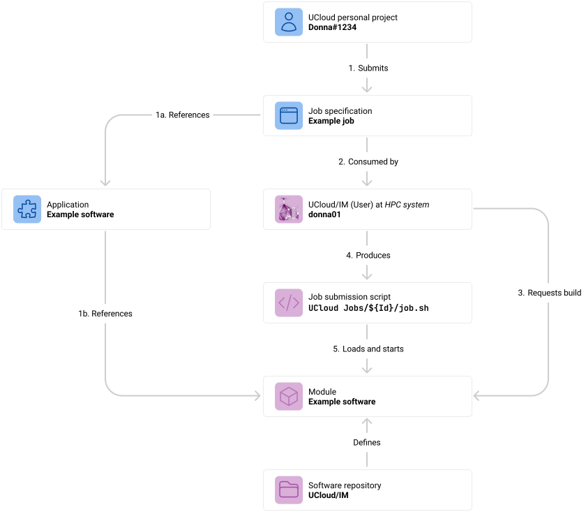
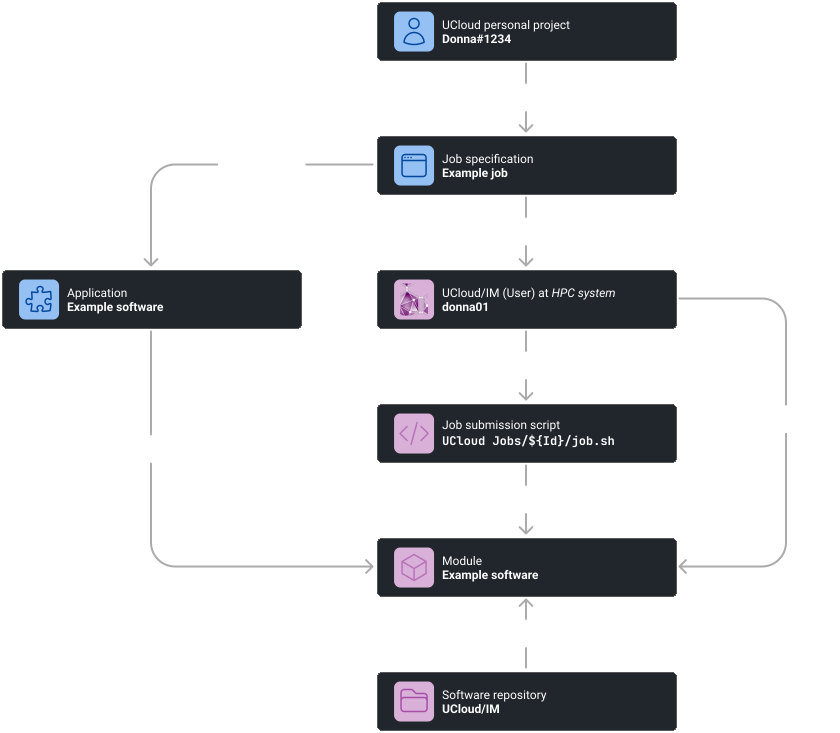
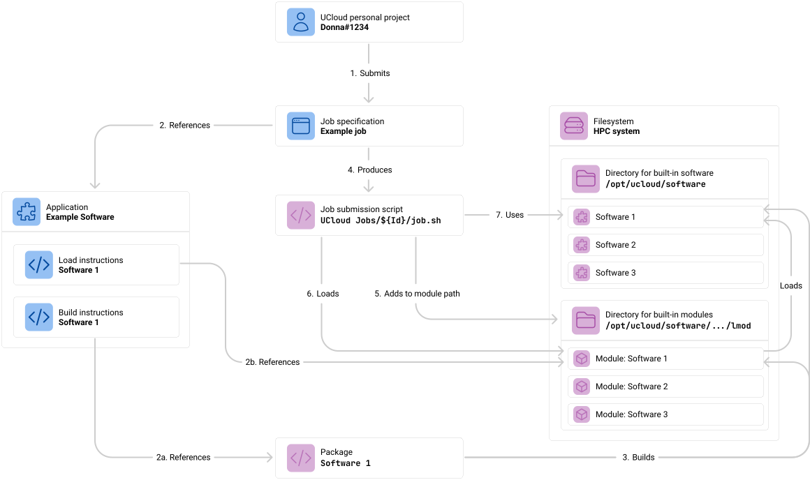
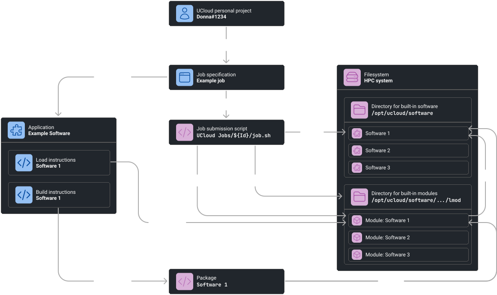
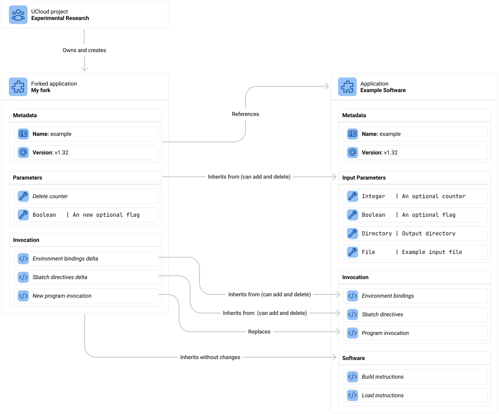
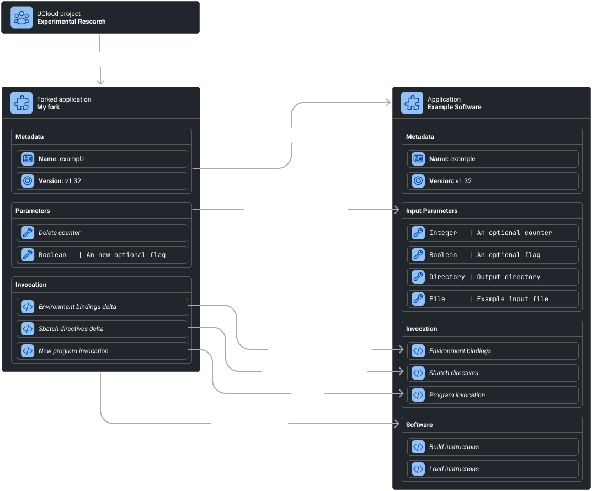
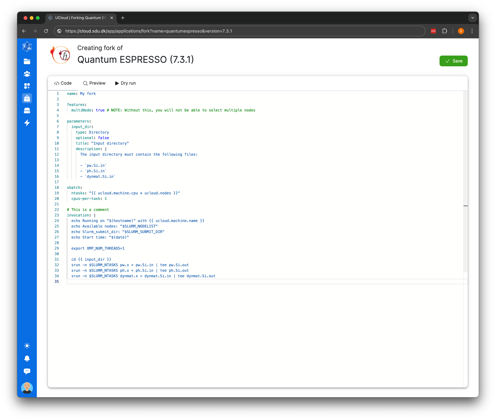
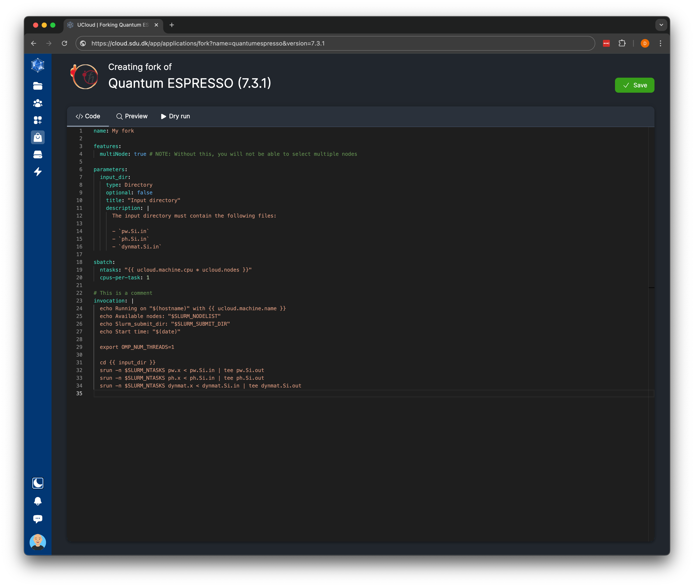

# Built-in Applications

This chapter will cover how to use and configure the built-in applications which UCloud offers for Slurm-based
providers. This chapter assumes familiarity with how applications work. Refer to [this](./app-management.md) for more
details. The built-in applications are optional and can be skipped if they are not a good fit for a given provider.

This chapter will cover the principales of how built-in applications are made. As a result, this chapter is also
recommended reading for anyone wishing to learn about effectively building applications for UCloud.

## Introduction

The built-in application repository is designed to provide end-users with essential applications for the service
provider. Access to the right software is crucial for users to perform their tasks effectively. The repository offers a
diverse selection of software commonly used in HPC environments. Including interactive applications such as JupyterLab
and RStudio, but also a selection of batch software such as Quantum ESPRESSO and GROMACS. A full list of applications
available in the repository can be found [here](./built-in-app-index.md).

The repository maintains its own set of modules, separate from the system-installed software, ensuring a clear
distinction and avoiding conflicts with existing installations.

<figure class="diagram">




<figcaption>

The UCloud/IM built-in software repository provides a range of software modules and applications. Builds of the module
are triggered by UCloud/IM (User) and subsequently loaded through the submission script.

</figcaption>
</figure>


The applications in the repository go through regular testing on various systems. The applications are highly flexible
and can be made to work in almost all HPC environments. Even if you do not meet the recommended requirements, it is
likely that many of the applications can be made compatible with just a few tweaks.

**Recommended system specification:**

<div class="table-wrapper">
<table>
<tbody>

<tr>
<th width="150px">Operating system</th>
<td>

Linux (See the [minimum requirements](./installation.md) for UCloud/IM for Slurm)

</td>
</tr>

<tr>
<th width="150px">Distribution</th>
<td>

TODO Similique est error nulla porro praesentium impedit. Est eum cum vel nihil quam dolor iste iste. A praesentium non
debitis ut. Consectetur totam non consectetur quis. Maxime amet enim autem reiciendis. Ratione assumenda in beatae
beatae optio delectus dolorem.… TODO

</td>
</tr>

<tr>
<th width="150px">Software packages</th>
<td>

The following software packages are required on the _host_:

- Lmod version TODO+
- Bash version TODO+
- TODO
- TODO

</td>
</tr>

<tr>
<th width="150px">Hardware</th>
<td>

No additional requirements beyond the minimum required for UCloud/IM.

The software required for user applications will be built on the same hardware which will run UCloud/IM. Performance
can be impacted by machines with low specs.

</td>
</tr>

</tbody>
</table>
</div>


## Setup and Configuration

The UCloud software repository is enabled by the default installation method, using the following configuration:

<figure>

```yaml
# /etc/ucloud/config.yml
slurm:
    applications:
        repositories:
        - apps.cloud.sdu.dk/slurm
```

<figcaption>

Enabling the UCloud software repository is done through the configuration property `slurm.applications.repositories`.

</figcaption>

</figure>

Once the repository has been enabled, a number of categories and applications will appear in the
[application management interface](../ops/app-catalog.md). If the repository is ever removed from the configuration,
then all of the contained applications will similarly be removed from the provider.

By default, all applications will be publicly available to all users of the system. It is possible to individually put
applications on a deny list, such that they are not public. It is also possible to swap it around, such that all 
applications are unavailable by default and needs to be individually made available. This is illustrated in the 
examples below:

<div class="tabbed-card">

<div data-title="Public by default">
<figure>

```yaml
slurm:
    applications:
        repositories:
        - url: apps.cloud.sdu.dk/slurm
          availability: PublicByDefault
          private:
          - ApplicationName1
          - ApplicationName2
          - ApplicationName3
```

<figcaption>

An example showing how to individually mark applications as private. Note that this uses a slightly more verbose
syntax for adding a repository.

</figcaption>

</figure>
</div>

<div data-title="Private by default">
<figure>

```yaml
slurm:
    applications:
        repositories:
        - url: apps.cloud.sdu.dk/slurm
          availability: PrivateByDefault
          public:
          - ApplicationName1
          - ApplicationName2
          - ApplicationName3
```

<figcaption>

An example showing how to individually mark applications as public. Note that this uses a slightly more verbose
syntax for adding a repository.

</figcaption>

</figure>
</div>

</div>

Applications imported via a repository will have an indicator in the user-interface stating if the application has been
tested on the system. This indicator is meant to show if the service provider has done any testing, beyond the testing
done by the UCloud team, to ensure that the application works well on their system. 


By default, all such applications will be marked as untested. Once a service provider has tested an application, it can be marked/unmarked as tested. If an application is known to not work on the system, then it should be hidden using one
of the methods listed above. The testing status can be set with one of the following commands:

<figure>

```terminal
$ sudo ucloud software compatibility apps.cloud.sdu.dk/slurm/ApplicationName tested
[green]OK🖌️

$ sudo ucloud software compatibility ls
The following applications have been marked as tested to work well on the provider:

- apps.cloud.sdu.dk/slurm/ApplicationName

$ sudo ucloud software compatibility apps.cloud.sdu.dk/slurm/ApplicationName untested
[green]OK🖌️
```

<figcaption>

Applications can be marked as officially tested/untested via the command-line interface. This will cause the UCloud
user-interface to show an appropriate indicator.

</figcaption>

</figure>

## Application Framework

UCloud's application repository is implemented with the use of [Spack](https://spack.readthedocs.io/). Upon activation
of the repository, UCloud will download and maintain its own installation of Spack along with packages from its own
repository. The files used for downloading this software is, by default, found in `/opt/ucloud/software`. 

When a user submits an application, which uses the app repository, it will contain both a set of loading instructions
and a set of building instructions. UCloud/IM (User) will then check if the relevant packages have already been built.
If they have not, then a request is sent to UCloud/IM (Server) requesting compilation. All software is built using Spack
running as the user `ucloudsoftware`. This is a special user created by the [installation](./installation.md) script.
The only purpose of this user is to compile software and subsequently only has access to the relevant files in
`/opt/ucloud/software`. Building of software always takes place prior to the submission of a job. This allows the 
installation to download any required sources from the Internet. The Spack installation is configured to automatically
create module files suitable for Lmod. In the job submission script, after compilation has taken place, the load
instructions are triggered. The load instructions will take care of appending to the module path and loading the correct
modules.


<figure class="diagram">




<figcaption>

TODO

</figcaption>
</figure>

## Customizing Applications

All applications in the UCloud repository are customizable to be able to fit into most HPC systems. This is achieved
using the techniques highlighted in the [Application management](./app-management.md) chapter. In this section we will
cover the general techniques for customizing applications. You can also look at the documentation of the 
[individual applications](./built-in-app-index.md) in the repository to understand how to tweak a single application.

### Customizing Preamble and Postamble

All applications in the UCloud repository allows for the customization of the pre- and postamble of a job submission 
script. This allows service providers to control what happens both before and after the normal application invocation
takes place.

<div class="info-box warning">
<i class="fa fa-warning"></i>
<div>

Remember that there are _no_ guarantees that any of the code in the pre/postamble are executed. The only guarantee that
UCloud/IM provides is that the script will contain the defined pre- and postambles. They can and _will_ sometimes not
fully execute. This can be due to a variety of reasons, such as Slurm cancellation, software or hardware failure.

_Do not depend on the pre/postambles running._

</div>
</div>

<div class="info-box warning">
<i class="fa fa-warning"></i>
<div>

The pre- and postambles are executed in the context of the user. These scripts cannot be used to enforce any kind of
rules on the HPC systems. Any user can circumvent the contents of these scripts by simply logging into the system and
submitting a completely different script.

_Do not depend on the pre/postambles running._

</div>
</div>

Customization of the pre- and postamble is done through the use of [templates injection](./app-management.md). It is
possible to change these both on a global level and a on an application level. All preambles and postambles are optional
and do not have to be defined. Applications found in the UCloud repository will always use the following template:

<figure>

```yaml
application: v2

# NOTE: All other fields have been left out for the sake of brevity.

invocation: |
  {- globalAppPreamble -}
  {- ${ApplicationName}AppPreamble -}

  # ----------------------------------------------------------------------------
  # The normal application invocation goes here
  # ----------------------------------------------------------------------------

  {- ${ApplicationName}AppPostamble -}
  {- globalAppPostamble -}
```

<figcaption>

Applications found in the UCloud app repository uses the above template allowing for easy customization of preambles
and postambles. Keep in mind that these are not guaranteed to run and can be customized/removed by the end-user if they
wish.

</figcaption>

</figure>

Thus for an application called `example`, it is possible to define the pre- and postambles like this:

<figure>

```yaml
# /etc/ucloud/config.yaml
slurm:
  applications:
    templates:
      globalPreamble: |
        echo "This is the global preamble"
    
      exampleAppPreamble: |
        echo "This is the preamble of the application 'example'"

      globalPostamble: |
        echo "This is the global postamble"
    
      exampleAppPostamble: |
        echo "This is the postamble of the application 'example'"
```

<figcaption>

Customization of preambles and postambles take place in the configuration file of UCloud/IM. All preambles and
postambles are optional. They will be included in the job submission scripts of applications that support them. All
applications in the UCloud repository support this convention.

</figcaption>

</figure>

This will produce the following job submission script:

<figure>

```bash
#!/usr/bin/env bash
# NOTE All sbatch directives and module loading have been left out of this file

echo "This is the global preamble"
echo "This is the preamble of the application 'example'"

# ----------------------------------------------------------------------------
# The normal application invocation goes here
# ----------------------------------------------------------------------------

echo "This is the postamble of the application 'example'"
echo "This is the global postamble"
```

<figcaption>

The resulting invocation from the shown configuration. Note that this job submission script does not include any of the
sbatch directives or software loading which normally takes place.

</figcaption>

</figure>

#### Examples

Customization of the preambles and postambles are one of the most powerful ways of ensuring compatibility with
applications on any given HPC system. A collection of examples shown below showcase how to use these capabilities to
tweak application behavior.

<div class="tabbed-card">

<div data-title="Partition modules">

This example is made for a hypothetical HPC environment which requires a different set of modules to be loaded depending
on the partition a given job is submitted to. This can be achieved by configuring the `globalPreamble` using the
`ucloud.partition` property as explained in the [Application management](./app-management.md) chapter.

<figure>

```yaml
# /etc/ucloud/config.yaml
slurm:
  applications:
    templates:
      globalPreamble: |
        
          module load parition/gpu
          {# Other GPU initialization code can go here #}
        
          module load parition/compute
        
```

</figure>

</div>

<div data-title="Application tweaks">

Some application allows for parameters to have their default values changes. This could for example be the degree
of parallelism in a given application. Such numbers are often highly system dependant and thus make sense to change
at a provider level.

In this example, we assume that the application `myApplication` accepts a `parallelismLevel` property, which will be
used as a default in-case the user doesn't provide a value. These properties go through the same evaluation logic as
all other templates, thus this can even depend on which machine type is used.

<figure>

```yaml
# /etc/ucloud/config.yaml
slurm:
 applications:
    templates:
      myApplicationAppPreamble: |
        
          {# 
            NOTE We have found that the parallelismLevel works better on these
            machines if we set it to 64 instead of the default value. The default
            works fine for the other machine types.
          #}
          
        
```

</figure>

</div>

<div data-title="Replacing invocation">

This examples shows how it is possible to completely replace the invocation of an application with something else.
This is a fairly big hammer and should be used with care. This technique uses the fact that is possible to add in our
own invocation, using all of the parameters available to use, before the normal invocation would take place. By ending
the preamble with `exit 0` it is possible to ensure that the bash script does not continue to the normal invocation.
Keep in mind that this will also mean that none of the postambles will run in this case.

_Please read the documentation of the application carefully before doing this._ You can find the application
documentation [here](./built-in-app-index.md).

<figure>

```yaml
# /etc/ucloud/config.yaml
slurm:
 applications:
    templates:
      myApplicationAppPreamble: |
        my-package --these --parameters --need --to --be-different \
          {{ inputDirectory | option("--input-dir") }}
        exit 0
```

</figure>

This will result in an invocation looking like this:

<figure>

```bash
#!/usr/bin/env bash
# NOTE: sbatch and module loading is left out

my-package --these --parameters --need --to --be-different \
    --input-dir '/the/path/to/the/input/directory'
exit 0

# NOTE: This is the normal invocation
my-package --input-dir '/the/path/to/the/input/directory'
```

</figure>

</div>

</div>

### Adjusting Loaded Modules

It is possible to tweak which modules an applications from the UCloud repository loads. This can be done through
the preamble as shown in the earlier section, when new modules are needed. It is, however, also possible to change which
modules are being loaded. This is achieved by changing the configuration variables which can be passed to Jinja
templates. The following convention is used for all applications found in the UCloud repository:

<figure>

```yaml
software:
  type: Native

  build:
    type: Spack
    repository: REPOSITORY_USED_FOR_APP
    fromScript: {{ cfg.buildScript$ApplicationName }}
    packages:
    - "{{ cfg.package$ApplicationName | default('TheApplicationPackage@7.3') }}"

  load:
    type: Module
    fromScript: {{ cfg.loadScript$ApplicationName }}
    modules:
    - "{{ cfg.module$ApplicationName | default('TheApplicationModule/7.3') }}"
```

</figure>

This allows service providers to either change individual packages/modules or replacing them completely by defining an
appropriate script. The [indidividual applications](./built-in-app-index.md) show the exact configuration parameters
used for a given application.

<div class="tabbed-card">

<div data-title="Simple replacement">

The following example shows how to do simple replacement of which package and modules to load.

<figure>

```yaml
# /etc/ucloud/config.yaml
slurm:
  applications:
    variables:
      packageQuantumEspresso: "custom-quantum-espresso-pkg"
      moduleQuantumEspresso: "custom-quantum-espresso-mod"
```

</figure>

</div>


<div data-title="Build script">

When the `fromScript` property is set for build instructions, then all packages and the repository is completely
ignored. Instead, the script is invoked with the same properties as the template would receive. This script should then
return the repository and packages in the following format on `stdout`:

<figure>

```json
{
    /* string */
    "repository": "",

    /* string[] */
    "packages": [
        ""
    ]
}
```

</figure>

The following example script shows how this can be used:

<figure>

```yaml
# /etc/ucloud/config.yaml
slurm:
  applications:
    variables:
      buildScriptQuantumEspresso: /opt/ucloud/scripts/quantum-builder
```

</figure>

<figure>

```python
#!/usr/bin/env python3
# File: /opt/ucloud/scripts/quantum-builder

import sys
import json

with open(sys.argv[1]) as fp:
    request = json.load(fp)

response = {
    "repository": "custom-repository"
    "packages": []
}

version = request["ucloud"]["application"]["version"]
if version == "7.2":
    response["packages"].append("special-quantum@7.2")
else:
    response["packages"].append("quantum-espresso@" + version)

print(json.dumps(response))
```

</figure>

</div>

<div data-title="Load script">

When the `fromScript` property is set for the load instructions, then all modules are ignored. Instead, the
script is invoked with the same properties as the template. The script then returns the modules to load in the following
format on `stdout`:

<figure>

```json
{
    /* string[] */
    "modules": [
        ""
    ]
}
```

</figure>

The following example script shows how this can be used:

<figure>

```yaml
# /etc/ucloud/config.yaml
slurm:
  applications:
    variables:
      loadScriptQuantumEspresso: /opt/ucloud/scripts/quantum-loader
```

</figure>

<figure>

```python
#!/usr/bin/env python3
# File: /opt/ucloud/scripts/quantum-loader

import sys
import json

with open(sys.argv[1]) as fp:
    request = json.load(fp)

response = {
    "modules": []
}

version = request["ucloud"]["application"]["version"]
if version == "7.2":
    response["modules"].append("special-quantum/7.2")
else:
    response["modules"].append("quantum-espresso/" + version)

print(json.dumps(response))
```

</figure>

</div>

</div>

### Modifying Parameters for srun/mpirun and Similar Tools

TODO Establish a convention and describe it here. This will likely involve environment variables or Jinja
variables being used in srun/mpirun and other similar tools (e.g. OpenMP). This will utilize the exact same techniques
as already covered in this chapter, we just need to come up with a convention.

-	Guidelines for parameter customization
-	Examples of common parameter modifications

### Application-Specific Checkpoints

TODO Establish a convention for how applications might have specific templates that can be injected in the middle of the
execution. These work similar to preambles and postambles except that they are in the middle. I don't know if there are
any applications that will actually need it. But if we end up having some, then we should describe it here.

-	Understanding well-defined phases in applications
-	Injecting templates at specific checkpoints
-	Examples and use cases

## Forkable Applications

The UCloud repository contains primarily applications intended to use the fork feature. The fork feature allows
end-users to fully customize how the job submission script is created.

A forked application can customize the parameters of an application. This includes deleting, replacing and adding new
parameters. Similarly, it is possible to do the same for environment bindings, sbatch directives and even the program
invocation. Notably, it is _not_ possible to directly change the software load and build instructions. Although, it is
possible for the job invocation to interact with the module systems of an HPC environment through normal command-line
invocation.

All forked applications have exactly one upstream application which is merged with the changes defined in the fork. The
result of this is a new application which has the exact same format as normal applications. The user-interface allows
users to fork a fork, but this is just a shorthand for cloning a fork. Forks cannot have another fork as an upstream
application. Forks always have exactly one upstream applications, this application will not have any upstream
applications.

Forks can either be bound to a specific upstream version or unbound. Applications which are unbound automatically
receive updates from the upstream application. This includes receiving new input parameters, environment bindings and
sbatch directives. If these were overriden in the old fork, then they will continue to be overriden. In case a new
version of the application has incompatible changes with the old version, then the forked application will break. Users
are shown a weak warning on the job submission page indicating that the fork was created with a different version.

Forks are owned by a project and can be used by all members of the project. (TODO Should these have further
permission associated with them?).

<figure class="diagram">




<figcaption>

Forked applications are created by members of a project and owned by the project. A forked application is, essentially,
a document describing the changes made to an upstream application. This includes changes to parameters, environment
bindings, sbatch directives and a replacement program invocation.

</figcaption>
</figure>

From an end-user perspective, an application is forked from the job submission page. This is done by clicking on the
"Fork" button. The fork button only appears for applications which have the `forkable` feature enabled. Most
applications in the UCloud repository has the `forkable` feature enabled. Applications which have the `requireFork`
feature set will automatically redirect the user to the fork page, unless they have already created a fork.

On the "fork" page, users are shown a trimmed down version of the original YAML file uploaded to the application
catalog. This will include _all_ comments added in the original YAML source file. This allows application authors to
describe how to customize the applications. The trimmed down YAML file can be changed, and works in exactly the same way
as the original application YAML format. The only differences are:

- The metadata `(name, version)` sections are now referring to the fork rather than the application
- It is not possible to change the `software` section

Users can preview the user-interface and view the output of dry runs before saving the fork.

<figure>


<figcaption>

End-users can create forks of an application by clicking the fork button (upper right corner, to the left of the refresh
button). Once a fork has been created, it can be selected from the flavor dropdown.

</figcaption>
</figure>

<figure class="mac-screenshot">




<figcaption>

The user-interface for creating a fork of an application. The fork editor allows users to directly modify the YAML
used in the creation of job submission scripts. Users can preview the job submission page and view the resulting
job submission script before saving the fork.

</figcaption>
</figure>

## Summary

TODO

-	Recap of key points discussed in the chapter
-	Final tips and best practices for managing applications with the UCloud repository