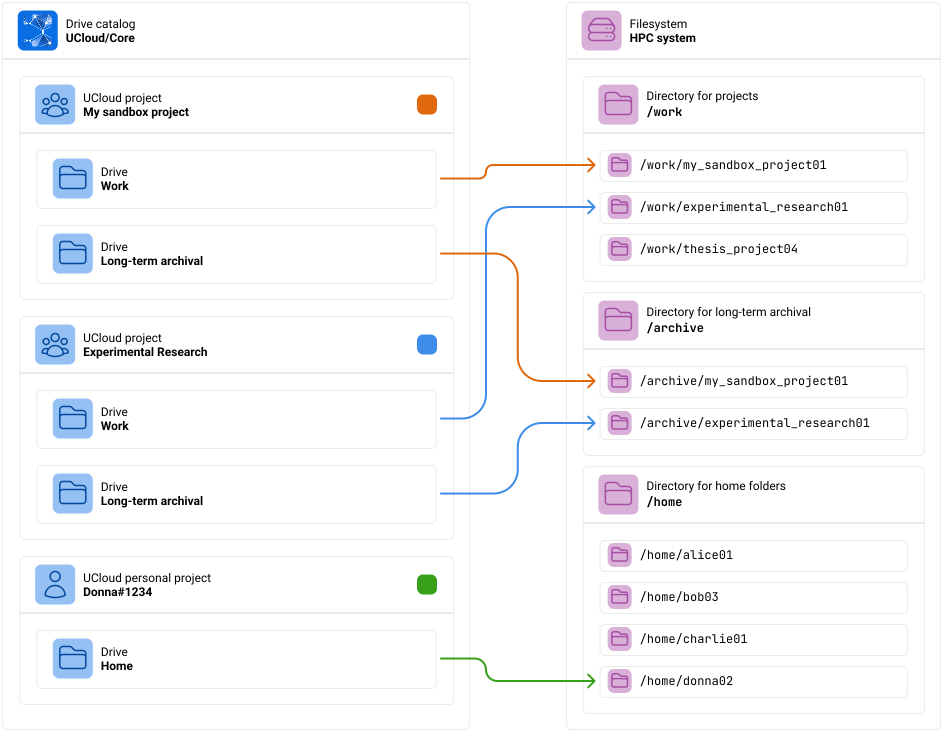
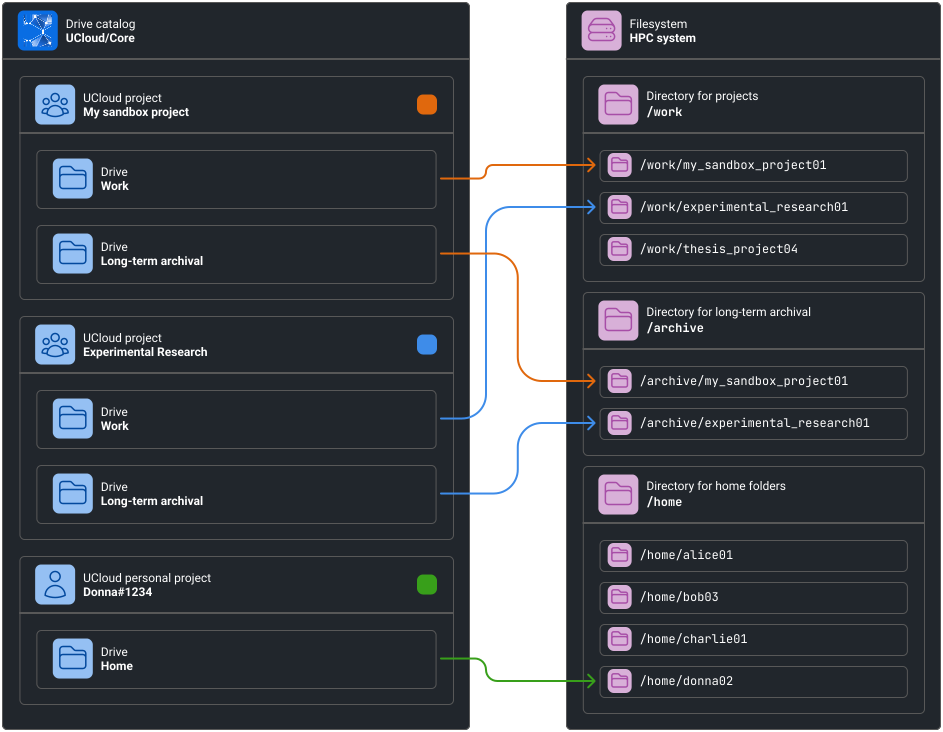
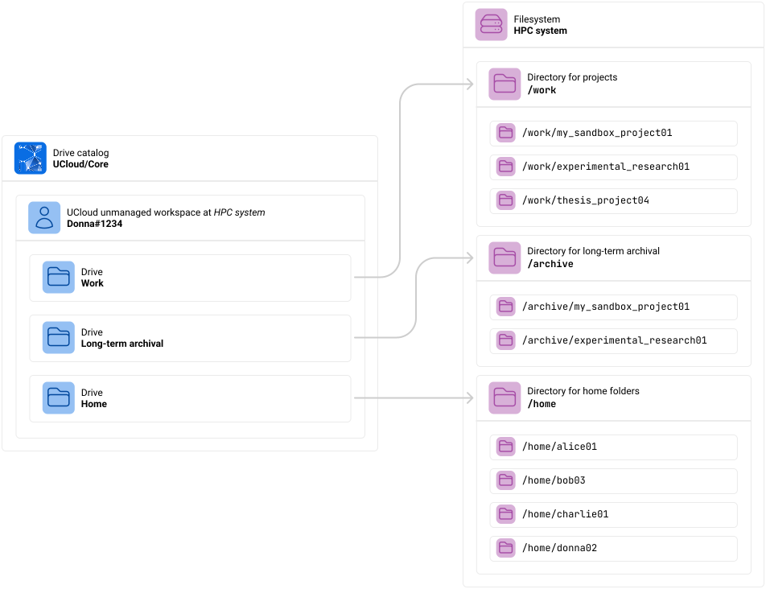
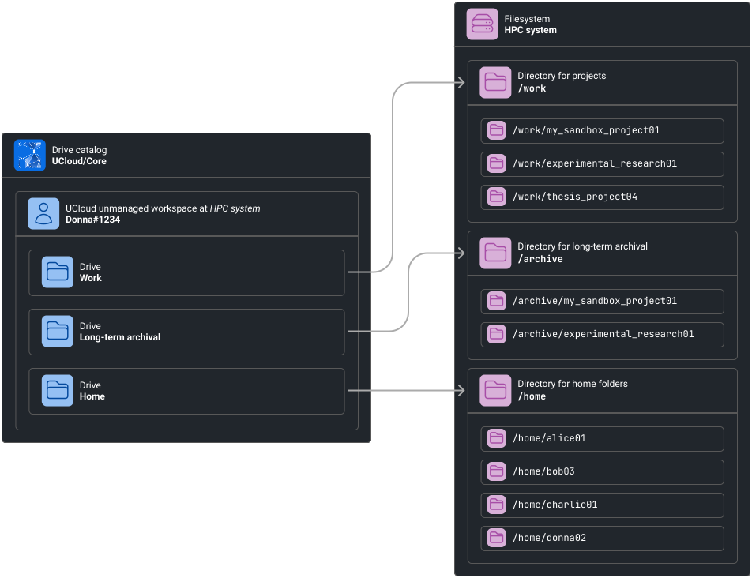

# Filesystem Integration

In this chapter we are going to cover how UCloud/IM for Slurm integrates with your local distributed filesystem. We will
start by covering the concept of UCloud drives and how these are mapped to your local environment. Following that will
be a discussion on how to manage various integrations which are needed for fully managed providers.

## Software and Hardware Requirements

TODO Section not yet complete. In this section we will talk about the software and hardware requirements that UCloud/IM
imposes on your filesystem. We will also discuss, in general terms, how UCloud/IM interacts with the filesystem. This
discussion will not include file management, as this is covered by the individual integrations.

## Products and Payment

TODO we need to explain how the products work and what the associated payment model means for you. For GB-hours I think
we should introduce a "tolerable burst-rate" which describes what the maximum current usage should be set to. Somewhere
around 200-300% seems like a reasonable default.

## Virtual Drives

UCloud has a concept of (virtual) drives. A drive in UCloud is simply a named entrypoint to your files, UCloud itself
does not impose any requirements on what a drive is specifically backed by, only that it is a meaningful entrypoint.

In most HPC environments, we commonly find a few different of these entrypoints. For example, you might have a `/home`
folder containing your own personal files. On top of that, you usually have a different entrypoint when you are
collaborating with others. This could, for example, be one or more shared project workspaces stored in different
folders.

In order to explain this better, we will be looking at an example from the point-of-view of our test user
`Donna#1234`. Donna is currently a member of three projects: "My sandbox project", "Experimental research" and a
personal project (a special type of project containing exactly one member).

<figure class="diagram">




<figcaption>

Donna is a member of three different projects. Each project has its own set of drives. Each drive is mapped to a
specific folder on the HPC system's filesystem. Keep in mind that only _managed_ providers have a concept of projects.

The colored square next to each project indicate the color of the corresponding arrows.

</figcaption>
</figure>

In this case, the HPC system has three different root-directories for entrypoints:

1. `/work`: A directory for shared files used for projects
2. `/archive`: A different filesystem which has been configured such that it is suitable for long-term archival of files
3. `/home`: A directory for personal files

Donna has for each of her ordinary projects, gotten space in both `/work` and `/archive`. For her personal project, she
has a some space in `/home`. Donna can switch between different views by selecting a different project. This makes it
very easy to differentiate between different sets of folders as they relate to a given project. In order to take
advantage of UCloud's project feature, you must first become a managed provider. You can learn more about this process
[here](./id-management.md).

For unmanaged providers, the virtual drive mapping is very similar. The only real difference is that all UCloud drives
now point to the root directories (e.g. `/work`) instead of a concrete project directory
(e.g. `/work/my_sandbox_project01`).

<figure class="diagram">




<figcaption>

Unmanaged providers are not able to take advantage of UCloud's project feature. As a result, drive mapping is less
precise and harder to navigate for the end-users.

</figcaption>
</figure>

### Configuring Drive Locators

The mapping process, from a drive to a specific folder, is called drive location in UCloud/IM. The bootstrap process
from the [installation guide](./installation.md) has already configured some for you, but these can be further tweaked.
Drive locators are configured in the main service configuration file (typically `/etc/ucloud/config.yml`) as part of
the `fileSystems` service.

#### Managed Drive Locators

Managed drive locators can be configured for different types of entity. Depending on the entity various variables are
made available to you for use in the location of a drive. For managed drive locators, you have a choice between using
the `pattern` property or the `script` property. Using the pattern property will allow you to easily do string
interpolation and return a path. The [script](#TODO) property instead allows you to fully customize the returned path.
In either case, the same variables are available to you.

<figure>

```yaml
services:
  type: Slurm

  fileSystems:
    hpc-storage: # This is the name of your product
      driveLocators:
        home:
          entity: User
          pattern: "/home/#{localUsername}"
          title: "Home"

        projects:
          entity: Project
          script: /opt/ucloud/scripts/locateProjectDrive
          title: "Work"

    # This provider has decided that the archival filesystem requires a separate
    # grant allocation. As a result, they have created a separate product for it.
    archive:
      driveLocators:
        archive:
          entity: Project
          pattern: "/archive/#{localGroupName}"
          title: "Long-term archival"
```

<figcaption>

Configuration of three managed drive locators. Two of them use the `hpc-storage` product, these point to `/home` and
`/work`. The last one uses a different product called `archive` which points to `/archive`. Different products require
separate resource allocations.

</figcaption>
</figure>

**Variables**

| Entity             | Variable          | Description                                                                |
|--------------------|-------------------|----------------------------------------------------------------------------|
| _Always available_ | `locatorName`     | The name of the drive locator (e.g. `home` or `project`)                   |
| _Always available_ | `categoryName`    | The name of the product category (e.g. `hpc-storage` or `archive`)         |
| `User`             | `ucloudUsername`  | The username of the UCloud identity (e.g. `Donna#1234`)                    |
| `User`             | `localUsername`   | The username of the local identity (e.g. `donna03`)                        |
| `User`             | `uid`             | The corresponding UID of the local identity (e.g. `41235122`)              |
| `Project`          | `ucloudProjectId` | The UCloud ID of the project (e.g. `94056ba8-b752-4018-8aab-d1caa5bc86aa`) |
| `Project`          | `localGroupName`  | The local group name of the project (e.g. `my_sandbox_project01`)          |
| `Project`          | `gid`             | The corresponding local GID of the project (e.g. `5234281`)                |

#### Unmanaged Drive Locators

<figure>

```yaml
services:
  type: Slurm

  fileSystems:
    hpc-storage:
      driveLocators:
        home:
          pattern: "/home"
          title: "Home"

        projects:
          pattern: "/work"
          title: "Work"

        archive:
          pattern: "/archive"
          title: "Long-term archival"
```

<figcaption>

Configuration of three unmanaged drive locators. They point to the folders `/home`, `/work` and `/archive`. All three
drives use the product called `hpc-storage`.

</figcaption>
</figure>

## Integrations

<div class="info-box info">
<i class="fa fa-info-circle"></i>
<div>

The integrations listed in this section require you to first become a managed provider by turning on automatic user
management. You can read more about the process [here](./id-management.md).

</div>
</div>

### GPFS

GPFS (also known as "IBM Storage Scale" or "IBM Spectrum Scale") is clustered file system developed by IBM. This
integration will allow for automatic creation and management of filesets. UCloud/IM will create exactly one fileset
per drive. The quota is automatically adjusted to match the values stored in UCloud.

This integration works by using the
[IBM Storage Scale management API endpoints](https://www.ibm.com/docs/en/storage-scale/5.2.0?topic=overview-storage-scale-management-api).

TODO Version requirements and so on

#### Creating a Service Account

TODO How to create a service account

#### Configuring the integration

Start by enabling the GPFS integration in the `identityManagement` section in `/etc/ucloud/config.yml`:

<figure>

```yaml
services:
  type: Slurm

  fileSystems:
    storage:
      management:
        type: GPFS
```

<figcaption>

The GPFS integration is enabled by setting the `type` property of `storage.management` to `GPFS`.

</figcaption>

</figure>

Additional configuration is provided in `/etc/ucloud/secrets.yml`. If this file is not already present, then it can be
created using the following commands:

<figure>

```console
$ sudo touch /etc/ucloud/secrets.yml
$ sudo chown ucloud:ucloud /etc/ucloud/secrets.yml
$ sudo chmod 600 /etc/ucloud/secrets.yml
```

<figcaption>

The `secrets.yml` file has special permissions which must be set correctly.

</figcaption>

</figure>

Inside the file, the `gpfs` section can be used to configure the integration.

<figure>

```yaml
gpfs:
  storage: # This is the product category name
    username: gpfs
    password: gpfspassword
    verifyTls: false
    host:
      address: localhost
      port: 62394
      scheme: http
    mapping:
      home: # This is a locator name
        fileSystem: "gpfs"
        parentFileSet: "home"
        # This has the same variables as the drive locator has
        fileSetPattern: "home-#{localUsername}"
      projects:
        fileSystem: "gpfs"
        parentFileSet: "work"
        # This has the same variables as the drive locator has
        fileSetPattern: "work-#{localGroupName}-#{gid}"
      archive:
        fileSystem: "gpfsarchive"
        parentFileSet: "archive"
        # This has the same variables as the drive locator has
        fileSetPattern: "archive-#{localGroupName}"
```

<figcaption>

The configuration required for GPFS. Remember to change the values such that they match the target environment.

</figcaption>

</figure>

TODO explain what this does and provide a better example

#### Breakdown of operations executed by UCloud/IM

In this section we will break down the exact operations invoked by UCloud/IM when managing GPFS.
This section is intended to help you understand how UCloud/IM will interface with your system and in which situations
it might conflict with other systems.

It is important to understand that this is all that the GPFS integration will do. GPFS can be configured and used
outside UCloud/IM and as long as it does not conflict with the content of this section, the UCloud/IM will not
interfere with those entities.

<div class="table-wrapper">
<table>
<thead>
<tr>
<th>Trigger</th>
<th>Description</th>
</tr>
</thead>

<tbody>
<tr>
<td>Resource allocation updated</td>
<td>

Note: This trigger also runs when a resource allocation is first created. The trigger will run after the user or group
has been created in the system. See the [User and Project Management](./id-management.md) chapter for more details.

**1. Evaluate the relevant drive locators**

The drive locators, explained earlier in this chapter, are first run to get a list of expected drives. The drives are
then matched up with the corresponding mappings defined in the GPFS configuration. Using the examples provided in this
chapter, the following information is discovered:

| Example entity        | Drive name | Locator name | Fileset                                | Filesystem    | Expected mount path                |
|-----------------------|------------|--------------|----------------------------------------|---------------|------------------------------------|
| Donna#1234            | Home       | `home`       | `home-donna01`                         | `gpfs`        | `/home/donna01`                    |
| My sandbox project    | Work       | `work`       | `work-my_sandbox_project01-5234281`    | `gpfs`        | `/work/my_sandbox_project01`       |
| My sandbox project    | Archive    | `archive`    | `archive-my_sandbox_project01`         | `gpfsarchive` | `/archive/my_sandbox_project01`    |
| Experimental Research | Work       | `work`       | `work-experimental_research01-5234284` | `gpfs`        | `/work/experimental_research01`    |
| Experimental Research | Archive    | `archive`    | `archive-experimental_research01`      | `gpfsarchive` | `/archive/experimental_research01` |

This process will also return appropriate permissions, owner and group.

**2. Check if the filesets exist**

This process is repeated all filesets discovered in step 1.

```http request
GET filesystems/${filesystem}/filesets/${fileset}
Accept: application/json
```

If the response code is in the 2XX range then we consider the fileset as existing, otherwise we do not.

[Call reference](https://www.ibm.com/docs/en/storage-scale/5.2.0?topic=endpoints-filesystemsfilesystemnamefilesetsfilesetname-get)

**3. Create filesets which do not exist**

This process is repeated for all filesets we did not find in GPFS from step 2. This step is skipped if all filesets
exist.

```http request
POST filesystems/${filesystem}/filesets
Accept: application/json
Content-Type: application/json

{
    "filesetName": "${fileset}",
    "inodeSpace": "${mappingParent}",
    "comment": "UCloud managed drive",
    "path": "${mountPath}",
    "owner": "${owner}:${group}",
    "permissions": "${permissions}"
}
```

[Call reference](https://www.ibm.com/docs/en/storage-scale/5.2.0?topic=endpoints-filesystemsfilesystemnamefilesets-post)

**4. Update the quota**

This process is repeated for all filesets located in step 1.

If UCloud/Core is reporting over-consumption in a project hierarchy, then usage should not be allowed to continue. This
is implemented by setting the quota on files to 0 (`quotaFiles = 0`). This will effectively prevent any more files from
being created
inside the fileset, without destroying any data found in the fileset. If UCloud/Core is not reporting any
over-consumption then the quota on file is set to unlimited (`quotaFiles = 1`).

```http request
POST filesystems/${filesystem}/quotas
Accept: application/json
Content-Type: application/json

{
    "operationType": "setQuota",
    "quotaType": "FILESET",
    "objectName": "${fileset}",
    "blockSoftLimit": ${quotaBytes},
    "blockHardLimit": ${quotaBytes},
    "filesSoftLimit": ${quotaFiles},
    "filesHardLimit": ${quotaFiles}
}
```

[Call reference](https://www.ibm.com/docs/en/storage-scale/5.2.0?topic=endpoints-filesystemsfilesystemnamequotas-post)

</td>
</tr>
<tr>
<td>Usage reporting (invoked periodically)</td>
<td>

**1. Query the current usage and fileset**

This step is repeated for all known drives in the entire system.

First a request is sent to retrieve information about the fileset. 

```http request
GET filesystems/${filesystem}/filesets/${fileset}
Accept: application/json
```

[Call reference](https://www.ibm.com/docs/en/storage-scale/5.2.0?topic=endpoints-filesystemsfilesystemnamefilesetsfilesetname-get)

This is followed up with an additional query for information regarding quota and usage:

```http request
GET filesystems/${filesystem}/quotas?filter=objectName=${fileset},quotaType=FILESET
Accept: application/json
```

[Call reference](https://www.ibm.com/docs/en/storage-scale/5.2.0?topic=endpoints-filesystemsfilesystemnamequotas-get)

**2. Report usage to UCloud/Core**

Based on the numbers found by step 1, a report is sent to UCloud/Core describing the usage. In case this leads to a
change in the over-consumption flag anywhere then a notification is emitted by UCloud/Core. Such a notification
will trigger the "Resource allocation updated" process.

</td>
</tr>
</tbody>
</table>
</div>

### WEKA

### CephFS

### Scripted (any filesystem)