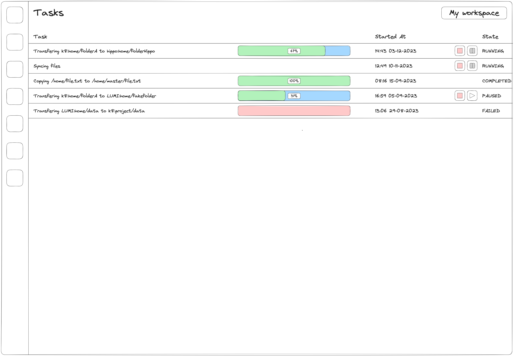

# Inter-Provider File Transfers

TODO This is just the old document copy&pasted into the new documentation. The style of this document is not suitable
for use here, but it at least reminds about roughly what should be going on in this chapter. Anyone asked to review
the documentation should probably just skip this entire chapter for now.

## User perspective

We start with an informal description of the feature from the perspective of a researcher. We assume that the researcher
has two active resource grants, one at "Provider A" and one at "Provider B". The researcher has already gone through
the connection process and has thus already established a mapping between their UCloud identity and an identity at
"Provider A" and another at "Provider B". We also assume that "Provider A" and "Provider B" already have a legal
framework in place which allows for this transfer to take place. Later in the story, we will highlight what happens if
no such framework is in place.

To initiate the transfer, the researcher opens UCLoud and locates the file they wish to transfer. From here, they right
click the file and select "Transfer to...". This opens up a system dialog, similar to the one displayed when the user
wants to move a file internally at a provider.

<figure class="diagram">

<figcaption>

System dialog shown when a researcher selects "Transfer to..." on a file or folder.

</figcaption>
</figure>

__Figure:__ 

In this system dialog, the researcher can browse all the files they have access to. In this case, they navigate to a
drive located at "Provider B". Inside of this drive, they find their desired destination folder and select
"Transfer to". At this point, a message will appear explaining that a transfer between two separate service providers
will take place.

<figure class="diagram">


<figcaption>

System dialog notifying the researcher that a transfer between two service providers is about to take place.

</ficaption>
</figure>

Once confirmed, the transfer will start with no further action required from the researcher. The researcher will be
redirected to a page which displays status updates from all their active background tasks, including file transfers.
This can include details such as overall progress through the transfer, a description of the current state. But it will
also allow the user to perform actions such as pausing and cancelling a transfer.

<figure class="diagram">



<figcaption>

Dedicated page for background tasks. This will allow the researcher to follow the status of ongoing and
previously completed file transfers.

</figcaption>
</figure>

## Architecture

The architecture of the file transfer feature follows the general philosophy of UCloud/IM: to be flexible and support
the existing infrastructure and solutions. This means that the feature must be able to support a wide variety of
different protocols. The figure below demonstrates the flow required for a researcher to initiate a file transfer
between "Provider A" and "Provider B". Note that it reuses the assumptions from the story in the previous section.

<figure class="diagram">


<figcaption>

A diagram showing the steps involved in initiating a data transfer between "Provider A" (source provider)
and "Provider B" (destination provider).

</figcaption>
</figure>

The process is initiated by the user, and is as follows:

1. __The researcher initiates the transfer.__ The researcher will include information about the files they wish to
transfer by including the full path to both source and destination folder.

2. __UCloud/Core contacts the source provider.__ The Core starts out by authorizing the request. Making sure that the
researcher has the appropriate permissions (according to UCloud's permission model) before proceeding. Assuming the
authorization step succeeds, the source provider is contacted about the transfer.

3. __"Provider A" determines if and how the transfer will take place.__ Based on the provider's configuration, a
determination is made to ensure that the proper legal frameworks are in place and to determine which underlying transfer
mechanism to use. If there is no proper framework for completing the transfer, then the request will be rejected and
no data transfer will take place. If there is a proper framework, then a suitable technology for the transfer is chosen
and the provider will reply with any relevant parameters for the transfer. This will also include a flag which tells
UCloud/Core if it needs to consult the destination provider about the transfer.

4. __(Optional) "Provider B" is consulted about the transfer.__ If the source provider indicated so, then UCloud/Core
will consult the destination provider about the transfer. This message will include information from the researcher and
the source provider.

5. __(Optional) "Provider B" responds.__ Similar to how the source provider replied with parameters, so will the
destination provider.

6. __Parameters for the transfer is sent to the researcher.__ All the results are combined into a single reply and is
sent to the researcher. The message will include all relevant parameters, including which mechanism is to be used for
the transfer.

7. __The researcher triggers the transfer based on the parameters by sending a message to "Provider A".__ The exact
message sent to the source provider will depend on the transfer mechanism. In some rare cases, the user might need to
provide input for this step. 

8. __(Optional) If needed, the researcher sends a trigger message to "Provider B".__

9. __The providers exchange data in a protocol specific way.__

## Security considerations

The providers involved in the transfer have an oppertunity to send parameters required for the transfer. In some cases,
this information can potentially be sensitive (directly or indirectly) and UCloud/Core should not know this information.
Given that UCloud/Core is required for the orchestration of the transfer, and thus, data must flow through it, we
propose a solution utilizing asymmetric cryptography to hide the information from UCloud/Core while still allowing
transit of information through it.

This works by having the client, controlled by the researcher, generate a public-private key-pair. When the researcher
initiates the transfer, in step 1, they will include a copy of their public-key. This key will allow the providers to
encrypt the sensitive parameters in such a way that only the researcher can use the information.

We recognize that this solution does not prevent a compromised version of UCloud/Core from sending its own 'evil'
parameters encrypted with the researchers public key. But as we will later show, the trigger messages sent based on the
sensitive parameters will not themselves contain sensitive data. As a result, a compromised version of UCloud/Core has
little to gain from doing so.

## Exploring mechanisms for file transfers

Based on the needs of the current partners in the HALRIC project, we have come up with a list of potential technologies 
to support for transferring files. The majority of the mechanisms discussed here are all widely available and are often
already present in many HPC systems.

### SFTP

SFTP, also known as the SSH File Transfer Protocol, is a network protocol for remote file access and management. As the
name implies, the protocol is co-developed as part of the SSH protocol. SFTP provides operations for common file
operations such as:

- Listing files
- Retrieving detailed file information, including access lists
- Read and write files
- Delete files

The protocol is typically deployed as part of an SSH server deployment. As a result, it depends on the authentication
mechanisms already provided by the SSH server. SFTP is very commonly enabled on SSH servers and is, by default, enabled
in [OpenSSH servers](https://github.com/openssh/openssh-portable/blob/86bdd3853f4d32c85e295e6216a2fe0953ad93f0/sshd_config#L109).

The most common way to use the SFTP protocol is using command-line utilities such as `scp`. For example, one can
initiate a transfer of a single file with the following command:

<figure class="diagram">

```terminal
$ scp /path/to/local/file user@remote-server.example.com:/path/to/remote/file
```

</figure>

SFTP allows for compression of payloads, which can minimize the amount of data sent. This is, for example, enabled via
the `-C` flag. Apart from compression, SFTP provides no extra smart features for transferring large amounts of data
efficiently.

In order to transfer files with SFTP, one must be able to connect with and authenticate against the remote SSH server.
As a result, for the end-user to initiate a file transfer the following technical conditions must be met:

- The destination provider must allow the ingoing SSH connection from the source provider
- The source provider must allow the outgoing SSH connection to the destination provider
- The user at the source provider must be able to connect to the destination provider as their corresponding user

### rsync

rsync is a utility made specifically for transferring and synchronizing files between systems. rsync is only capable of
performing synchronization of files. Unlike SFTP, it performs checks to minimize the amount of data transferred. This
includes checking if a file is already present by looking at basic attributes such as file size, modification
timestamps and checksums. 

The `rsync` command can be used in the following way:

<figure class="diagram">

```terminal
$ rsync -azP /path/to/local/file user@remote-server.example.com:/path/to/remote/file 
```

<figcaption>

A snippet showing how to invoke `rsync`. It has the "archive" flag (`-a`) which perserves certain file
attributes. Compression is turned on with the `-z` flag. Progress wil be shown to the end-user due to the `-P` flag.

</figcaption>

</figure>

Similar to SFTP, it commonly uses SSH as the underlying transport protocol. As a result, it also inherits the security
model of SSH.

To use rsync between two providers, the following conditions must be met:

- The destination provider must allow the ingoing SSH connection from the source provider
  - Alternatively the native rsync protocol may be used
- The source provider must allow the outgoing SSH connection to the destination provider
  - Alternatively the native rsync protocol may be used
- The user at the source provider must be able to connect to the destination provider as their corresponding user
- rsync must be present at both the source and destination provider

### SFTP/rsync implementation

<figure class="diagram">


<figcaption>

Example showing how a file transfer mechanism based on SSH could work.

</figcaption>
</figure>

1. __The researcher initiates the transfer.__ For this transfer mechanism, it is very important to remember that the
researcher includes a public-key used for asymmetric encryption of secrets.

2. __UCloud/Core contacts the source provider.__ 

3. __"Provider A" determines if and how the transfer will take place.__ In this case, the provider determines that the
transfer is possible and should use an SSH based transfer mechanism (SFTP or rsync). The provider creates an endpoint
which allows for the insertion of a temporary key. This endpoint is encrypted using the public-key of the researcher.
This means that UCloud/Core will not be able to read the secret endpoint, only the researcher will be able to read it.

4. __"Provider B" is consulted about the transfer.__ 

5. __"Provider B" responds.__ Provider B also creates a secret endpoint and encrypts it using the public-key
of the researcher.

6. __Parameters for the transfer is sent to the researcher.__ The frontend will as a response to this message determine
that it needs to create a temporary key-pair used for the SSH transfer. In the following trigger messages the researcher
will forward the public part of this key-pair. This key-pair is different from the one used to facilitate the transfer.

7. __The researcher triggers the transfer based on the parameters by sending a message to "Provider A".__ This message
will contain the public part of the key-pair previously generated.

8. __The researcher sends a trigger message to "Provider B".__ This message will contain the public part of the key-pair
previously generated.

9. __The providers exchange data in a protocol specific way.__ Data transfer begins immediately once both providers have
a key. Due to the way SSH based transfers work, it is initiated and managed by the source side. The key used for the
transfer is automatically deleted once the transfer is complete (or a timeout is reached).

### Globus

Globus is a service which delivers file management feature amongst many service providers. It requires an
existing installation, and often, a premium subscription, already present at the service provider. Once a service
provider is connected, then end-users can access data from any of the service providers they already know and perform
file management as needed, including transferring the files between individual services. The service supports many
different "connectors" which allow it to access data using different underlying mechanisms.

Integrating into Globus is made possible using their REST-style [API](https://docs.globus.org/api/transfer/).  One way
of integrating Globus into UCloud is by creating a provider. End-users can then connect to Globus using their
institutional credentials, the same they would use for Globus. Once connected, the provider will be able to expose the
data to the end-user in a similar way as it is exposed in Globus. In such a scenario, the UCloud provider would act as
both the source and destination provider of a transfer. Also note that the service providers actually containing the
data would not need to be directly connected to UCloud/Core. 

<figure class="diagram">


<figcaption>

Example of how a Globus integration could work.

</figcaption>
</figure>

The figure above illustrates how an integration with Globus could work:

1. __The researcher initiates the transfer.__  This will contain information about the absolute paths to both files.
Encoded in these would be information about the SPs connected to Globus.

2. __UCloud/Core contacts the Globus provider.__ As in the normal flow, the source provider is contacted.

3. __The Globus provider determines if and how the transfer will take place.__ In this case it will tell us that the
Globus transfer will be used. A trigger endpoint is forwarded to the researcher. The trigger endpoint will need no
special parameters.

4. __Parameters for the transfer is sent to the researcher.__

5. __The researcher triggers the transfer.__ In this case, the trigger message will likely be empty, since no special
instructions are required for this transfer mechanism.

6. __The Globus provider will use the Globus API to initiate the transfer.__ This will trigger an actual transfer of
files. From this point forwarded, the task is essentially complete for the integration module. The integration module
will periodically track the progress of the transfer and send updates back to UCloud/Core.

7. __Globus will orchestrate the transfer between the two service providers.__ The exact mechanism of how the transfer
will take place depends on Globus. It is considered a black box from the point-of-view of the integration module.