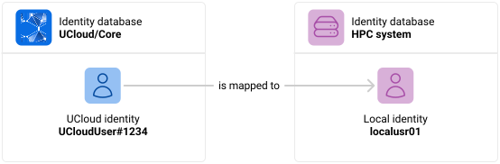
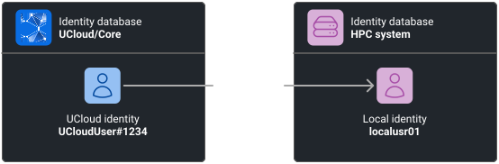
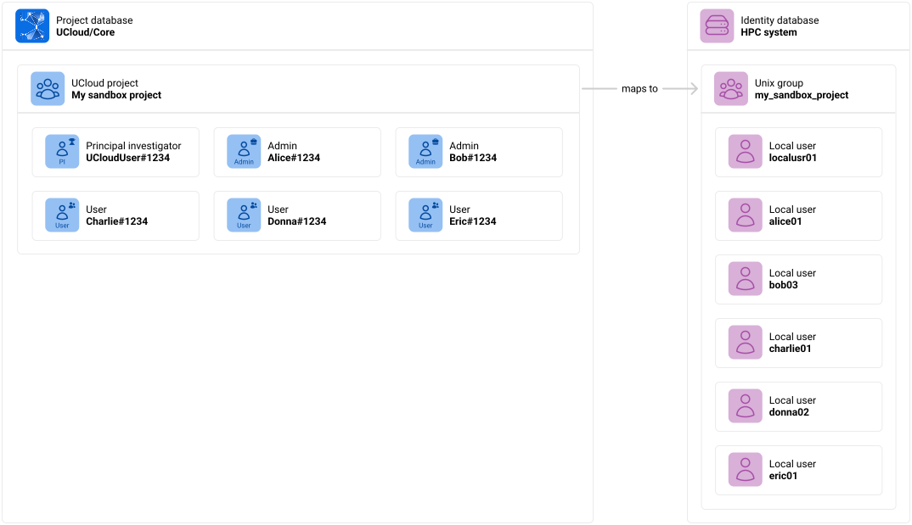
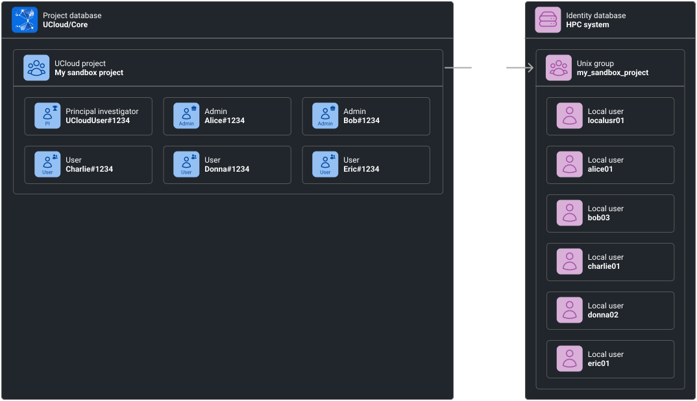
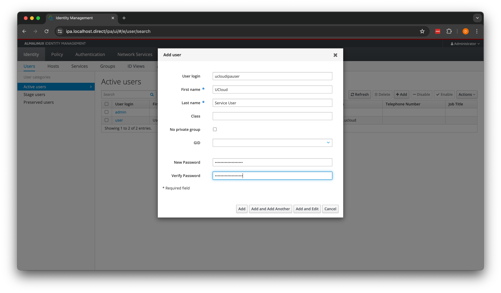
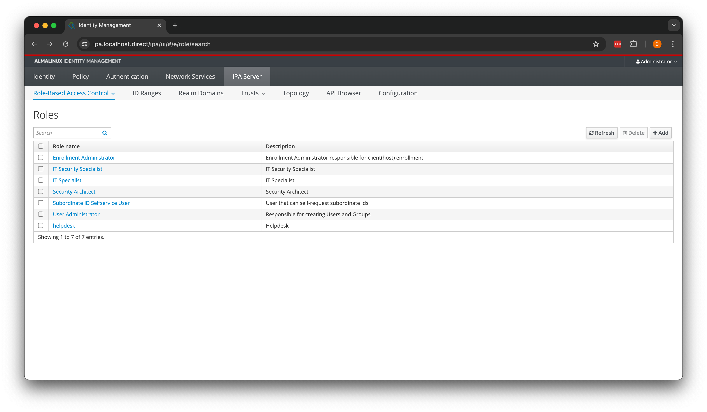
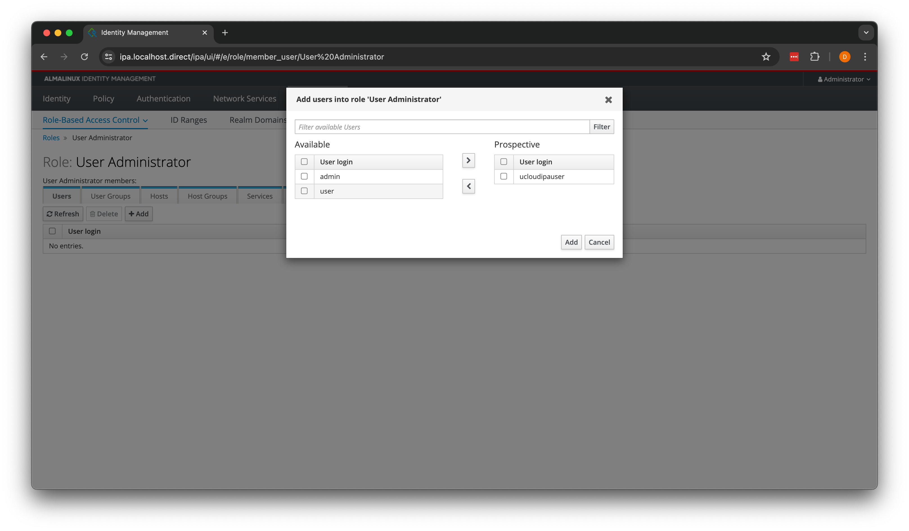

# User and Project Management

In this article, we will go through how UCloud/IM interfaces with the identity management system of your environment.
In particular, this is going to deal with how users and projects are synchronized and mapped between UCloud and your
system.

## User Mapping

User mapping is the process of transforming a UCloud identity into a local identity. Recall from a
[previous chapter](./architecture.md) that UCloud/IM for Slurm uses your local identities on the HPC system for
enforcing authentication and authorization. From the point of view of your system, users coming from UCloud are simply
ordinary users of your system. They can do exactly the same actions as if they had used SSH to access your system.
Nothing less, nothing more. This has the benefit of simplifying your infrastructure while allowing your users to access
the system through more traditional means, such as SSH. The mapping between identities always takes place, both for
managed and unmanaged providers, but the way that the mapping is established differs between the two.

<figure class="diagram">




<figcaption>

UCloud identities are mapped into local identities. This way, the UCloud/IM (server instance) can spawn user instances
running as a local identity in response to requests from the user. This ensures that UCloud users can only do the
actions as they could by accessing through SSH.

</figcaption>
</figure>

### Establishing a Mapping: Unmanaged Providers

In unmanaged mode, UCloud/IM _will not_ create or manage any users, projects or any resource allocation. All of this
must be done by you through whichever means you have. As a result, in unmanaged mode, it is assumed that local
identities have already been configured correctly by a system administrator (or via sysadmin controlled script).

The connection procedure is started by the end-user while logged into your system's frontend. From your frontend, they
will be able to run the following command:

```console
$ whoami
localusr01

$ ucloud connect
You can finish the connection procedure by going to: https://sandbox.dev.cloud.sdu.dk/app/connection?token=XXXXXXXXXXX

Waiting for connection to complete... (Please keep this window open)

Connection complete! Welcome 'localusr01'/'UCloudUser#1234'!
```

In the UCloud user-interface, the user will be able to find a new project should appear with the name of your
service-provider:

<figure>


<figcaption>

A new project has appeared, allowing your user to consume resources from your service-provider!

</figcaption>
</figure>

### Establishing a Mapping: Managed Providers

When a provider is managed, UCloud/IM will be responsible for automatically synchronizing users, projects and resource
allocations from UCloud/Core into the service provider. It achieves this using the supporting systems in UCloud/Core,
these are described in detail in [this](../overview/apm.md) article. In short, UCloud has an advanced system for
managing resource allocations.

<figure class="diagram">


<figcaption>

UCloud has an advanced system for managing resource allocations. This system used in combination with UCloud/IM allows
for fully automatic management of users, projects and resource allocations.

</figcaption>
</figure>

The process is as follows:

1. **A user submits a grant application.** The application describes the project and along with it a
   request for resources at one or more service providers. At this point, because the user has no resources
   at `HPC system` they cannot consume any of the resources. Not until a user has been granted a resource allocation can
   they use a service provider.

2. **A grant-approver decides to accept the application.**  Who can approve application is up to the service provider. A
   service provider can decide to manage all applications themselves, or they can delegate this responsibility to
   someone else.

3. **The resources created from the successful application are registered in UCloud/Core.**

4. **UCloud/Core notifies the service provider.** Whenever a workspace is updated with respect to their resource
   allocations, a notification is sent to the service provider. The message is intercepted and handled by UCloud/IM (
   Server). A user mapping is not yet established.

5. **The user connects with the provider.** Once a user has received at least one resource allocation at a provider,
   they are allowed to connect to it. The user connects to the provider by clicking the appropriate button in the UCloud
   user-interface. This will send a message to the service provider (authenticated by UCloud/Core).

6. **The service provider synchronizes the UCloud identity with the local identity database.** The result of this is a
   user being created in the local identity database. A mapping is saved in UCloud/IM's internal database and
   UCloud/Core is notified that the connection was successful. The UCloud user can now consume resources on the service
   provider. You can read more about different integrations later in this article. It is the responsibility of each
   integration to determine what the local username is. See the individual integrations for more details.

## Project Mapping

<div class="info-box info">
<i class="fa fa-info-circle"></i>
<div>

Mapped projects are only available to managed providers. All unmanaged providers will not be able to use any of the
project management features available in UCloud or UCloud/IM.

</div>
</div>

Project mapping, like user mapping, is the process of mapping a UCloud project into something corresponding at the
service provider. In UCloud/IM for Slurm that something is a Unix group. The name of the resulting Unix group depends on
the integration used for managing projects and users. The figure below illustrates how projects are mapped:

<figure class="diagram">




<figcaption>

UCloud projects are mapped into corresponding Unix groups.

</figcaption>
</figure>

There are some notable differences between what a UCloud project can support and what is actually supported in projects
using UCloud/IM for Slurm.

- UCloud projects support further grouping of members, this is not supported by UCloud/IM for Slurm.
- Project roles are not synchronized to the HPC system, but can still be used for project management in UCloud/Core.
- Members of a UCloud project that have not yet connected to the provider, is not present on the provider.
    - Once a UCloud user connects to the provider, they will automatically be added to the corresponding Unix groups.

## Integrations

<div class="info-box warning">
<i class="fa fa-warning"></i>
<div>

Configuring any of these integration will transition your provider from an unmanaged to a managed provider. Please make
sure you read the migration section before implementing this on production data.

</div>
</div>

### FreeIPA

[FreeIPA](https://freeipa.org) is an open source identity management system which utilizes various open-source
components, such as: 389DS, Kerberos, ntpd and more. UCloud/IM for Slurm is capable of synchronizing users and projects
into FreeIPA. Installing and deploying FreeIPA is outside the scope of this document, instead we refer to FreeIPA's own
[documentation](https://freeipa.org).

The integration works by using FreeIPA's [JSON-RPC API](https://www.freeipa.org/page/V4/JSON-RPC.html). JSON-RPC support
was added in version 4 and is included in the default configuration.

#### Creating a service account

In order to do this, UCloud/IM requires a service account. You can create this account from the web interface by first
creating a service user. A password is required for this user, since it will be used for authentication against the API.

<figure class="mac-screenshot">



<figcaption>

Start by creating a new user. You can do this by going to "Identity" / "Users" and clicking on "Add". Fill out the
form and finish by clicking on "Add".

</figcaption>
</figure>

Next, we need to assign the appropriate permissions to the service user. To do this go to "IPA Server" /
"Role-Based Access Control" and select "User Administrator" followed by assigning the `ucloudipauser` this role.

<figure class="mac-screenshot">



<figcaption>

Selecting the IPA server role. Found by going to "IPA Server" / "Role-Based Access Control".

</figcaption>
</figure>

<figure class="mac-screenshot">



<figcaption>

Assigning the IPA server role to the service user. Found by clicking on "Add" in the "Users" tab.

</figcaption>
</figure>

#### Configuring the integration

Start by enabling the FreeIPA integration in the `identityManagement` section in `/etc/ucloud/config.yml`:

<figure>

```yaml
services:
  type: Slurm

  identityManagement:
    type: FreeIPA
```

<figcaption>

The FreeIPA section is enabled by setting the `type` property of `identityManagement` to `FreeIPA`.

</figcaption>

</figure>

Next, you must configure how to use the API. This is configured in `/etc/ucloud/secrets.yml`. If you do not already have
this file, then you can create it:

<figure>

```console
$ sudo touch /etc/ucloud/secrets.yml
$ sudo chown ucloud:ucloud /etc/ucloud/secrets.yml
$ sudo chmod 600 /etc/ucloud/secrets.yml
```

<figcaption>

The `secrets.yml` file has special permissions which must be set correctly.

</figcaption>

</figure>

Once created, you can add the `freeipa` section which configures it.

<figure>

```yaml
freeipa:
  url: https://ipa.ucloud   # Replace this with the hostname of your FreeIPA instance
  username: ucloudipauser   # Update this to match the name of your service account
  password: adminadmin      # Update the password to match your service account
  verifyTls: true
  namingPolicy: # This controls how to name users and projects
    type: Default
```

<figcaption>

The configuration required for FreeIPA. Remember to change the values such that they match your environment.

</figcaption>

</figure>

#### Naming Policies

TODO The `namingPolicy` configuration property has not yet been implemented. What is described here is simply the only
behavior currently implemented.

The `namingPolicy` configuration property allows you to control how to name new users and projects. Keep in mind that
the naming policy is only used when users and projects are created. This means that if you make changes to the naming
policy then already existing projects and users will not be changed in any way. UCloud/IM allows you to change the
policy since it stores the ID from creation and not the computed name.

<div class="table-wrapper">
<table>
<thead>
<tr>
<th>Policy</th>
<th>Description</th>
</tr>
</thead>

<tbody>
<tr>
<td>

`Default`

</td>
<td>

The default naming policy will attempt to create alphanumeric names which closely resemble the name of the user and
project, while remaining POSIX compliant.

__Users:__ Usernames use the following format:

```text
${firstLetterOfFirstName}${lastName}${twoDigitNumber}
```

The `twoDigitNumber` is used to differentiate between users with the exact same username. The number is always present
and starts at 1. The usernames are created from the UCloud username, below is an example transformation:

```text
DonnaJensen#4512 -> djensen01
```

The names will always use pure ASCII. A transformation is made to resemble the closest equivalent as possible.
For example:

```text
JensHågensen#5128 -> jhagensen01
```

Usernames are cut off to ensure they do not become too long. Take for example this exaggerated example:

```text
ThisisaverylongusernameLongerthanwewouldexpectmostpeopletohave#1234 -> tlongerthanwewouldexpectmost01
```

For users where their last name is not apparent, their first name is used instead.

```text
Alice#1234 -> alice01
```

__Projects:__ Projects use a similar format:

```text
${cleanedProjectTitle}${twoDigitNumber}
```

The cleaning process is similar to the username cleaning process, except it also handles various form of spaces and
replace them with underscores. Below is a number of examples:

```text
testProject -> testproject01
My SandBox PrOject -> my_sandbox_project01
this is my long project nåme what will it be -> this_is_my_long_project_name01
```

</td>
</tr>
</tbody>
</table>
</div>

#### Breakdown of operations executed by UCloud/IM

In this section we will break down the exact operations invoked by UCloud/IM when managing your users and projects.
This section is intended to help you understand how UCloud/IM will interface with your system and in which situations
it might conflict with other systems.

It is important to understand that this is all that the FreeIPA integration will do. Users and groups can be created
in FreeIPA without UCloud/IM and as long as it does not conflict with the content of this section, the UCloud/IM will
not interfere with those entities.

<div class="table-wrapper">
<table>
<thead>
<tr>
<th>Trigger</th>
<th>Description</th>
</tr>
</thead>

<tbody>
<tr>
<td>User connected</td>
<td>

**1. Check if the user already exists**

This is done by looking up users which have an `employeenumber` matching their UCloud username.

```text
Command: user_find

employeenumber: $UCloudUsername
```

If the user exists, re-establish a mapping between the UCloud user and the existing identity and do not run any of the
remaining steps.

**2. Create a user with the username specified by the naming policy**

```text
Command: user_add

uid: $LocalUsername
givenname: $FirstName
sn: $LastName
cn: $FirstName $LastName
employeenumber: $UCloudUsername
```

**3. Add the newly created user to the `ucloud_users` group**

As explained in the [installation procedure](./installation.md), UCloud/IM for Slurm depends on sudo to be configured to
allow changing user to any member of the `ucloud_users` group. Since UCloud/IM will need to run commands on this user's
behalf, it will have to add the user to this group.

```text
Command: group_add_member

cn: ucloud_users
user: $LocalUsername
```

**4. Save the mapping in UCloud/IM's local database**

This will allow all components of UCloud/IM to determine what the mapping is. It will also allow the project creation
logic to lookup the UID of users from their UCloud username.

**5. Run the add member trigger of all projects the user belongs to**

See the "project updated" trigger for details.

</td>
</tr>

<tr>

<td>Project updated</td>

<td>

Note that this is triggered everytime a project is updated, including when it is first created. You will only receive
notifications about projects that have an allocation on your provider.

**1. Check if the project already exists**

This is done by looking up in UCloud/IM's local database to check if the project has already been created. This will
return the corresponding Unix GID. If the project already exists skip to step 3.

**2. Create the project using a name specified by the naming policy**

```text
Command: group_add

cn: $ProjectGroupName
description: UCloud Project: $UCloudProjectId
```

The resulting Unix GID is saved in UCloud/IM's local database such that it will be found by step 1 during the next
update.

Following the group creation, the following command is executed by UCloud/IM (Server):

```console
$ sudo /sbin/sss_cache -E
```

**3. Add new members (repeated for each new member)**

UCloud/IM keeps track of which members are added to or removed from a project. This step is repeated for each new member
added to the project. If no members are added, then this step is skipped.

If the member added to the project has not yet connected to the provider, skip this member.

```text
Command: group_add_member

cn: $ProjectGroupName
user: $LocalUsername
```

**4. Remove members no longer part of the project (repeated for each member)**

UCloud/IM keeps track of which members are added to or removed from a project. This step is repeated for each member.
If no members are removed, then this step is skipped.

If the member removed from the project has not yet connected to the provider, skip this member.

```text
Command: group_remove_member

cn: $ProjectGroupName
user: $LocalUsername
```

</td>

</tr>

<tr>
<td>User disconnects</td>

<td>

TODO Remove user from all projects

</td>
</tr>

</tbody>

</table>
</div>

### Scripted

This integration is another [script](#TODO) integration. Script integrations allow you to fully customize all aspects of
user and project creation. It is entirely up to you to create these scripts. All scripts will be invoked with a single
argument, which is a path to a JSON file. The contents of the JSON file will depend on the script, see below for
details. All scripts are expected to return the response as a JSON object on `stdout`. Detailed error messages and
debug information should be printed to `stderr`. In case of errors a non-zero exit code should be returned.

In order to configure this integration, you must first configure it:

<figure>

```yaml
services:
  type: Slurm

  identityManagement:
    type: Scripted
    onUserConnected: /opt/ucloud/extensions/onUserConnected
    onProjectUpdated: /opt/ucloud/extensions/onProjectUpdated
```

<figcaption>

The Scripted integration is enabled by setting the `type` property of `identityManagement` to `Scripted` and providing
the relevant scripts.

</figcaption>

</figure>

Note that the scripts pointed to in the configuration file is your choice. You can point it to any script of your
choosing. The script does not have to reside in any specific folder. The script _must_ be readable and executable by the
UCloud/IM (Server) user. They do not have to be invoked by any of the user instances.

#### Script: `onUserConnected`

The `onUserConnected` script is invoked _every_ time a user connects to this service provider. As input, it will receive
the UCloud the username, as well as a parsed version of the UCloud username. This input will suggest a username using
the default naming policy from the FreeIPA integration. The suggested username will not contain the two-digit number at
the end.

This script __must__ check if the UCloud user has registered before and in that case return the old UID. It is the
responsibility of the script to save this information somewhere it can be retrieved later. In case the user has not
registered before, then the script __must:__

- Create a new user and be ready to return its UID
- Add the new user to the `ucloud_users` group

<div class="table-wrapper script-example">
<table>
<tbody>

<tr>
<th>Request</th>

<td>

```json
{
  /* string */
  "ucloudUsername": "",

  /* string */
  "firstName": "",

  /* string */
  "lastName": "",

  /* string */
  "suggestedUsername": ""
}
```

</td>
</tr>

<tr>
<th>Response</th>

<td>

```json
{
  /* uint32 */
  "uid": 0
}
```

</td>
</tr>

<tr>
<th>Example request</th>
<td>

```json
{
  "ucloudUsername": "DonnaJensen#4512",
  "firstName": "Donna",
  "lastName": "Jensen",
  "suggestedUsername": "djensen"
}
```

</td>
</tr>

<tr>
<th>Example response</th>
<td>

```json
{
  "uid": 41235122
}
```

</td>
</tr>

</tbody>
</table>
</div>

#### Script: `onProjectUpdated`

<div class="table-wrapper script-example">
<table>

<tr>
<th>Request</th>
<td>

```json
{
    /* string */
    "ucloudProjectId": "",
  
    /* string */
    "projectTitle": "",

    /* string */
    "suggestedGroupName": "",
  
    /* uint32 | null */
    "unixGid": null,
  
    /* object[] */
    "allMembers": [
        {
            /* uint32 */
            "uid": 0,

            /* string */
            "ucloudUsername": "",

            /* "PI" | "ADMIN" | "USER" */
            "role": "USER"
        }
    ],
  
    /* object[] */
    "membersAddedToProject": [
        {
            /* uint32 */
            "uid": 0,
          
            /* string */
            "ucloudUsername": "",
          
            /* "PI" | "ADMIN" | "USER" */
            "role": "USER"
        }
    ],

    /* object[] */
    "membersRemovedFromProject": [
        {
            /* uint32 */
            "uid": 0,
          
            /* string */
            "ucloudUsername": ""
        }
    ]
}
```

</td>
</tr>

<tr>
<th>Response</th>
<td>

_No response required_

</td>
</tr>

<tr>
<th>Example request</th>
<td>

```json
{
    "ucloudProjectId": "94056ba8-b752-4018-8aab-d1caa5bc86aa",
    "projectTitle": "My sandbox project",
    "suggestedGroupName": "my_sandbox_project",
    "unixGid": 5234281,
  
    "allMembers": [
        {
          "uid": 41235100,
          "ucloudUsername": "UCloudUser#1234",
          "role": "PI"
        },     
        {
          "uid": 41235101,
          "ucloudUsername": "Alice#1234",
          "role": "ADMIN"
        },     
        {
          "uid": 41235102,
          "ucloudUsername": "Bob#1234",
          "role": "ADMIN"
        },     
      
        /* NOTE: Charlie#1234 has not yet connected to the provider and is not included in this list */
      
        {
            "uid": 41235122,
            "ucloudUsername": "DonnaJensen#4512",
            "role": "USER"
        }
    ],
  
    "membersAddedToProject": [
        {
            "uid": 41235122,
            "ucloudUsername": "DonnaJensen#4512",
            "role": "USER"
        }
    ],

    "membersRemovedFromProject": [
        {
            "uid": 412353147,
            "ucloudUsername": "Eric#1234"
        }
    ]
}
```

</td>
</tr>

<tr>
<th>Example response</th>
<td>

_No response_

</td>
</tr>

</table>
</div>

### OpenID Connect

TODO Design tbd

## Migrating from an Unmanaged to Managed Provider

TODO This section has not yet been written. It will need to cover the following topics:

- Explain what will happen when you turn on one of these integrations
- Explain that you cannot go back to being an unmanaged provider
- Outline the procedure for converting unmanaged workspaces into managed workspaces
  - Explain how to convert the allocations. This will need to be done by hand but the IM can provide CLI tools for this.

It is not obvious that this section belongs here, since we have not yet explained the full extent of accounting and
quota management. But this is the thing which actually makes you a managed provider.