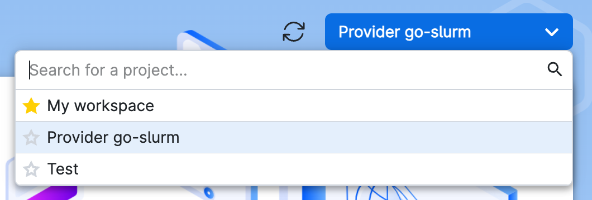
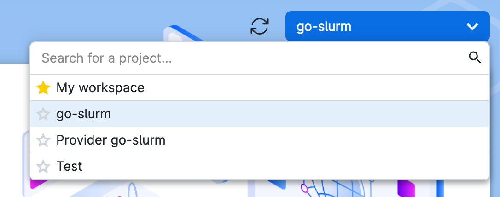
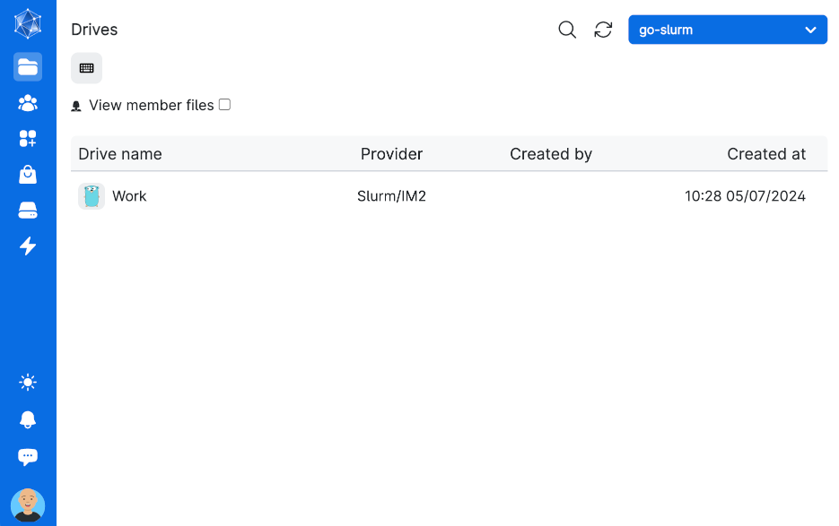

# Installation

This document will guide you through the process of obtaining and installing UCloud/IM for Slurm. By the end of this
document you will be connected to UCloud's sandbox environment. Please see [this](#TODO) document for more information
about becoming a provider in the production environment.

## Prerequisites

The UCloud Integration Module should be deployed on the HPC frontend or a node with a similar configuration.

System minimum requirements:

- __OS:__ Linux (any distribution)
- __CPU:__ x86_64 with at least 4 vCPU
- __Memory:__ 16GB

HPC cluster minimum requirements:

- __Slurm:__ TODO version number
- __Filesystem:__ A distributed filesystem exposing a standard POSIX interface
    - UCloud/IM for Slurm has integrations with: GPFS, CephFS (TODO), WEKA (TODO)

In addition, the machine must be able to perform the following actions:

- Communicate with Slurm using the normal CLI commands (e.g. `sinfo`).
- Access to a distributed filesystem. Mount-point must be the same as on the compute nodes.
- The machine must use the same user database as the compute nodes, such that users and ids are consistent across the
  entire cluster.
- `sudo` must be installed.
- Must allow out-bound Internet connectivity (Note: Production environments also require some in-bound Internet
  connectivity).
- Must have at least one partition which should accept UCloud jobs

In order to follow along with this document you also need:

- You must have one test user on the system. The test user must have access to:
    - Some folder(s) on the distributed filesystem (e.g. `/home/$USERNAME`)
    - An associated Slurm account which can submit jobs to a Slurm partition

## Obtaining the Software

<div class="tabbed-card">

<div data-title="RHEL" data-icon="fa-brands fa-redhat">

RPM packages for RHEL are automatically built. You can download the latest RPM package
[here](https://github.com/sdu-escience/ucloud/releases). Once you have downloaded the package, you can install it with
the following command:

```console
$ sudo dnf install -y ucloud-im-rhel.rpm
```

This package will automatically configure and install UCloud/IM and you are ready for the next steps. You can verify
that the installation was successful by running the following command:

```console
$ ucloud version
UCloud/IM 2024.1.0
```

You can additionally verify that your machine is configured correctly by running:

```console
$ sudo ucloud slurm verify
Software
-------------------------------------------------------------------------------
UCloud/IM        | 2024.1.0 (OK)
Slurm            | 23.11.7 (OK)

Machine
-------------------------------------------------------------------------------
OS               | AlmaLinux 8.9 (Midnight Oncilla) x86_64 (OK)
CPU              | AMD EPYC 7282 (64) @ 2.800GHz (OK)
Memory           | 128771MiB (OK)
Filesystem       | GPFS (estimated from /home/, OK)

Machine and service configuration
-------------------------------------------------------------------------------
Service          | Configured (OK)
sudo             | OK
sudo config      | OK
IM config        | Awaiting init (OK)

TEST SUCCESSFUL
```

</div>

<div data-title="Ubuntu" data-icon="fa-brands fa-ubuntu">

Ubuntu instructions **go here**.

</div>

<div data-title="Manual" data-icon="fa-brands fa-golang">

Manual instructions **go here**.

</div>

</div>

## Registering as a Provider

<div class="info-box info">
<i class="fa fa-info-circle"></i>
<div>

This section will create a secret file containing your credentials. By default, it will be located at
`/etc/ucloud/server.yml`. Please keep this file safe and keep a backup of it. In case of a re-installation, you
should aim to re-use this file.

</div>
</div>

Before you can start UCloud/IM, you must register as a service provider. This is only needs to be done once. You can
automatically register with the sandbox environment by running the following command:

```console
$ sudo ucloud register --sandbox
Please finish the registration by going to https://sandbox.dev.cloud.sdu.dk/app/provider/registration?token=XXXXXXXXXXXX

Waiting for registration to complete (Please keep this window open)...
Registration complete! You may now proceed with the installation.
```

Once the registration is complete, you now have a provider on UCloud's sandbox environment. From the UCloud interface,
you should now be able to select your provider project from the project switcher. You can add other UCloud users to help
manage your provider by inviting them through the interface. See the [end-user documentation](https://docs.cloud.sdu.dk)
for more details.

<figure>



<figcaption>

You will be able to manage parts of your provider through UCloud's interface. To do this, you must first select the
provider project which you are automatically added to.

</figcaption>
</figure>

## Bootstrapping the Configuration

In this section we will bootstrap the configuration of your provider such that you may test that everything is working
as intended. Your provider will start out in an _unmanaged_ state.

<div class="info-box info">
<i class="fa fa-info-circle"></i>
<div>

__As an unmanaged provider__, UCloud will be running with limited
functionality towards your service provider. In particular, quota management and project management will be disabled and
will have to be done by hand. This means that UCloud/IM _will not_ create or manage any users, projects or any resource
allocation. All of this must be done by you through whichever means you have.

__Managed providers__ have all UCloud functionality turned on. This allows UCloud/IM to automatically manage users,
projects
and quotas. This can co-exist with users and projects created through other means. UCloud/IM will _only_ manage users
that have been created through UCloud. During the following section we will explain how to transition your provider from
an unmanaged state to a managed state.

</div>
</div>

In order to start the bootstrapping process, you can run the following command:

```console
$ sudo ucloud slurm bootstrap
```

This will take you through a configuration wizard, as shown below:

```console
Welcome, $providerName. This configuration wizard will take you through the bootstrapping process. You will need to
answer a few questions about your environment.

You will have a chance to review the configuration at the end.

Some default values have been chosen based on your installation method (RPM package).

Now configuring: Filesystem
------------------------------------------------------------------------------------------------------------------------
[🙋] Please select all root-folders relevant for end users. (e.g. /home)    /work

Now configuring: Slurm
------------------------------------------------------------------------------------------------------------------------
[🙋] Please select a Slurm partition to configure.                          fat
[🙋] Select an accompanying QoS                                             normal
[🙋] What should we call the (fat/normal) combination in UCloud?            hippo-fat
[🙋] Do you use full-node reservations?                                     no
[🙋] How many (v)CPU does a full node have (hippo-fat)?                     128
[🙋] How much memory does a full node have in GB (hippo-fat)?               4096
[🙋] How many GPUs does a full node have (hippo-fat)?                       0

Now configuring: SSH
------------------------------------------------------------------------------------------------------------------------
[🙋] Do you allow user to SSH to your frontend from their own machine?      yes
[🙋] What is the hostname of your SSH frontend?                             frontend.hippo.example.com
[🙋] Should end-users be allowed to upload new SSH keys via UCloud?         yes

Now configuring: Applications
------------------------------------------------------------------------------------------------------------------------
[🙋] Do you wish to support interactive applications (web-based)?           yes
[🙋] Do you wish to support remote desktop applications?                    yes
```

This configuration wizard will finish up your configuration and place it in UCloud's configuration folder. The
default/recommended folder, regardless of installation method, is `/etc/ucloud`.

## Testing the Configuration

In order to test the configuration, we must first ensure that UCloud/IM is turned on.

<div class="tabbed-card">

<div data-title="RHEL" data-icon="fa-brands fa-redhat">

You can start UCloud/IM via `systemd` by running the following command:

```console
$ sudo systemctl start ucloud-im
```

You can verify that UCloud/IM is running by checking the status.

```console
$ sudo systemctl status ucloud-im
● ucloud-im.service - UCloud Integration Module
   Loaded: loaded (/usr/lib/systemd/system/ucloud-im.service; enabled; vendor preset: disabled)
   Active: active (running)
```

In case of errors, you should check the log files in `/var/log/ucloud`. At this stage, you should focus on:

```console
$ sudo less /var/log/ucloud/server.log
```

You might also be able to find useful information in the journal:

```console
$ sudo journalctl -u ucloud-im
```

You can find more guidance for troubleshooting in our [troubleshooting guide](../ops/troubleshooting.md).

</div>

<div data-title="Ubuntu" data-icon="fa-brands fa-ubuntu">

Ubuntu instructions **go here**.

</div>

<div data-title="Manual" data-icon="fa-brands fa-golang">

Manual instructions **go here**.

TODO Cover sudo and the groups required. Explain that the `ucloud_users` group must exist and the ucloud service user
be able to use it.

</div>

</div>

Now that UCloud/IM is running you must connect your UCloud identity to your local identity. At this stage, your provider
will be in an unmanaged state. As a result, we will be following the unmanaged connection procedure. This requires you
to have an already existing user on the HPC system. The user should have access to both the distributed filesystem and
on Slurm. In other words, this user should be configured as a normal user of the HPC system.

As your test user, run the following command to initiate the connection procedure:

```console
$ whoami
local-test-user

$ ucloud connect
You can finish the connection procedure by going to: https://sandbox.dev.cloud.sdu.dk/app/connection?token=XXXXXXXXXXX

Waiting for connection to complete... (Please keep this window open)

Connection complete! Welcome 'local-test-user'/'UCloudUser#1234'!
```

In the UCloud user-interface, a new project should appear with the name of your service-provider:

<figure>



<figcaption>

A new project has appeared, allowing your user to consume resources from your service-provider!

</figcaption>
</figure>

Similarly, the other parts of the UCloud user-interface also now show your resource on your service-provider. For
example, the file management interface will show you the relevant top-level folder that you specified during the
configuration bootstrap procedure.

<figure>



<figcaption>

The `/work` folder has appeared inside UCloud. This is the same folder which was configured during the bootstrapping
process. Depending on the folder(s) you chose, you might see something different.

</figcaption>
</figure>

## Next Steps

You have now successfully connected your service provider to UCloud's sandbox environment! Your service provider is
currently _unmanaged_ and running in _proxy_ networking-mode.

In order to get your service-provider into UCloud's production system you must upgrade the networking-mode and should
change it into a managed provider. During the next chapters, we will discuss how to do this. In the next section we will
explain what is going on behind the scenes with your new UCloud provider and also discuss networking-modes.