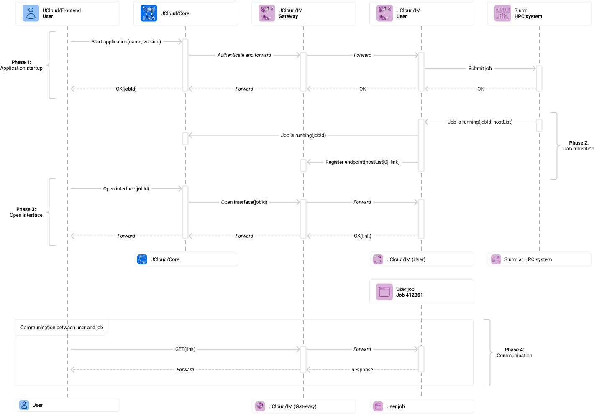
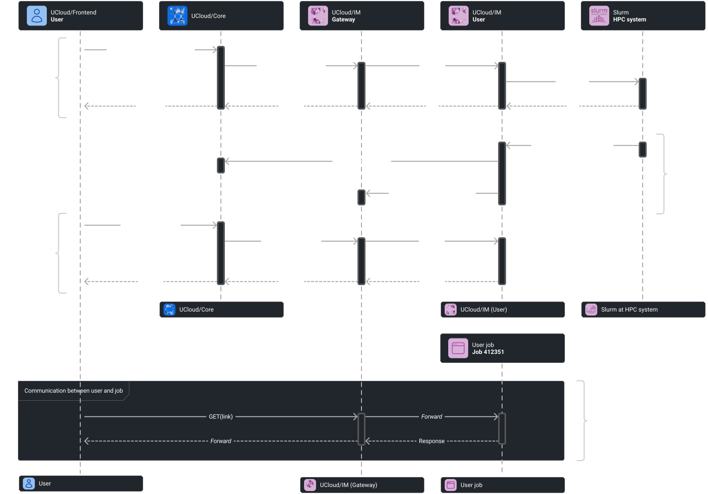

# Interactive Jobs

This chapter contains the technical details about how interactive jobs work in UCloud/IM for Slurm. This chapter
builds heavily on the [Slurm integration](./slurm.md) and [Application Management](./app-management.md) chapters.
UCloud/IM for Slurm also ships with a number of [built-in interactive applications](./built-in-apps.md) which are
enabled by default.

This chapter also heavily relies on networking details originally covered in
[Architecture and Networking](./architecture.md). A recap is provided in this chapter.

## The Gateway

## Web-interfaces

- The web application feature is enabled via the `web` section
- Port allocation is managed or unmanaged depending on the `web.port` value
  - When allocated, ports are passed in `UCLOUD_WEB_PORT/ucloud.webPort`
- The gateway will send traffic to the compute node running the requested rank on the allocated/fixed port
- Hostnames are used for resolving the IP address (with all this implies)
- UCloud/IM will not reconfigure any firewalls. It assumes that the frontend node can speak with the compute nodes
  freely.
- When a web enabled application is started, a message is sent to the gateway system configuring a new endpoint
- No authentication is done by the gateway instance, since we assume that the firewall would allow access regardless
- As a result, it is the responsibility of the application to enforce proper authentication
- Authentication tokens should be either supplied by the user (through an input parameter) or automatically generated.
  When auto-generated it should be emitted to stdout or in a file. This will allow the user to access the application
  when they open the interface.

<figure class="diagram">

<figcaption>

The UCloud/IM built-in software repository provides a range of software modules and applications. Builds of the module
are triggered by UCloud/IM (User) and subsequently loaded through the submission script.

</figcaption>
</figure>

## Remote Desktop Environments (via VNC)

