# Slurm Integration

This chapter will cover how UCloud/IM for Slurm integrates with Slurm itself. The chapter will cover the internals of
how the software will interact with the local Slurm system. The chapter will also discuss how various integrations can
ensure automatic management of accounts and quotas.

## Introduction

UCloud/IM interacts with the Slurm system through the normal Slurm commands. UCloud/IM does not currently utilize the
JSON or REST functionality. As a result, UCloud/IM only requires version TODO XXX TODO or above.

As covered in the [Architecture and Networking](./architecture.md) chapter, these commands (when responding to a user
request) will be run as the corresponding local user. Thus, if `Donna#1234` has a local identity of `donna01` then all
Slurm commands run on her behalf will be run as the `donna01` user.

The diagram below summarizes the significant steps involved in the submission of a job.

<figure class="diagram">

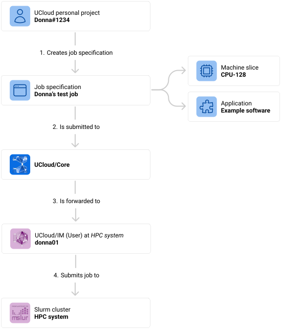
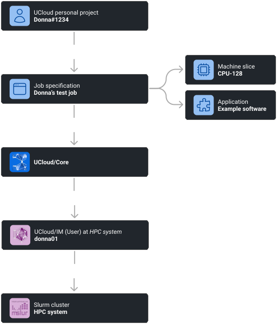

<figcaption>

In UCloud/IM for Slurm, a user can submit a job to UCloud/Core. These jobs are then forwarded to the service provider
where a context switch occurs such that the job is submitted as the correct local identity. In this case `Donna#1234`
is mapped to the user `donna01`.

</figcaption>
</figure>

1. **The end-user creates a job specification.** This step is typically done through the UCloud user-interface where
   the user can select from an application catalog. Once selected, the user will be selected with a variety of input
   parameters. These input parameters can be specific to the software, while others are related to how it should be
   scheduled.
2. **The job specification is submitted to UCloud/Core.** Once the specification has been created, a network call is
   made to UCloud/Core. This call is authenticated as the user's UCloud identity. Along with the request is also
   information about which project it should be executed as.
3. **UCloud/Core validates the request and forwards it to the relevant provider.** UCloud/Core will validate,
   authenticate and authorize all parts of the request. Once done, it will find the appropriate service provider based
   on the request and forward the message.
4. **The UCloud/IM (User) instance corresponding to the end-user submits the job to Slurm.** The details on how this
   submission takes place is covered by this chapter along with the following chapters.

## Machine Types and Slices (Products)

As covered in the [User and Project Management](./id-management.md) chapter, users must first apply and be approved
to use any service provider. Their application contain one or more resource allocations for a _category of products_
which the service provider exposes. A product category or, as we will refer to them in this context, a machine type is
the unit for which you can receive a resource allocation. Machine types bundle together machines that have similar
hardware. For example, if a system have three types of nodes in the HPC system then at least three
different machine types are required. A machine type defines several machine slices, also known as a _product_ in the
rest of
UCloud. Such a slice describes the concrete specification of the slice which includes the number of cores, the amount of
RAM and the number of GPUs connected to it.

<figure class="diagram">

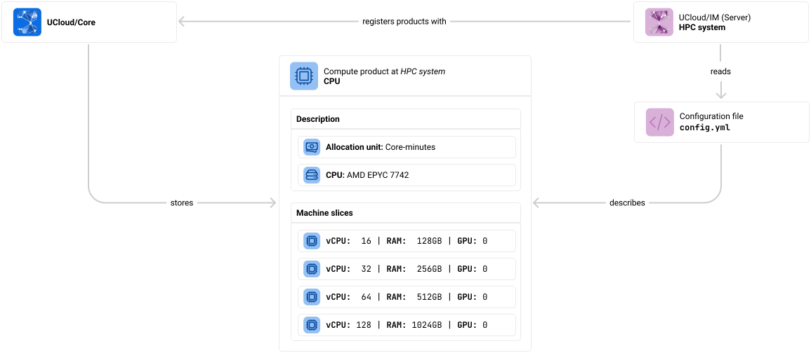
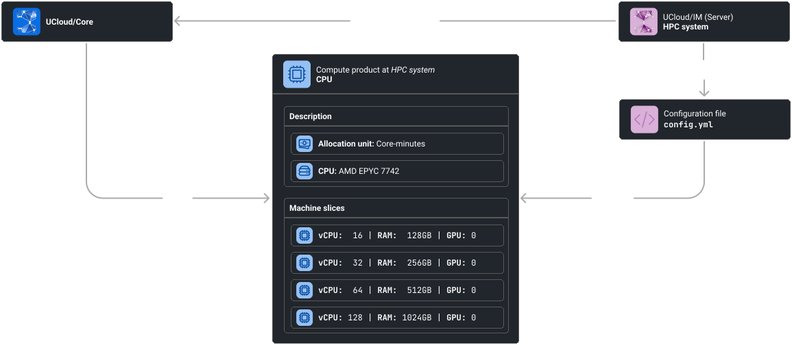

<figcaption>

Machines types (`ProductCategory`) and machine slices (`Product`) define the services of a provider. They are described
by the main configuration file (`/etc/ucloud/config.yml`) and are registered by the main UCloud/IM component into
UCloud/Core.

</figcaption>
</figure>

As seen in the [Installation](./installation.md) chapter, UCloud/IM can bootstrap the configuration which includes the
definition of one or more machine types. The result of this is a section in the `config.yml` configuration file. In
`slurm.machines` you are able to define as many machine types as you wish. Note that it is possible to have different
machine types pointing at the same Slurm partition, as long as it points to a different quality-of-service (QoS). In
UCloud/IM for Slurm a machine type corresponds roughly to a (partition, qos) pair. As we will see in the next section,
machine types and machine slices play a critical role in how Slurm jobs are submitted to the queue.

In the diagram below we show how the YAML configuration maps to our previous diagram. For the full list of options, see
the [reference chapter](./config-reference.md).

<figure class="diagram">
<div class="tabbed-card">

<div data-title="Diagram" data-icon="fa-solid fa-square-pen">

<figure class="diagram">

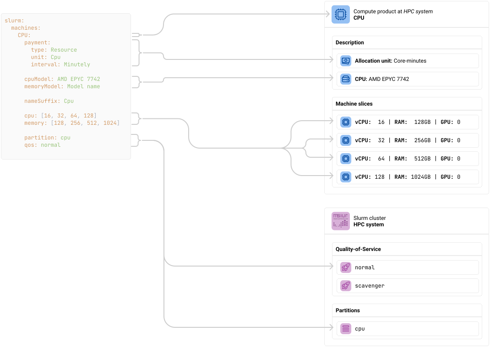
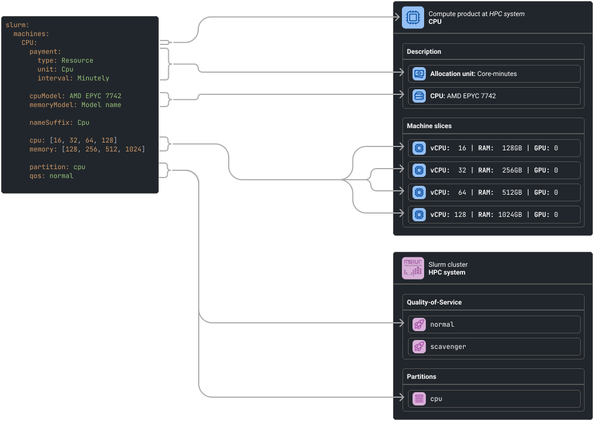

</figure>

</div>

<div data-title="Code" data-icon="fa-solid fa-code">

```yaml
slurm:
  machines:
    CPU:
      payment:
        type: Resource
        unit: Cpu
        interval: Minutely

      cpuModel: "AMD EPYC 7742"
      memoryModel: "Model name"

      nameSuffix: Cpu

      cpu: [ 16, 32, 64, 128 ]
      memory: [ 128, 256, 512, 1024 ]

      partition: normal
      qos: normal
```

</div>

</div>

<figcaption>

A diagram depicting the configuration required for defining a machine type called `CPU`. This machine type has an
allocation unit of Core- (`type: Resource` and `unit: Cpu`) minutes (`interval: Minutely`). It maps to the `cpu`
Slurm partition, and it will use the `normal` QoS. It defines four separate machine slices with up to 128 vCPU and
1024GB RAM.

See the "Code" tab for selectable text.

</figcaption>

</figure>

## Job Submission

UCloud/IM uses the following procedure to submit a job to Slurm:

1. Determine the primary drive belonging to the project
    - TODO How?
2. In the primary drive, create the job folder at `UCloud Jobs/${UCloudJobId}`
3. In the job folder, create the submission script `job.sh`
4. Generate the `sbatch` preamble and add it to the submission script
5. Generate the application start-up code using the job specification and referenced application
6. Submit the job using:
   ```terminal
   $ sbatch "${PrimaryDrive}/UCloud Jobs/${UCloudJobId}/job.sh"
   412512
   ```   

In this section, we will discuss step 4 of how UCloud/IM selects the submission parameters for the
[`sbatch` preamble](https://slurm.schedmd.com/sbatch.html). In the coming chapters, we will also be discussing step
5, which is how UCloud/IM determines how to run the user's job.

The diagram below highlights the important steps in submitting a job.

<figure class="diagram">

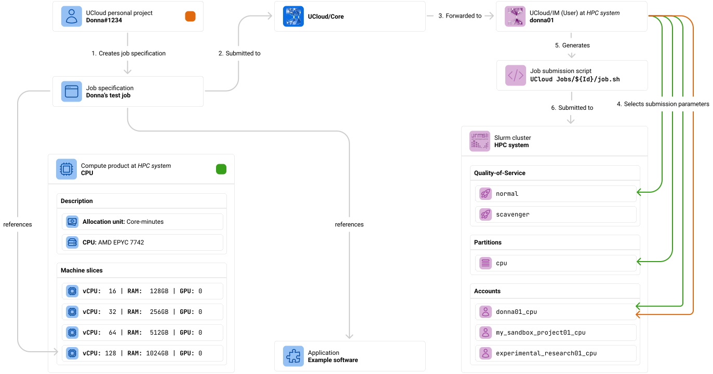
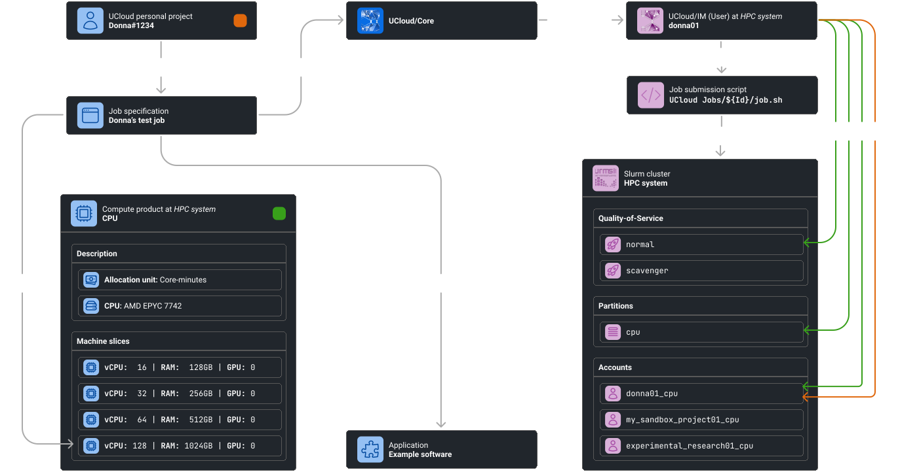

<figcaption>

TODO

</figcaption>
</figure>

The table below summarizes which submission parameters UCloud/IM will include. Note that the integration module does not
support all the option of Slurm, but keep in mind that the integration module does not disallow the direct use of Slurm.
Advanced users should still be encouraged to use Slurm directly through the HPC frontend.

<figure>
<div class="table-wrapper no-code-wrap">
<table>
<thead>
<tr>
<th>Option</th>
<th>Description</th>
</tr>
</thead>
<tbody>

<tr>
<td><code>--account</code></td>
<td>

Selects the account used for the job submission.

**Unmanaged providers:** This value is taken from the job specification's input parameters. The user must manually
supply the account for each job. UCloud/IM is not able to verify if the machine type + account combination is valid
prior to submission.

**Managed providers:** An account is automatically chosen based on the requested:

- UCloud project
- Machine slice and corresponding machine type

See below for discussion on how this mapping process takes place and how to configure it.

</td>
</tr>

<tr>
<td><code>--chdir</code></td>
<td>

This controls the working directory of the submission script, as it runs. This is set to the job directory in which the
submission script resides. This is done to ensure consistency with the other IM implementation of UCloud.

</td>
</tr>

<tr>
<td><code>--partition</code></td>
<td>

This determines the partion to use. This value is taken directly from the configuration of the selected
machine type.

</td>
</tr>
<tr>
<td><code>--qos</code></td>
<td>

This determines the quality-of-service to use. This value is taken directly from the configuration of the selected
machine type.

</td>
</tr>

<tr>
<td><code>--constraint</code></td>
<td>

This controls additional scheduling constraints in Slurm. By default, this option is not set. This option can be
controlled by advanced configuration of the machine types. See the [Advanced Scheduling](./advanced_scheduling.md)
appendix for more information.

</td>
</tr>

<tr>
<td><code>--cpus-per-task</code></td>
<td>

This controls the amount of cores available in each node. This value is taken directly from the machine slice
selected for the job.

</td>
</tr>

<tr>
<td><code>--gpus-per-node</code></td>
<td>

This controls the amount of GPUs available in each node. This value is taken directly from the machine slice
selected for the job.

</td>
</tr>

<tr>
<td><code>--mem</code></td>
<td>

This controls the amount of memory available in each node. This value is taken directly from the machine slice
selected for the job.

</td>
</tr>

<tr>
<td><code>--nodes</code></td>
<td>

This controls the amount of nodes available to the job. This value is taken directly from the job specification's input
parameters.

</td>
</tr>

<tr>
<td><code>--time</code></td>
<td>

This manages the time allocation of the job. If the job does not complete within this amount of time, it will
automatically be cancelled. In UCloud, this will correspond to the `EXPIRED` state. The time is derived from the input
parameters of the job specification. Note that UCloud only supports time allocations at the granularity of hours.

</td>
</tr>

<tr>
<td><code>--job-name</code></td>
<td>

The job name is shown in the output of various Slurm commands. To make it easier for users to understand how the job
was submitted, this will be set to `UCloud: ${UCloudJobId}`. Note that the job name, which can optionally be set in
UCloud, is not used for this parameter.

</td>
</tr>

<tr>
<td><code>--output</code><br><code>--error</code></td>
<td>

These options are used to redirect the `stdout` and `stderr` streams of the submission scripts to specific files.
UCloud/IM will forward these logs to UCloud/Core and will be shown in the user-interface to the user. The files will be
placed in the job folder and will be called `stdout.txt` and `stderr.txt`.

</td>
</tr>

<tr>
<td><code>--parsable</code></td>
<td>

This flag is set by UCloud/IM to interpret the output of the `sbatch` command. This option has no effect on the actual
job.

</td>
</tr>
</tbody>
</table>
</div>
<figcaption>

A table describing the parameters which UCloud/IM for Slurm will pass to the `sbatch` submission script. Parameters not
described here are not set by the integration module and cannot be set for any job submitted through UCloud, unless
these parameters are configured by the [application](./app-management.md).

</figcaption>
</figure>

## Choosing a Slurm Account

<div class="info-box info">
<i class="fa fa-info-circle"></i>
<div>

This section is only relevant for **managed providers**. An account is always based on direct user-input in the case
of unmanaged providers.

</div>
</div>

Slurm accounts are selected according to the project and the machine type specified for a given job. Irrespective of the
account management integration method employed, UCloud/IM must be configured to identify the appropriate account. The
account mapping process is defined within the configuration, allowing for the selection between invoking a script or
employing the simpler pattern method. Configuration is managed through the `slurm.accountManagement.accountMapper`
section by setting the type property accordingly. Regardless of the chosen method, the same variables are accessible for
both the pattern and the script.

<div class="tabbed-card">
<div data-title="Pattern" data-icon="fa-solid fa-pencil">

```yaml
slurm:
  accountManagement:
    accountMapper:
      type: Pattern
      users: "#{localUsername}_#{partition}"
      projects: "#{localGroupName}_#{partition}"
```

</div>

<div data-title="Script" data-icon="fa-solid fa-code">

```yaml
slurm:
  accountManagement:
    accountMapper:
      type: Script
      script: "/opt/ucloud/scripts/account-mapper"
```

The response of the script must use the following format:

```json
{
  /* string */
  "account": ""
}
```

</div>
</div>

**Variables**

| Entity             | Variable             | Description                                             |
|--------------------|----------------------|---------------------------------------------------------|
| _Always available_ | `entityType`         | `"User"` or `"Project"`                                 |
| _Always available_ | `partition`          | The partition configured for this machine type          |
| _Always available_ | `qos`                | The quality-of-service configured for this machine type |
| _Always available_ | `categoryName`       | The name of the machine type                            |
| `User`             | `localUsername`      | The local username of the user                          |
| `User`             | `ucloudUsername`     | The username of the UCloud identity                     |
| `User`             | `uid`                | The corresponding local UID of the user                 |
| `Project`          | `localGroupName`     | The local group name of the project                     |
| `Project`          | `ucloudProjectTitle` | The UCloud project title                                |
| `Project`          | `ucloudProjectId`    | The UCloud project ID                                   |
| `Project`          | `gid`                | The corresponding local GID of the project              |

<br>

If the configured account mapper is ever changed, then this change will only have an effect on new Slurm accounts. The
account mapper is evaluated once per project + machine type combination once they receive a resource allocation for this
machine type. The result of the account mapper is saved in the internal database for future use. It is possible to list
mappings and delete faulty mappings from the command line. Deleting a mapping will automatically trigger the account
mapper _and_ resource allocation update trigger to re-run immediately.

<figure>

```terminal
# Listing Slurm mappings based on a regex
$ sudo ucloud slurm accounts list --regex ".*_faulty_cpu.*"
| Type    | Project title      | Local ID             | Category | Account             | 
|--------------------------------------------------------------------------------------|
| User    | Donna#1234         | donna02              | CPU      | donna02_faulty_cpu  |

# Removing a faulty mapping
# This will NOT delete the Slurm account
$ sudo ucloud slurm accounts rm --account donna02_faulty_cpu
OK

$ sudo ucloud slurm accounts list --regex ".*_faulty_cpu.*"
| Type    | Project title      | Local ID             | Category | Account             | 
|--------------------------------------------------------------------------------------|
| No results                                                                           |
```

<figcaption>

Commands showing how to list Slurm account mappings and deleting a faulty mapping.

</figcaption>

</figure>

## Keeping Track of Jobs

UCloud/IM (Server) is responsible for keeping track of all relevant jobs in the Slurm cluster. It will do this by
periodically pulling information about all jobs in the relevant partitions of the Slurm cluster. For each job, it will
produce an internal update report. If this update report indicates that UCloud/Core should be notified about a change,
then it will send either an update or register a new job. New jobs are registered in case of jobs which are submitted
outside UCloud. UCloud/IM will keep an internal mapping between Slurm jobs and UCloud jobs, this allows it to know
which UCloud job is to be updated.

TODO The integration module should keep track of reservations and generate a warning to the user if their job is set to
expire before the node reservation starts. This is similar to how a warning should be generated if a K8s node is
cordoned.

### Example: Dealing with a Known Job

In this example, we will look at how UCloud/IM (Server) deals with the monitoring of a job which it knows. Jobs
submitted through UCloud are always immediately known since a mapping is created when the job is submitted. Jobs which
are submitted outside UCloud become known after their initial registration.

In this case, UCloud/IM is looking at the job with Slurm ID `141232`. Slurm is reporting that this job is running. The
job report shows that a mapping has already been established with the corresponding UCloud job with ID `5124313`. The
report also states that a state transition has occurred from `IN_QUEUE` to `RUNNING`. This trigger a message to UCloud
which lets it know that the job is now running. The end-user(s) owning this job will automatically receive a
notification about the state change.

<figure class="diagram">

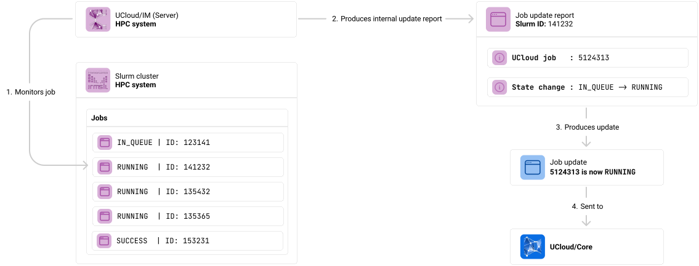
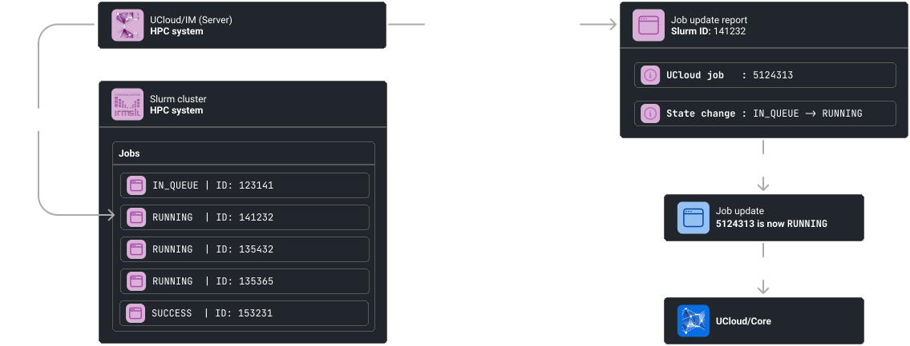

<figcaption>

UCloud/IM (Server) monitoring a job which has made a state transition from `IN_QUEUE` to `RUNNING`.

</figcaption>
</figure>

### Example: Dealing with an Unknown Job (Submitted outside UCloud)

UCloud/IM is not only capable of handling jobs that have been submitted from UCloud, it can also handle jobs that are
submitted directly to Slurm. In such a case, the job update report will not be able to find a corresponding UCloud job.
This triggers a separate process of finding the appropriate UCloud owner, machine slice and other scheduling parameters.
The owner is found by using the database of already invoked account mappers. This is used in combination with the
partition and QoS to determine the correct project and machine slice.

If no owner could be found, then no job is registered in UCloud. UCloud/IM will make no attempts to monitor or manage
such a job.

Assuming that an owner is found, then a new job is created and registered with UCloud/Core. UCloud/Core will respond
with the ID of the new job, which is stored internally in UCloud/IM. This establishes a mapping which means that it is
now considered a "known" job.

<figure class="diagram">

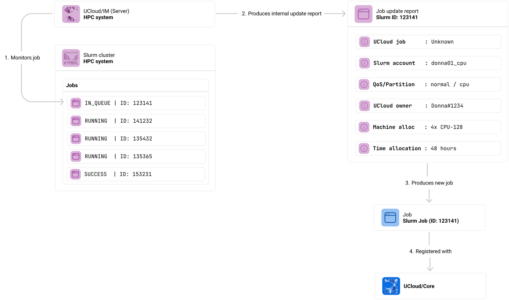
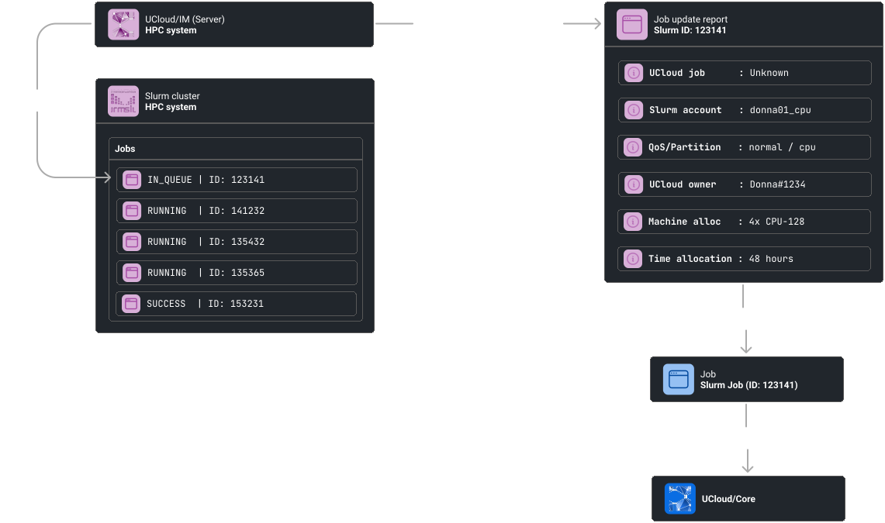

<figcaption>

UCloud/IM (Server) monitoring a job which it does not have a mapping for. This happens when a job is submitted
directly to Slurm.

</figcaption>
</figure>

## Integrations

<div class="info-box info">
<i class="fa fa-info-circle"></i>
<div>

The integrations listed in this section require you to first become a managed provider by turning on automatic user
management. You can read more about the process [here](./id-management.md).

</div>
</div>

### Automatic

This integration will automatically manage Slurm accounts, configure quotas and fairshare. It will achieve this using
the standard Slurm mechanisms and will use only the normal command-line tools, as shown in the breakdown section. In
order for this to be done, the UCloud service user must have the correct privileges. The setup of these privileges are
covered by the [Installation](./installation.md) chapter as these are already a requirement.

As described in the rest of this chapter, the automatic integration will aim to create exactly one account per
`(project, machine type)` resource allocation that exists in the system. The integration will also ensure that an
association is created between the members of the project and the associated Slurm accounts. Members are automatically
added and removed, in a similar fashion to how they can be synchronized to [Unix groups](./id-management.md#freeipa).

This integration is configured in the following way:

<figure>

```yaml
  slurm:
    accountManagement:
      accounting: # Usage and quota management
        type: Automatic
```

<figcaption>

The "Automatic" account management is configured by setting the type to `Automatic`.

</figcaption>

</figure>

#### Configuring Partitions and Accounting

This integration depends on the [accounting](https://slurm.schedmd.com/accounting.html) functionality of Slurm. You
should generally follow the Slurm documentation for setup. Below we have included a checklist of items that you must
ensure have been configured, as the integration depends on these.

**1. Confirm that accounting is enabled**

You should confirm that the following properties are set. *Note that the values likely need to be different for any
specific system.*

```ini
# /etc/slurm/slurm.conf

JobAcctGatherType=jobacct_gather/linux
JobAcctGatherFrequency=30

AccountingStorageType=accounting_storage/slurmdbd
AccountingStorageHost=slurmdbd
AccountingStoragePort=6819
```

**2. Configure accounting to enforce the correct properties**

You should confirm that the accounting is actually enforced. *The property MUST include the options listed here, but
MAY include more.*

```ini
# /etc/slurm/slurm.conf

AccountingStorageEnforce=associations,limits,qos,safe
```

| Option         | Description                                                                                            |
|----------------|--------------------------------------------------------------------------------------------------------|
| `associations` | This will ensure that only the users who are added to an account can use it.                           |
| `limits`       | This will ensure that limits set on associations and QoS are actually enforced.                        |
| `qos`          | This will require all jobs to have a quality-of-service set (explicitly or via a default).             |
| `safe`         | This will ensure that jobs are able to complete with the remaining quota before they can be submitted. |

**3. Configure tracking of resource consumption**

Slurm will by default track CPU and memory usage. However, it does track GPUs. If the system needs to support a machine
type with an accounting unit of GPU-hours, then this must be turned on with:

```ini
# /etc/slurm/slurm.conf

AccountingStorageTRES=gres/gpu
```

**4. Configure partition(s) to only allow the relevant quality-of-service(s)**

This step will ensure that only users with a resource allocation to a partition can actually submit to said partition.
The system should generally be configured in such a way that every partition has *exactly* one corresponding
quality-of-service. The only exception to this should be for scavenger queues, in which case two quality-of-services
are needed for one partition.

The `AllowQoS` property must be set on the partition. This can contain a comma-separated value to allow multiple QoS
to access a given partition.

```ini
# /etc/slurm/slurm.conf

# Example with no scavenger queue
PartitionName=cpu Nodes=c[1-2] AllowQoS=normal

# Example with a scavenger queue
PartitionName=cpu Nodes=c[1-2] AllowQoS=normal,scavenger
```

A quality-of-service can be configured with the following command:

```terminal
$ sacctmgr add qos $qosName
 Adding QOS(s)
  $qosName
 Settings
  Description    = $qosName
Would you like to commit changes? (You have 30 seconds to decide)
(N/y): Y
```

**5. Configure the partition's billing to match the UCloud/IM configuration**

This integration uses `grptresmins` billing for resource tracking. The billing weights are configurable in Slurm and
should match the billing configured in the UCloud/IM configuration. The machine type billing configuration looks like
this:

<figure>

```yaml
slurm:
  machines:
    CPU:
      payment:
        type: Resource
        interval: Minutely

        # One of the following lines will be active
        unit: "Cpu"
        # unit: "Gpu"
        # unit: "Memory"
```

<figcaption>

The configuration of an accounting unit for a machine type.

</figcaption>

</figure>

Depending on the `unit` used, the billing should be configured differently. The table below shows how to configure
the billing for each unit.

<div class="table-wrapper no-code-wrap">
<table>
<thead>
<tr>
<th>Unit</th>
<th>Configuration</th>
</tr>
</thead>
<tbody>

<tr>
<td><code>Cpu</code></td>
<td>

```ini
PartitionName=mypartition Nodes=c[1-2] AllowQoS=normal TRESBillingWeights="CPU=1.0"
```

</td>
</tr>

<tr>
<td><code>Gpu</code></td>
<td>

```ini
PartitionName=mypartition Nodes=c[1-2] AllowQoS=normal TRESBillingWeights="GRES/gpu=1.0"
```

</td>
</tr>

<tr>
<td><code>Memory</code></td>
<td>

```ini
PartitionName=mypartition Nodes=c[1-2] AllowQoS=normal TRESBillingWeights="Mem=1.0G"
```

</td>
</tr>

</tbody>
</table>
</div>

#### Breakdown of operations executed by UCloud/IM

<div class="table-wrapper">
<table>
<thead>
<tr>
<th>Trigger</th>
<th>Description</th>
</tr>
</thead>

<tbody>
<tr>
<td>Resource allocation updated</td>
<td>

Note: This trigger also runs when a resource allocation is first created. The trigger will run after the user or group
has been created in the system. See the [User and Project Management](./id-management.md) chapter for more details.

**1. Determine the Slurm account associated with the `(project, machine type)` pair**

This step will first look in the internal database for account mappings. If it is not found in the database, then the
account mapper is invoked as defined by the configuration. See the
[Choosing a Slurm Account](#choosing-a-slurm-account) section.

**2. Check if the Slurm account exists**

This is achieved using the following command:

```terminal
$ sacctmgr -nP show account $accountName
```

If the command returns any output, then it is assumed that account exists. If the account exists, skip to step 4.

**3. Create the Slurm account**

```terminal
$ sacctmgr -i create account $accountName qos=$qos defaultqos=$qos
```

**4. Update billing and fairshare**

If UCloud/Core is reporting over-consumption in a project hierarchy, then usage should not be allowed to continue. This
is implemented by setting the maximum number of jobs to 0 (`maxjobs = 0`). This will effectively prevent any more jobs
from
being submitted, without cancelling any jobs currently running. If UCloud/Core is not reporting any
over-consumption then the maximum number of jobs is set to unlimited (`maxjobs = -1`).

The resource allocation is converted into "resource"-minutes, where resource is either Cores, GPUs or
Gigabytes of memory. The fairshare value is derived from this and set to `${resourceMinutes} / 60 / 24`.

```terminal
$ sacctmgr -i modify account $accountName set \
    maxjobs=$maxJobs \
    grptresmins=billing=$resourceMinutes \
    fairshare=$fairshare
```

</td>
</tr>

<tr>
<td>Project updated</td>
<td>

Note: This trigger will always run following the creation that occurs in "Resource allocation updated". As a result, the
account is guaranteed to exist at this point.

**1. Add new members to the Slurm account**

This step is repeated for every member added to the project. If no new members are added to the project, this step is
skipped. This step is only invoked for users which are already connected to the provider.

```terminal
$ sacctmgr -i add user $localUsername account=$accountName
```

**2. Remove old members from a Slurm account**

This step is repeated for every member removed from a project. If no new members are removed from the project, this step
is skipped. This step is only invoked for users which are already connected to the provider.

```terminal
$ sacctmgr -i remove user $localUsername account=$accountName
```

</td>
</tr>

<tr>
<td>User disconnects</td>

<td>

TODO Remove user from all projects

</td>
</tr>

<tr>
<td>Usage reporting (invoked periodically)</td>
<td>

**1. Retrieve usage numbers by Slurm account**

```terminal
$ sshare -Pho account,user,grptresraw
```

**2. Report usage numbers to UCloud/Core**

This step is repeated for each row of usage reported by Slurm. The account is reverse-mapped to _all_ matching
`(project, machine type)` pairs. For each of these, UCloud/Core receives the usage corresponding to the usage reported
by Slurm.

In case this leads to a change in the over-consumption flag anywhere then a notification is emitted by UCloud/Core. Such
a notification will trigger the "Resource allocation updated" process.

TODO If a product is marked as `freeToUse` then we should not send usage numbers.

</td>
</tr>

</tbody>
</table>
</div>

### Scripted

This integration is another [script](#TODO) integration. Script integrations allow you to fully customize all aspects of
Slurm account and quota management. It is entirely up to you to create these scripts. All scripts will be invoked with
a single argument, which is a path to a JSON file. The contents of the JSON file will depend on the script, see below
for details. All scripts are expected to return the response as a JSON object on `stdout`. Detailed error messages and
debug information should be printed to `stderr`. In case of errors a non-zero exit code should be returned.

In order to configure this integration, you must first configure it:

<figure>

```yaml
slurm:
  accountManagement:
    accounting:
      type: Scripted
      onQuotaUpdated: /opt/ucloud/scripts/onQuotaUpdated
      onProjectUpdated: /opt/ucloud/scripts/onProjectUpdated
      onUserDisconnected: /opt/ucloud/scripts/onUserDisconnected
      onUsageReporting: /opt/ucloud/scripts/onUsageReporting
```

<figcaption>

The Scripted integration is enabled by setting the `type` property to `Scripted` and providing
the relevant scripts.

</figcaption>

</figure>

Note that the scripts pointed to in the configuration file is your choice. You can point it to any script of your
choosing. The script does not have to reside in any specific folder. The script _must_ be readable and executable by the
UCloud/IM (Server) user. They do not have to be invoked by any of the user instances.

#### Script: `onQuotaUpdated`

The output of the account mapper, explained earlier in this chapter, are provided to the `onQuotaUpdated` script. This
script is invoked every time a relevant update happens to a resource allocation. This includes the first time that
the resource allocation is created.

The script is expected to perform the following actions:

- It __must__ ensure that the Slurm account is created
- It __should__ ensure that the Slurm account is capable of submitting jobs with the relevant QoS and partition
- It __should__ ensure that no further usage is allowed if `locked = true`
- It __should__ ensure that further usage is allowed if `locked = false`
- It __should__ update billing and fairshare systems appropriately
- It __should not__ attempt to add any users to the Slurm account

<div class="table-wrapper script-example">
<table>
<tbody>

<tr>
<th>Request</th>

<td>

```json
{
  /* object */
  "account": {
    /* string */
    "accountName": "",
    /* string */
    "partition": "",
    /* string */
    "qos": "",
    /* string */
    "categoryName": ""
  },
  /* object */
  "quotaUpdate": {
    /* uint64 */
    "combinedQuotaInResourceMinutes": 0,
    /* bool */
    "locked": false
  }
}
```

</td>
</tr>

<tr>
<th>Response</th>

<td>

_No response required_

</td>
</tr>

<tr>
<th>Example request</th>
<td>

```json
{
  "account": {
    "accountName": "donna01_cpu",
    "partition": "cpu",
    "qos": "normal",
    "categoryName": "CPU"
  },
  "quotaUpdate": {
    "combinedQuotaInResourceMinutes": 60000,
    "locked": false
  }
}
```

</td>
</tr>

<tr>
<th>Example response</th>
<td>

_No response_

</td>
</tr>

</tbody>
</table>
</div>

#### Script: `onProjectUpdated`

The output of the account mapper, explained earlier in this chapter, are provided to the `onProjectUpdated` script. This
information is combined with information about users added to a project and removed from a project.

The script is expected to perform the following actions:

- It __must__ ensure that the users added to the project are added to the corresponding account
- It __must__ ensure that the users removed from the project are removed from the corresponding account
- It __should__ attempt to verify that the project members are correctly synchronized with the account

<div class="table-wrapper script-example">
<table>
<tbody>

<tr>
<th>Request</th>

<td>

```json
{
  /* object */
  "account": {
    /* string */
    "accountName": "",
    /* string */
    "partition": "",
    /* string */
    "qos": "",
    /* string */
    "categoryName": ""
  },
  /* object[] */
  "allMembers": [
    {
      /* uint32 */
      "uid": 0,
      /* string */
      "ucloudUsername": "",
      /* "PI" | "ADMIN" | "USER" */
      "role": "USER"
    }
  ],
  /* object[] */
  "membersAddedToProject": [
    {
      /* uint32 */
      "uid": 0,
      /* string */
      "ucloudUsername": "",
      /* "PI" | "ADMIN" | "USER" */
      "role": "USER"
    }
  ],
  /* object[] */
  "membersRemovedFromProject": [
    {
      /* uint32 */
      "uid": 0,
      /* string */
      "ucloudUsername": ""
    }
  ]
}
```

</td>
</tr>

<tr>
<th>Response</th>

<td>

_No response required_

</td>
</tr>

<tr>
<th>Example request</th>
<td>

```json
{
  "account": {
    "accountName": "donna01_cpu",
    "partition": "cpu",
    "qos": "normal",
    "categoryName": "CPU"
  },
  "allMembers": [
    {
      "uid": 41235122,
      "ucloudUsername": "Donna#1234",
      "role": "USER"
    }
  ],
  "membersAddedToProject": [
    {
      "uid": 41235122,
      "ucloudUsername": "Donna#1234",
      "role": "USER"
    }
  ],
  "membersRemovedFromProject": []
}
```

</td>
</tr>

<tr>
<th>Example response</th>
<td>

_No response_

</td>
</tr>

</tbody>
</table>
</div>

#### Script: `onUserDisconnected`

TODO

#### Script: `onUsageReporting`

The `onUsageReporting` script is invoked periodically. The script should return a list of accounts and their associated
usage in "resource"-minutes. Where "resource" matches the accounting unit specified on the machine type's configuration.
For example, if a machine type is configured in GPU-minutes/GPU-hours then it should be returned in GPU-minutes.
Similarly, Core-minutes/Core-hours should return Core-minutes. Note that it is _always_ returned in minutes regardless
of the accounting unit used.

<div class="table-wrapper script-example">
<table>
<tbody>

<tr>
<th>Request</th>

<td>

_No request_

</td>
</tr>

<tr>
<th>Response</th>

<td>

```json
{
  /* object[] */
  "usage": [
    {
      /* string */
      "account": "",
      /* uint64 */
      "usageInResourceMinutes": 0
    }
  ]
}
```

</td>
</tr>

<tr>
<th>Example request</th>
<td>

_No request_

</td>
</tr>

<tr>
<th>Example response</th>
<td>

```json
{
  "usage": [
    {
      "account": "donna01_cpu",
      "usageInResourceMinutes": 5128
    }
  ]
}
```

</td>
</tr>

</tbody>
</table>
</div>
