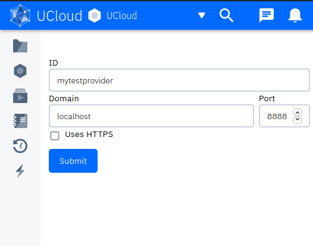
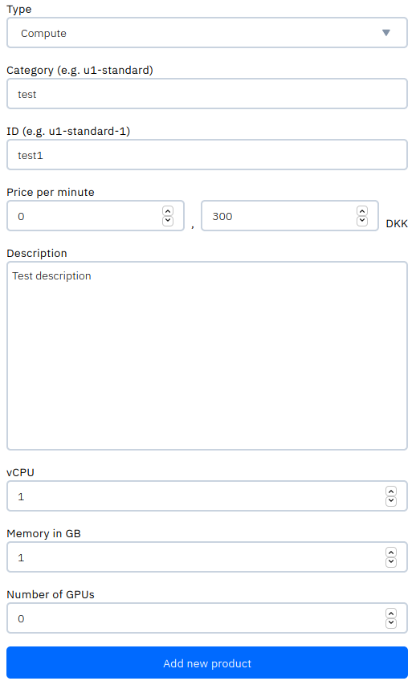
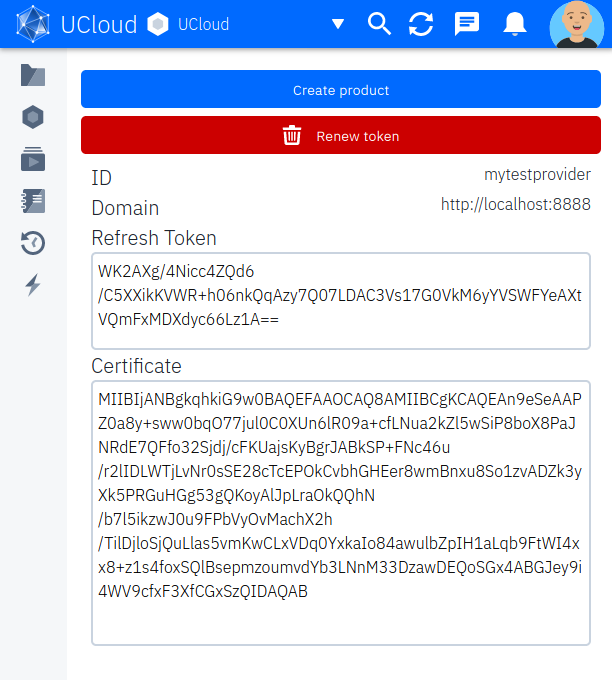

# Provider Example Project (Spring Boot)

This repository shows an example project for how to integrate with UCloud. You will be able to use this example project
in combination with a local instance of UCloud to develop your own provider for UCloud. 

To get started you should have a locally running copy of UCloud, you can follow 
[this](../../backend/service-lib/wiki/getting_started.md) guide to get started. 

Next, you must configure your locally running UCloud to send traffic to your provider. Using the admin user, which you
created during the "Getting started" guide, you should be able to go to the
["Admin/Providers"](http://localhost:9000/app/admin/providers) page of UCloud. From here, you will need to create a
provider.



__Figure 1:__ Creating a provider

You should then be able to [view](http://localhost:9000/app/admin/providers/mytestprovider) the provider in the UCloud
interface. First you need to configure the products that your provider supports. A product is, for example, a specific
flavor of machine. You can read more about products [here](../../backend/accounting-service/README.md). In figure 2 we
show an example product, which will work with this example project.



From this interface, you will be able to see two key parts of information required for this service:

1. Refresh token
2. Certificate



__Figure 3:__ Viewing provider information

You will need to add this information to the configuration that Spring boot uses. This could, for example, be passed to
Spring Boot using command-line arguments:

```
--ucloud.certificate="REPLACE WITH CERTIFICATE VALUE"
--ucloud.refreshToken="REPLACE WITH REFRESH TOKEN VALUE"
--ucloud.host="localhost"
--ucloud.tls=false
--ucloud.port=8080
--server.port=8888
```
