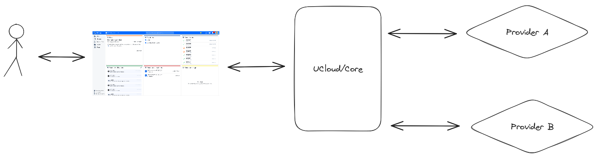
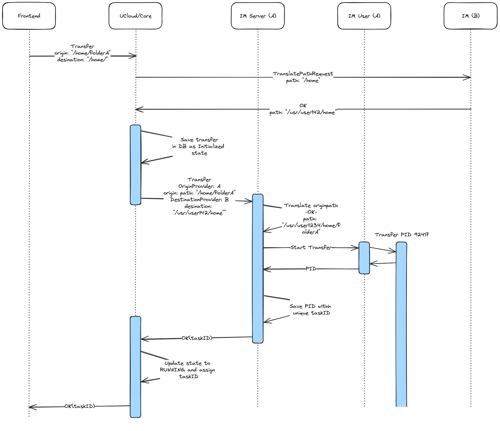
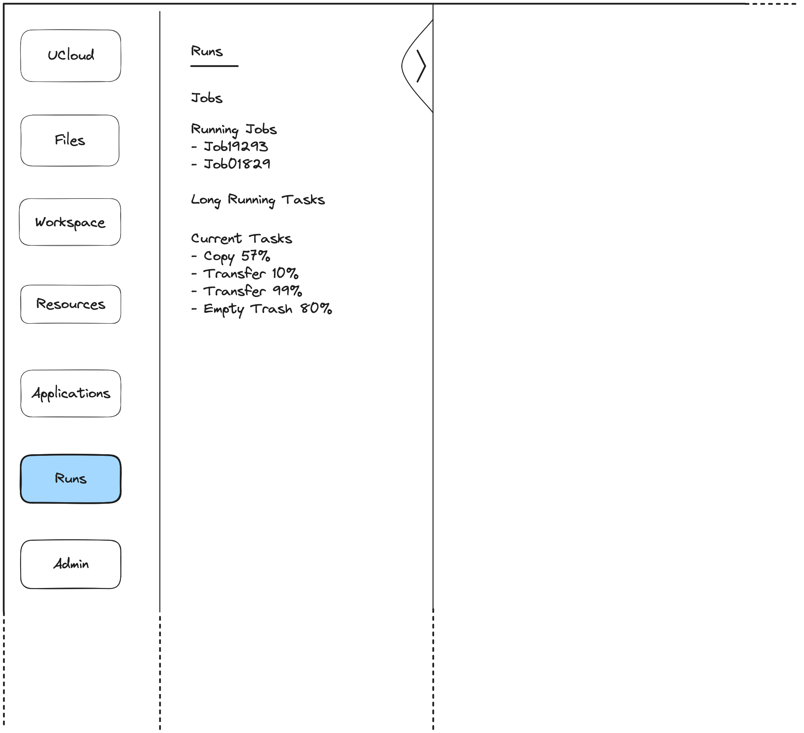
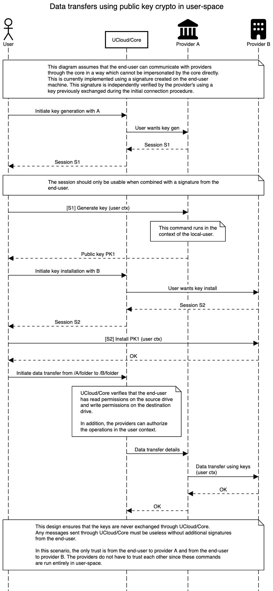

# Introduction

The UCloud platform is made of several different components. In generalized terms, UCloud can be split into:

 - *UCloud/Frontend* which is the default web user interface for UCloud.
 - *UCloud/Core* which is responsible for orchestration of resources, accounting, project management, etc.
 - A number of *Provider*s of resources, such as data or HPC centers that are able to communicate with UCloud/Core and allow access to compute, storage, or other kinds of resources. Communication with UCloud/Core usually happens through a small, flexible module called the *Integration Module*.
 
An end-user will interact with the UCloud/Frontend which communicates with the UCloud/Core which communicates with the providers, thereby granting users access to resources at the providers in one interface.



Each provider may have different resources, and use different software internally, and may even be located at completely physical locations. However, providers does not have any knowledge of each other nor communication between them.

This causes a problem if an end-user want to transfer data from one provider to another. Not only does the providers not have any knowledge of the other provider, but the physical distance between providers may also cause such a transfer of data to take much longer than moving data within the same system.

The aim of this document is to describe a possible implementation that will support data transfer between two providers in UCloud, with the following goals in mind:

 - It should be optional for a provider if they want to support data transfer or not.
 - It should be up to each provider which software they want to use for the transfer.
 - Data transfer should happen directly between providers, to limit reliance and trust on the UCloud/Core.
 - It should be possible for the end-user to track the progress of a transfer, as well cancel it.


This document will present a possible implementation for UCloud with these goals in mind. The focus will be on a plugin for the Integration Module that supports data transfer between two providers using SSH and Rsync. It will also discuss a possible exchange of keys that will be used to create trust between providers and limit reliance on the UCloud/Core. A proposal for additions to the UCloud/Frontend will be presented.

Changes to the frontend, core and integration module are necessary for this feature, and will be described.


# File transfer process

A user must start by selecting a source file. The source file can be either a regular file or a folder. Following that, the user must select a destination folder at the receiving provider. UCloud/Core returns an error if both the source and destination belong to the same provider. Following authorization, UCloud/Core forward the request to the source provider. We will refer to the provider who has the source file as the source provider. We refer to the provider of the destination as the destination provider.

UCloud/IM implements the transfer by the provider's choice of software. Examples include scp, Rsync, FTP, or any other software with file transfer capabilities. UCloud/IM at both providers must have a plugin, of the same type, configured for file transfer.




# Changes to the UI

The frontend need to introduce a transfer operation similar to the move and copy of the file component. This should list and verify files/folders that are applicable for data transfer.

The source file can be any file or folder which the user has read permissions for. The source can be either a file or a folder. The user must have write permissions for the destination folder. The destination must be a folder.


Once files/folders have been selected for transfer and a destination folder has been selected, a pop-up should appear describing the action to the user. The user should confirm that they have understood that:

 1. The transfer means moving files to another provider and physical location, which might take a long time,
 2. They are responsible for checking if they are allowed to make the transfer according to the data processing agreement,
 3. The transfer task can be monitored on a dedicated "Tasks" page.


The dedicated page for tasks contain all background task the user has initiated. To keep the page relevant only tasks that are still running or completed tasks from within a certain time span from now and into the past will be shown. Older or more specific task can be found using filtering on the same page.


To make the page available to the user we will change the runs "tab" in the side menu to hold two subsections. The original jobs page and a background task page. In the same way we show a subset of the running jobs in the side menu the user will also see subset of their background tasks.




# UCloud/Core changes

UCloud/Core needs a new endpoint which can be invoked by the end-user:

```kotlin
// Added to Files RPC container
object TransferFilesBetweenProviders {
    data class RequestItem(
        val sourcePath: String,
        val destinationPath: String,
    )
    
    sealed class ResponseItem {
        data class Success(val taskId: Long) : ResponseItem()
        data class Failure(val reason: String) : ResponseItem()
    }
    
    val call = call<BulkRequest<RequestItem>, BulkResponse<ResponseItem>, CommonErrorMessage>(...)
}
```

The end-user can select multiple source folders. However, they can only select a single destination folder. This simplfies the UX and reduces the risk of choosing the wrong destination.

Upon receiving the request, UCloud/Core processes each item. For each item, the UCloud/Core will:

 - Check that the source and destination drives exist
 - Check that the user has read permissions for the source drive
 - Check that the user has edit permissions for the destination drive
 - Check that they have active allocations at both providers
 - Check the metadata of the source file, to see if it is allowed to be moved away from the provider, i.e. due to file sensitivity or data agreements that are valid for the current provider, but not the destination.
 - Check that there is no identical transfer ongoing

If any of the above requirements is not satisfied the UCloud/Core can immediately fail the specific request-item and will not forward that specific item to the provider. These skipped items will be marked as failed as true in the coresponding response.

The two provider's must be able execute the transfer without involving UCloud/Core. In some circumstances, this will require the two providers to negotiate some details. This negotiation must happen without involving UCloud/Core. Examples of this include translating UCloud paths into local paths. How the negotiation occurs is dependant on the plugin. It may involve zero or more requests between the providers.

```kotlin
// Added to FilesProvider RPC container
// This is sent to the source provider
object TransferFilesBetweenProvidersForProvider { // TODO Naming
    data class RequestItem(
        val sourcePath: String,
        val destinationPath: String,
                
        val taskId: Long,
        val destinationProvider: String,
    )
    
    sealed class ResponseItem {
        object Success : ResponseItem()
        data class Failure(val reason: String) : ResponseItem()
    }
    
    val call = call<BulkRequest<RequestItem>, BulkResponse<ResponseItem>, CommonErrorMessage>(...)
}

// Added to the FilesControl RPC container
object UpdateTransferTask {
    // NOTE: Only the source provider can call this function
    data class RequestItem(
        val taskId: Long,
        val newState: TaskState? = null,
        val newProgress: Double? = null, // value between 0 and 100 (both inclusive)
        val newStatus: String? = null,
    )
    
    class ResponseItem()
    
    val call = call<BulkRequest<RequestItem>, BulkResponse<ResponseItem>, CommonErrorMessage>(...)
}
```

UCloud/Core sends this request to the source provider. The task will have an initial state of `INITIATED`. If the provider responds with `Failure` then the task will automatically transition to the `FAILURE` state. The end-user can use this task id to track the progress of the transfer. The provider must use the `UpdateTransferTask` endpoint to update the status of a task.

Should an error occur while the transfer is in progress there are two paths of operation

 1. The error is recoverable. If such an error occurs, UCloud/IM will attempt to retry later. UCloud/IM will use the `PAUSED` state to communicate a recoverable error.
2. The error is unrecoverable. In this case the provider will update the state to `FAILURE`. This is a terminal state and it cannot change from this state.

If any of these cases happens, the user should be informed by the UCloud/Core notification system that the transfer has been interrupted and that action on their part might be needed. It should also be possible for the users to get emails if such transfers or other long time running requests are failing but it should be selected in the user notification settings page.

The table below gives an overview of the different states a task can be in:

| State name | Description |
|------------|-------------|
| `INITIATED` | The source provider has accepted the transfer request, but the transfer has not started yet. |
| `RUNNING` | The transfer is ongoing and is actively making progress. |
| `SUCCESS` | Terminal state indicating that the task has completed successfully. |
| `PAUSED` | Temporary state indicating that the task is not actively making progress. This can happen due to a temporary error or user action. |
| `FAILURE` | Terminal state indicating that the task has failed and cannot continue. |
| `HALTED` | TODO |

Once the data have been transferred successfully the data will be present at both providers and it is up to the user to delete it at the origin provider if they no longer require it. The data at the destination provider will be owned by the user who initiated the transfer in the same way as if they had uploaded it at the destination site in the first place.

The extended attributes and ACL will not be in sync across providers but be specific for that particular provider they reside at.


## Out of resources

During a transfer the destination resources might be consumed or overspend. In this case we would expect the destination provider to inform UCloud/Core that the resource has reached it limit. This will happen using the normal mechanism for locking a drive. The transfer plugin should attempt to put the task in a `PAUSED` state since this is likely only a temporary problem. UCloud/Core will not attempt to pause the transfer.


## A word on the `PAUSED` state

Pausing should only be a temporary state. It should be possible for a provider to cancel a transfer that has been set in `PAUSED` state after a certain time span. This could be due to not being able to restart a transfer or if the user never get enough resources to finish the transfer. How long a provider wants to maintain a paused transfer should be their own choice.

## Database

To facilitate task lookup and request forwarding after a start of data transfer, the UCloud/Core needs to store different data regarding the transfer. This will be done in the following table, `transfer_task`, located within the `file_orchestrator` schema. 

| Name | Type | Description | Example | 
|------|------|-------------|---------|
| `id` | `bigserial` | Unique identifier for this transfer (see `taskId`) | 41231 |
| `provider_id` | `text` | Foreign key to provider table | ucloud |
| `initiated_by` | `text` | User who initiated the request | User#1231 |
| `source_path` | `text` | The source path | /4123/src-folder |
| `destination_path` | `text` | The destination path | /5243/dst-folder |
| `state` | `text` | Current state of task | `RUNNING` |
| `progress` | `float8` | Progress of the task. Value is between 0 and 100 (both inclusive). | 2.76 (2,76%) |
| `created_at` | `timestamptz` | When task started | `2023-11-25 18:14:25.851903 +00:00` |
| `last_update` | `timestamptz` | Timestamp of last change to any of the internal state | `2023-11-25 20:24:29.160568 +00:00` |

# UCloud/IM changes

The Integration Module will handle most of the transfer operation. It will create a tunnel between the two providers, the source and the destination, so that the transfer happens directly between these providers.

The source provider keeps track of each on-going transfer by a *task ID* and *process ID* of the software that is doing the actual transfer. Information about the transfer will be pushed to the UCloud/Core by the source provider. This includes the *state* and *progress* of the transfer.


## Exchange of keys

Before file transfer can begin, trust should be established between the user and the two providers, A and B, to avoid reliance on UCloud/Core during the transfer. Since data transfer can be performed in user-mode between the two providers, trust does not need to be established between the two providers. 

When a file transfer is initiated by the user, a request for a session will be sent to both providers through UCloud/Core. The session between the client and the provider should only be usable when combined with a signature from the client.

When the session is established between the client and provider A, the client will request A to generate a key-pair, and get a public key in return, through the session. 

When the session is established between  the client and provider B, the client will send the public key from A to provider B.

Provider A is now ready to initiate a transfer to provider B.




## Plugin interface

The data transfer plugin interface will have to be implemented. This will grant flexibility to the providers. It gives the provider the freedom to decide which software they want to use for data transfers.

The minimum required functionality for a data transfer plugin is that it should be able to:

 - Initiate a transfer between itself and another provider.
 - Cancel a transfer.
 
Optionally a plugin can support the following functionality: 

 - Pause a transfer.
 - Resume/unpause a paused transfer.
   In case *pause* is supported by the plugin, *resume* should be supported as well.
   
The plugin should push the state and progress of transfer to the UCloud/Core. The progress should always be a percentage of completion. It is the Integration Module's responsibility to translate the progress to a percentage.
    
**NOTE:** The following interface is not an accurate implementation, but an example of how it could look.
 
```kotlin


data class FileTransferState(
    val state: TaskState,
    val progress: Int
)

interface FileTransferPlugin : Plugin<ConfigSchema.Plugins.FileTransfer>{
    
    // Start file transfer 
    suspend fun RequestContext.start(
        path: String,
        destinationProvider: String,
        destinationPath: String
    )
    
    // Cancel file transfer 
    suspend fun RequestContext.cancel(taskId: Int)
    
    // Pause file transfer
    suspend fun RequestContext.pause(taskId: Int)
    
    // Resume file transfer
    suspend fun RequestContext.resume(taskId: Int)
    
    // Get current state and progress 
    suspend fun PluginContext.getState(taskId: Int): FileTransferState
}
```

**NOTE:** It is required that two providers use the same plugin for file transfers if they want to support file transfers between them.


## Rsync plugin example

> Work in progress [name=Brian]

This is an example of how an Rsync plugin could work. The plugin requires that Rsync is installed.

 - Start transfer
   - Call rsync to start transfer, logging the progress to a file.
   - Save PID along with a task ID.
 - Cancel transfer
   - Look up PID based on task ID.
   - Kill the process with PID (if it exists).
   - Delete task from database.
 - Pause transfer
   - Look up PID based on task ID.
   - Kill the process with PID.
 - Resume transfer
   - Call rsync to start the transfer again, with the same parameters. Rsync will automatically determine what is missing.
   - Update the PID for the given task ID.
 - Get state
   - Get the PID by looking up the task id in the database.
   - Read the log file from Rsync containing the progress and return this, along with a state.
   
At given intervals the integration module should:

 - Reads all tasks/transfers from the database.
 - Call `getState` on each task.
 - Push the returned values of these calls, with the state and progress of all tasks to UCloud/Core. 
   
# Notes and questions

> Should the receiving provider be responsible for anything? The receiving provider could be responsible for pushing progress to the UCloud/Core, but I think this could be done from the sending provider more easily?

Dan: I have clarrified the document a bit on this. I think only the source provider should be pushing this information. There might be cases where this can be done by the destination provider, but I doubt it. Until we know of such a case, I would suggest we simply block the destination provider from even updating the state.
