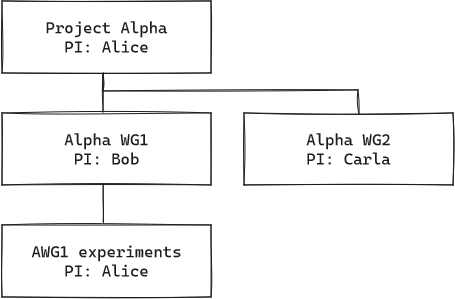
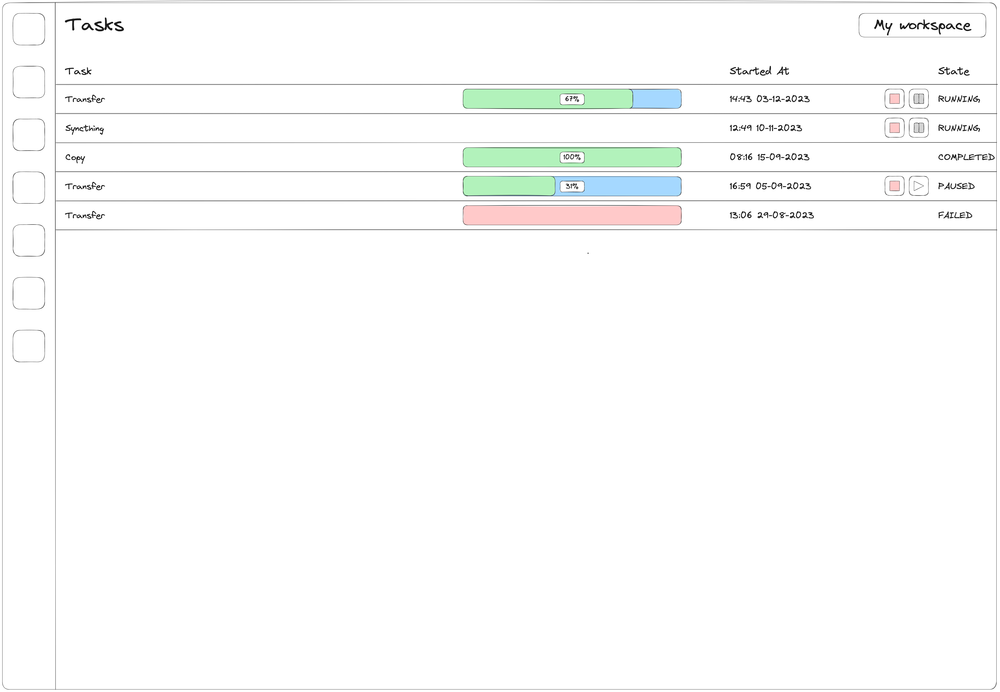

# Introduction

UCloud is a digital research environment that helps you connect to different compute and storage providers. It makes
it easy to find services, apply for resources, and manage projects. UCloud aims to connect end-users with heterogeneous
service providers across many different countries.

With UCloud, you can use your organization’s credentials to log in, apply for access to a super-computer, invite
collaborators, upload your dataset, and start your data analysis. Its application catalog is large and varied and
contains applications of many different types. For example, you can run interactive applications such as JupyterLab,
RStudio and Visual Studio Code. You can create a temporary remote desktop session and run applications such as MATLAB.
Alternatively, you can even create long running virtual machines running the operating system of your choice. Large
multi-node batch jobs can even be submitted to an existing Slurm cluster. You may even create your own private
ephemeral Slurm cluster.

UCloud is a secure cloud computing platform that comes with built-in monitoring and auditing features. Service
providers have full control over their data and system. UCloud is designed to fit over an existing system and does not
dictate how a system should work. It helps service providers with user and project management, as well as enforcing
quotas and tracking usage. This includes showing detailed statistics of usage.

# Approach and principles 

The design and UCloud, throughout all of its components, follow these principles:

- __User-friendly and reliable.__ UCloud is a digital research environment designed to help researchers. Design
  choices should always consider the impact on the end-users daily work. Researchers must consider UCloud a reliable
  tool. UCloud should never get in the way of their work.

- __Federation and orchestration.__ At the core of UCloud lies an orchestration platform that establishes a federation
  of heterogeneous service providers. UCloud’s core establishes clear rules of participation that favor
  discoverability and flexibility.

- __Flexibility.__ UCloud’s orchestration layer must ensure that providers can participate with their existing
  systems. UCloud must not dictate how a service provider works.

- __Always verify.__ All components of the platform use the principle of always verifying communication. When
  communication goes along a chain, each part of the chain should be verifiable. For example, when UCloud acts as a
  proxy for the end-user, the service provider must be able to verify the end-users identity independently.

- __Scalability and performance.__ UCloud must ensure good scalability and solid performance to remain a reliable tool
  for researchers. UCloud deploys several metrics to track performance and scalability issues over time. These metrics
  guide the roadmap for new development.

# Methodology

> [!NOTE]
> TODO We may need to adjust this further before it is suitable.

UCloud uses an _agile methodology_ for development and deployment, which will also be used for this project. The method
is commonly used for complex projects like this one, and it emphasizes collaboration, flexibility, continuous
improvement, and high-quality results.

This project methodology is fundamentally designed around the concept of tasks, also known as issues. An issue is a
description of some desired change within the project. Issues contain a description of either an observed bug to fix
or a desired enhancement to the software. Issues can be assigned to team members by team or project leaders or
developers can assign themselves to work on certain issues.

Large or complex issues, which need to be broken down into smaller tasks, are called epics. Associated with every epic
is a number of smaller issues. For example, new features in UCloud commonly become an epic.

Epics often have a number of design documents attached to them. During the creation of these design documents we cover
many aspects. This includes high-level architecture, use-cases and UI mock-ups.

New features described by epics are placed into the project roadmap with a starting date and estimated deadline. The
goal of the roadmap is to provide an easy way to plan the work needed to complete the project in a timely manner. The
roadmap provides an overview of the whole project and a detailed always up-to-date view of the scheduled work for the
next 3-6 months.

Most issues go through a fixed set of stages:

1. __Backlog:__ The backlog is a list of tasks. It describes the next tasks/issues to work on. The order in which
   tasks are completed from the backlog is determined by the roadmap.

2. __Design and development:__ The issue enters this stage once a developer starts working on it. New requirements are
   often discovered during the lifetime of an issue. These new issues enter the backlog as any other issue. Epics
   corresponding to bigger features receive detailed sub-issues and developers are assigned to individual issues.

3. __Initial testing:__ Eventually code will reach a functional stage. At this point the issue becomes “ready for
   initial testing”. In this stage, the code is tested by the assigned developer. Code can be tested both manually and
   automatically.

4. __Code review:__ After the testing stage, the assigned developer will submit a pull request and the issue enters
   the “code review” stage. The code is reviewed by one or more developers in the team knowledgeable of the affected
   code. This typically includes the team leader. The review causes a feedback loop between reviewers and the
   developer. Once the reviewers accept the proposed change, the code is merged into a staging or `master` branch and
   the associated issue is closed. Under normal circumstances, a staging branch is used, but in some cases the team
   leader may choose to pick the `master` branch. 

5. __Staging and testing:__ Changes made to the software base of UCloud through issues are bundled together to form a
   release-candidate. This release-candidate is deployed to the development environment of UCloud. This release
   candidate goes through internal alpha testing. New issues may arise from alpha testing, which are inserted in the
   backlog. Depending on the nature of the issue, these may block the release candidate from release or can simply be
   dealt with in later releases. Once the release candidate has passed internal alpha testing, it is deployed to the
   production environment.

6. __Deployment:__ After testing, features are deployed to the production environment. New big features are introduced
   in production as “beta” and a testing phase by the users starts. Bugs reports are submitted by the users via the
   integrated bug reporting feature in the web UI. After the beta testing is complete, the feature is promoted to
   stable.

# Software architecture

The UCloud platform is made of several different components. In generalized terms, UCloud can be split into:

- __UCloud/Frontend.__ The default web user interface for UCloud.

- __UCloud/Core.__ Responsible for orchestration of resources, accounting, project management, etc.

- A number of *Provider*s of resources, such as data or HPC centers that are able to communicate with UCloud/Core and
  allow access to compute, storage, or other kinds of resources. Communication with UCloud/Core usually happens
  through a small, flexible module called the *Integration Module*.
 

An end-user will interact with the UCloud/Frontend which communicates with the UCloud/Core which communicates with the
providers, thereby granting users access to resources at the providers in one interface.

Each provider may have different resources, and use different software internally, and may even be located at completely
physical locations. However, providers does not have any knowledge of each other nor communication between them.

## UCloud/Frontend architecture

## UCloud/Core architecture

### Foundation

The foundation of UCloud/Core is responsible for delivering the core services required by UCloud. This includes
features such as:

- Authentication and user management
- Auditing
- Monitoring and alerting

Authentication:
- Researchers and students can log into UCloud by using their own institutions credentials
- This is made possible by supporting a wide range of different identity providers
  - UCloud supports (configurable) SAML2 IdPs, notably WAYF.
  - WAYF (Where Are You From) is a danish identity federation for research and infrastructure. WAYF provides authentication via the local organization (e.g. SDU). At a technical level this is implemented with SAML.
  - WAYF connects to a larger internation federation of IdPs called eduGAIN.
  - UCloud also supports (configurable) OpenID Connect IdPs
  - This means that it is possible to configure a large range of IdPs into UCloud as long as they support the OIDC protocol
  - OIDC is a protocol which...
- The first time a user logs into UCloud a user is created
- The identities of multiple IdPs can be mapped into a single UCloud user
- Once authenticated, only the UCloud identity will be used
- Once authenticated, a JWT and refresh-token is created
  - JWTs are an open, industry standard method for representing (auth) claims between two parties
  - The tokens are digitally signed by UCloud/Core and contain information about the UCloud user
  - The tokens are short-lived and are used to authenticate all calls to UCloud/Core
  - Clients (i.e. end-users) can renew their access tokens using a long-lived refresh-token
  - The refresh-token itself is an opaque token created by UCloud/Core

Auditing and monitoring
- UCloud/Core produces a detailed audit trail
  - The audit trail contains information about:
  - user session
  - the request and select request parameters
  - response codes and response times
- This is sent into an ElasticSearch database
  - Purpose of this is persistent storage which allows us to query the structured data
  - ElasticSearch is commonly used for storage of structured logs, such as this
  - Automatically deleted after our retention period (defined elsewhere)
- Connected to Grafana and its alertmanager
  - Grafana is...
  - Gives us visualization of the cluster health
- UCloud/Core and UCloud/IM produces prometheus metrics which are periodically scraped
  (optional for service providers)
  - Promthetus is...
- The prometheus metrics give us real-time insights into the health of our services and can help troubleshoot
  issues

### Accounting and Project Management (APM)

Project management
- UCloud has built-in support for project management
- Projects consist of one or more members
- Each member has a role (PI, admin or user)
- Each project has exactly one PI
- Members are organized into groups
- Copy & paste stuff from the existing documentation

Product catalogue:
- Service providers describe their "service catalog" through products
- This describes the hardware and the services they provide. For example, this will include hardware 
 specification and any potential service constraints.
- Can be bundled into a category of similar products. This allows for slicing of a single compute machine.
- Describes the payment model of a product.
- Multiple product types for different services: compute, storage, license, IP addresses, public links 
  (L7 ingress)

Resource grants:
- UCloud/Core uses resource grants to determine which service providers a given user can access
- A resource grant comes in the form of "project X has been granted Y credits to use product Z in a period P"
- UCloud/Core collects usage information from the provider
- Usage numbers are reported back to both grant givers, service providers and researchers
- UCloud/Core comes with a built-in system for managing the resource grant process

Orchestration:
- Resource catalogue (copy & paste from existing docs)
- Orchestration API

## UCloud/IM architecture

Overall architecture
- Server modes
- Plugins and extension-points

User mapping (and a small focus on verification)

Example of two common setups showing all the steps for accessing a file

## File transfer between service providers

User perspective:

- Researcher has already been granted resources at Provider A and Provider B
- Researcher has already connected to both providers and have files at both providers
- Researcher selects a file from Provider A and selects "Transfer file"

- Researcher then selects a destination folder at Provider B

- This creates a transfer job. The progress can be followed on a dedicated page.

- Explain the need for file transfer between service providers
- Overall architecture
  - Diagram showing how UCloud/Core is only an orchestrating part of data transfer
  - Show that the researcher is the initiating party
  - Show that data transfer (ideally) occurs directly between service providers, 
    potentially with a protocol specific intermediate
- An end-users perspective to file transfer
  - Use the current UI mockups to explain the story of a file transfer
  - This more or less simply repeats what the overall architecture diagram is trying to show. The provider's are 
    in the control together with the end-user.
- Introduction to protocols
  - Maybe something about how we came up with the protocols we will be discussing
  - Talk about how these protocols are used normally
  - SFTP
    - Very common among already deployed HPC centers [citation needed]
    - Provides common file access operations and is often included and enabled in most SSH server deployments. For 
      example, the default OpenSSH server has SFTP enabled. (https://github.com/openssh/openssh-portable/blob/86bdd3853f4d32c85e295e6216a2fe0953ad93f0/sshd_config#L109)
    - Typically used via the `scp` command.
    - Uses authentication and authorization from the pre-existing SSH server
    - Single-threaded
    - Has no built-in smart mechanism for determining which files are already present on the server.
    - Compression available
  - RSync
    - Commonly uses authentication and authorization from the pre-existing SSH server 
    - Single-threaded
    - Smart mechanism for determining differential transfers
    - Requires an rsync executable at the remote side
    - Compression available
  - Globus Connect
    - Globus connect server delivers file transfer and sharing capabilities between service providers
    - It requires an installation of the Globus Connect Server already present at the HPC provider
    - It supports a variety of data connectors and several protocols for data access
    - 
- Example?

Frame 13:

1. User requests a transfer of files from provider A to provider B
2. UCloud/Core verifies the request and forwards the request to the initiating provider
3. Provider A determines the suitable protocol for the transfer and responds with a session in which 
   the transfer will take place.
4. Response from provider A is forwarded to the researcher
5. User initiates the transfer directly with provider A
6. Data transfer takes place in a transfer method specific way. Both the source and destination may 
   be pushing and pulling data as needed.