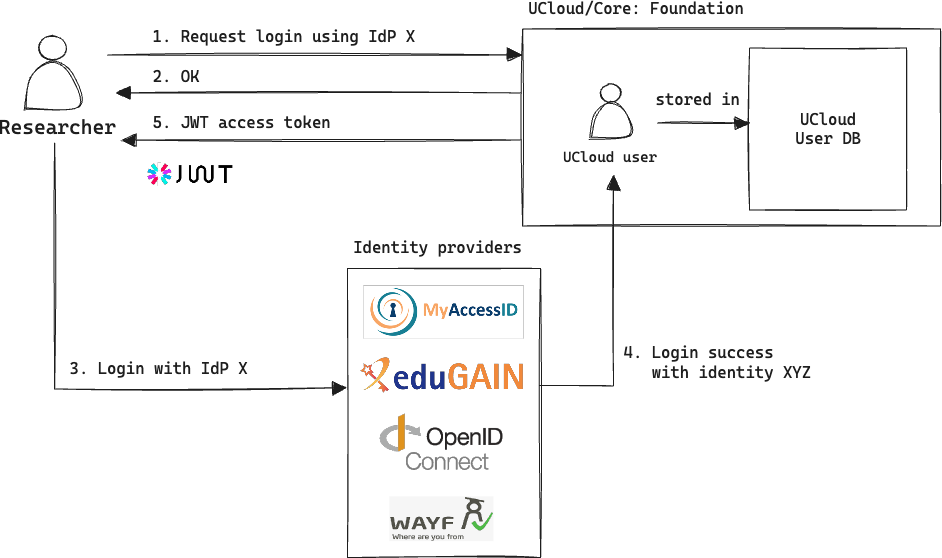

# Introduction

UCloud is a digital research environment that helps you connect to different compute and storage providers. It makes
it easy to find services, apply for resources, and manage projects. UCloud aims to connect end-users with heterogeneous
service providers across many different countries.

With UCloud, you can use your organization’s credentials to log in, apply for access to a super-computer, invite
collaborators, upload your dataset, and start your data analysis. Its application catalog is large and varied and
contains applications of many different types. For example, you can run interactive applications such as JupyterLab,
RStudio and Visual Studio Code. You can create a temporary remote desktop session and run applications such as MATLAB.
Alternatively, you can even create long running virtual machines running the operating system of your choice. Large
multi-node batch jobs can even be submitted to an existing Slurm cluster. You may even create your own private
ephemeral Slurm cluster.

UCloud is a secure cloud computing platform that comes with built-in monitoring and auditing features. Service
providers have full control over their data and system. UCloud is designed to fit over an existing system and does not
dictate how a system should work. It helps service providers with user and project management, as well as enforcing
quotas and tracking usage. This includes showing detailed statistics of usage.

# Approach and principles 

The design and UCloud, throughout all of its components, follow these principles:

- __User-friendly and reliable.__ UCloud is a digital research environment designed to help researchers. Design
  choices should always consider the impact on the end-users daily work. Researchers must consider UCloud a reliable
  tool. UCloud should never get in the way of their work.

- __Federation and orchestration.__ At the core of UCloud lies an orchestration platform that establishes a federation
  of heterogeneous service providers. UCloud’s core establishes clear rules of participation that favor
  discoverability and flexibility.

- __Flexibility.__ UCloud’s orchestration layer must ensure that providers can participate with their existing
  systems. UCloud must not dictate how a service provider works.

- __Always verify.__ All components of the platform use the principle of always verifying communication. When
  communication goes along a chain, each part of the chain should be verifiable. For example, when UCloud acts as a
  proxy for the end-user, the service provider must be able to verify the end-users identity independently.

- __Scalability and performance.__ UCloud must ensure good scalability and solid performance to remain a reliable tool
  for researchers. UCloud deploys several metrics to track performance and scalability issues over time. These metrics
  guide the roadmap for new development.

# Methodology

UCloud uses an _agile methodology_ for development and deployment, which will also be used for this project. The method
is commonly used for complex projects like this one, and it emphasizes collaboration, flexibility, continuous
improvement, and high-quality results.

This project methodology is fundamentally designed around the concept of tasks, also known as issues. An issue is a
description of some desired change within the project. Issues contain a description of either an observed bug to fix
or a desired enhancement to the software. Issues can be assigned to team members by team or project leaders or
developers can assign themselves to work on certain issues.

Large or complex issues, which need to be broken down into smaller tasks, are called epics. Associated with every epic
is a number of smaller issues. For example, new features in UCloud commonly become an epic.

Epics often have a number of design documents attached to them. During the creation of these design documents we cover
many aspects. This includes high-level architecture, use-cases and UI mock-ups.

New features described by epics are placed into the project roadmap with a starting date and estimated deadline. The
goal of the roadmap is to provide an easy way to plan the work needed to complete the project in a timely manner. The
roadmap provides an overview of the whole project and a detailed always up-to-date view of the scheduled work for the
next 3-6 months.

Most issues go through a fixed set of stages:

1. __Backlog:__ The backlog is a list of tasks. It describes the next tasks/issues to work on. The order in which
   tasks are completed from the backlog is determined by the roadmap.

2. __Design and development:__ The issue enters this stage once a developer starts working on it. New requirements are
   often discovered during the lifetime of an issue. These new issues enter the backlog as any other issue. Epics
   corresponding to bigger features receive detailed sub-issues and developers are assigned to individual issues.

3. __Initial testing:__ Eventually code will reach a functional stage. At this point the issue becomes “ready for
   initial testing”. In this stage, the code is tested by the assigned developer. Code can be tested both manually and
   automatically.

4. __Code review:__ After the testing stage, the assigned developer will submit a pull request and the issue enters
   the “code review” stage. The code is reviewed by one or more developers in the team knowledgeable of the affected
   code. This typically includes the team leader. The review causes a feedback loop between reviewers and the
   developer. Once the reviewers accept the proposed change, the code is merged into a staging or `master` branch and
   the associated issue is closed. Under normal circumstances, a staging branch is used, but in some cases the team
   leader may choose to pick the `master` branch. 

5. __Staging and testing:__ Changes made to the software base of UCloud through issues are bundled together to form a
   release-candidate. This release-candidate is deployed to the development environment of UCloud. This release
   candidate goes through internal alpha testing. New issues may arise from alpha testing, which are inserted in the
   backlog. Depending on the nature of the issue, these may block the release candidate from release or can simply be
   dealt with in later releases. Once the release candidate has passed internal alpha testing, it is deployed to the
   production environment.

6. __Deployment:__ After testing, features are deployed to the production environment. New big features are introduced
   in production as “beta” and a testing phase by the users starts. Bugs reports are submitted by the users via the
   integrated bug reporting feature in the web UI. After the beta testing is complete, the feature is promoted to
   stable.

# Software architecture

The UCloud platform is made of several different components. In generalized terms, UCloud can be split into:

- __UCloud/Frontend.__ The default web user interface for UCloud.

- __UCloud/Core.__ Responsible for orchestration of resources, accounting, project management, etc.

- A number of *Provider*s of resources, such as data or HPC centers that are able to communicate with UCloud/Core and
  allow access to compute, storage, or other kinds of resources. Communication with UCloud/Core usually happens
  through a small, flexible module called the *Integration Module*.

<p align="center"></p>

__Figure:__  Diagram showing the overall architecture of UCloud. The architecture shows how UCloud/Core connects to
multiple different providers. Potentially exposing all of their services to the researcher on the left.

An end-user will interact with the UCloud/Frontend which communicates with the UCloud/Core which communicates with the
providers, thereby granting users access to resources at the providers in one interface.

Each provider may have different resources, and use different software internally, and may even be located at completely
physical locations. However, providers does not have any knowledge of each other nor communication between them.

## UCloud/Core architecture

### Foundation

The foundation of UCloud/Core is responsible for delivering the core services required by UCloud. This includes features
such as authentication and user management, auditing, monitoring and alerting.

Researchers and students can get easy access to UCloud by using their own institutions credentials. This is possible
since UCloud supports authentication through a wide range of identity providers. Most notably authentication is
supported through WAYF (Where Are you From), which is a Danish identity federation for research and education in Denmark
and the North Atlantic. WAYF provides authentication via the local organization (e.g. SDU), but also connects to a
larger international federation of identity providers called eduGAIN.

Authentication through other identity providers can be configured. UCloud currently supports authentication through SAML
and OpenID Connect, which are both open, industry standard authentication protocols. This means that it is possible to
configure a large range of identity providers into UCloud, as long as they support either SAML (such as WAYF) or OpenID
Connect protocols.

The first time a researcher or student logs into UCloud, a UCloud user is created. The identities of multiple identity
providers can be mapped into a single UCloud user. Once authenticated, only the UCloud identity will be used.

At a technical level, when a user has authenticated an access-token, in the form of a JSON Web Token (JWT), and a
refresh-token are created. JWTs are an open, industry standard method for representing authentication claims between two
parties. These tokens are digitally signed by UCloud/Core and contain information about the UCloud user.

The access-token is short-lived and are used to authenticate all calls to UCloud/Core. Clients (i.e.) end-users can
renew their access tokens using the long-living refresh-token.

<p align="center"></p>

__Figure:__ Diagram showing the authentication flow in UCloud. All UCloud users authenticate using their existing
credentials from the organization. This identity is then mapped into a single UCloud identity, which is used throughout
UCloud.

UCloud/Core produces a detailed audit trail. This trail contains information about user sessions, request and (select)
request parameters, response codes, response times etc. The individual components of UCloud/Core sends this to a data
store based on the Redis database management software.

The event stream from Redis is captured by the foundation component where it is analyzed and stored in ElasticSearch,
which is a platform commonly used for storage of structured logs, such as this. This allow us to query the structured
data. The data is automatically deleted after our retention period.

UCloud/Core and UCloud/IM produces metrics which are periodically scraped (optional for service providers). These
metrics are passed to Prometheus, an open source systems monitoring and alerting toolkit.

Both ElasticSearch and Prometheus is connected to Grafana, an open source platform for data analytics and monitoring,
and its alert manager. This allows us access to visualization of the cluster health, as well as real-time insights of
the heath of our services and help for troubleshooting any issues that might arise.


<p align="center"></p>

__Figure:__ A diagram showing how auditing data and metrics are collected and monitored in UCloud.

### Accounting and Project Management (APM)

UCloud has flexible built-in support for project management. Projects in UCloud play an important role, as they are the
core abstraction used for collaborations. Later in this section, we will also see how projects are used for permission
management and resource grant management.

A project consist of one or more members, each with a role (PI, admin or user), where exactly one member is PI
(Principal Investigator). The PI is responsible for managing the project, including adding and removing users.

Members can be further organized into groups, each with permissions to resources that can be configured by the PI or
admins.

<p align="center"></p>

__Figure:__ Structure of a project. In this case the project has four members who are placed in three different groups.
Note that any user can be a member of more than one group.

End-users can create a project through the grant application feature. These projects can in turn create sub-projects.
The sub-projects can receive parts of the grants owned by the parent. Permissions and memberships of projects are not
hierarchical. This means that a user must be explicitly added to every project they need permissions in. 

<p align="center"></p>

__Figure:__ A digram showing a project hierarchy. Note that being a member of a project high up in the hierarchy does
not imply that you have any permissions in the projects further down in the hierarchy.  

In order for a project to consume resources from a project, they must first receive a grant. The figure below
illustrates the overall structure for grant allocations in UCloud. In this diagram, we can see that providers own a
_product catalog_ which defines their services. From this catalog, the provider can delegate the responssibility of
awarding grants to a _grant giver_. The _grant givers_ can in turn award grants to projects after a successful
application from a researcher.

<p align="center"></p>

__Figure:__ A diagram showing the overall structure for grant allocations in UCloud.

Service providers expose their services to UCloud through a product catalog. The services will be stored by UCloud/Core
as products with exact hardware specification and any potential service constraints, and presented to the end-user in a
user-friendly way. Users and projects will be able to apply for access to the products through UCloud/Core.

Different kinds of product types for different services are supported, such as compute, storage, software licenses, IP
addresses and public links.

As an example, a Provider might have the following services:

- **Storage:** Two tiers of storage. Fast storage, for short-lived data. Slower storage, for long-term data storage.

- **Compute:** Three tiers of compute. Slim nodes for ordinary computations. Fat nodes for memory-hungry applications.
  GPU powered nodes for artificial intelligence.
  
Products can also be bundled into into categories of similar products. This allows for flexibility when service
providers define their products and pricing model, and also allow more advanced products to be defined, such as slicing
of single compute machines.

The figure below shows an example of how a provider catalog might look. Here the provider catalog contain three
different categories of products, namely `u1-storage`, `u1-standard` and `u1-gpu`. The provider advertises this product
catalog to UCloud/Core, which gives the core knowledge about which services the provider has to offer. From these
services projects can be awarded resource grants.

<p align="center"></p>

__Figure:__ A product catalog owned by a provider. The figure illustrates how the catalog is advertised to UCloud/Core.
It also shows that grants are awarded to projects which allow them to use products from the catalog.

UCloud/Core uses resource grants to determine which service providers a given user can access. UCloud/Core ships with a
complete system for managing grant applications. Once an application is approved, a project is awarded with a resource
grant, the figure below illustrates the internals of a single grant.

<p align="center"></p>

__Figure:__ Resource grants are awarded to projects by a grant giver. They give time-limited access to a specific
category of products. This product category is part of a larger product catalog owned by a specific service provider.

Resource grants are time-limited and belong to a single project. During the period in which it is active, service
providers will report usage numbers back to UCloud. This allows both UCloud/Core and the end-user to track their usage
over time. This can be used for generating detailed reports over usage, both at the level of individual projects both
also at a larger level, such as at a grant giver or even a service provider.

### Orchestration

UCloud uses a *resource* abstraction to synchronize tasks between UCloud/Core and providers. As a result, resources are
often used to describe work for the provider. For example, a computational job is one type of resource used in UCloud.

To understand how resources work, we will first examine what all resources have in common:

- __A unique identifier:__ Users and services can reference resources by using a unique ID.

- __Product reference:__ Resources describe a work of a provider.

- __A specification:__ Describes the resource. For example, this could be the parameters of a computational job.

- __Ownership and permissions:__ All resources have exactly one workspace owner.

- __Updates and status:__ Providers can send regular updates about a resource. These update describe changes in the
system. These changes in turn affect the current status.

UCloud, in almost all cases, store a record of all resources in use. We refer to this datastore as the catalog of
UCloud. As a result, UCloud/Core can fulfil some operations without involving the provider. In particular, UCloud/Core
performs many read operations without the provider’s involvement.

End-users interact with all resources through a standardized API. The API provides common CRUD operations along with
permission related operations. Concrete resources further extend this API with resource specific tasks. For example,
virtual machines expose an operation to shut down the machine.

In the following sections, we will discuss how providers work in UCloud. To start with, we want to provide an example
of how a resource, more specifically a job, is managed by UCloud/Core. This is shown in the figure below.

<p align="center"></p>

__Figure:__ A diagram showing what happens when a researcher wants to start a job.

The diagram shows a single researcher who wants to start a job. This researcher belongs to a project which has already
been awarded with a resource grant at a specific provider. The flow starts when the user submits a job:

1. __The user submits a job.__ The request will contain a specification for the job. Inside of this specification the
user will write information about the requested product (i.e. machine type). It will also contain information about the
application to run and any input parameters it might need. The user is authenticated via the access token discussed in
the "Foundation" section.

2. __UCloud/Core looks up the user and authorizes their request.__ UCloud/Core performs authentication, authorization
and validation of the received request. This process includes a wide variety of checks, one of which is to ensure that
the user as an appropriate resource grant at the provider. UCloud/Core knows which provider to forward the request to
based on the requested product (stored in the request).

3. __The request is forwarded to the appropriate provider.__ The job of the provider is now to turn the request from the
end-user into an appropriate command at the service provider. For example, if the provider is running a Slurm system,
then the provider must submit the job to the queue. Once the job has been created on the computational backend, an
OK response is forwarded back to the researcher. This causes UCloud/Core to write down that the job resource was
successfully created. At this point, it will become part of the jobs the researcher can see when they browse their
resource catalog.

4. __As the job runs, the provider will periodically push updates about the job to UCloud/Core.__ Throughout a job's
lifetime the provider will send periodic updates. These updates can include information about the job's life-cycle.
For example, the provider will send an update once the job transitions from the queue to a running state. It will send
another update when the job terminates. These updates are received by UCloud/Core and the resource catalog is updated
accordingly. The changes are visible to the researcher when they browse their resource catalog.

## UCloud/IM architecture

The UCloud Integration Module (UCloud/IM) is a plugin-based software which implements UCloud's provider API. It is
designed to be deployed at a service provider to expose the services of the already existing infrastructure. This means
that in most cases communication occurs directly between UCloud/Core and UCloud/IM. Except for the rare cases where
direct communication between an end-user (e.g. a researcher) and service provider is needed.

The purpose of UCloud's provider API is to expose services of different kinds. Recall that providers expose to
UCloud/Core their service catalog through products. These products can describe different hardware + software
combinations that are available. For example, a provider can advertise a specific node type which has the ability to
run container-based workloads. Thus, UCloud/IM must find a way to translate these commands from UCloud/Core into real
work on the infrastructure. This will require speaking to the infrastructure whatever it may be. The communication 
between UCloud/IM and UCloud/Core is mostly initiated by UCloud/Core, often as a result of user-action. However, in some
cases the communication is initiated by UCloud/IM. This is done mostly to push updates from the provider to the core.
This is, for example, used to communicate how a job changes over time or to push usage information into UCloud.

The figure below highlights the high-level architecture of the integration module in the context of multi-user systems.
Along with how it speaks to the outside world.

<p align="center"></p>

__Figure:__ The overall architecture of UCloud/IM and how it integrates with the outside world, including UCloud/Core
and the existing infrastructure.

From this diagram, we can see that UCloud/IM consists of four different components:

1. __IM Gateway:__ The gateway is responsible for accepting all incoming traffic. Its role is to route the traffic to
the appropriate sub-components. 

2. __IM Server:__ The role of the server component is to handle all meta-traffic coming from UCloud/Core. In other
words, it must handle all commands that are not the direct result of a user-action.  The server component is also the
only component capable of persisting data and speaking to UCloud/Core. The server component will occasionally speak to
the existing infrastructure to query the state of certain components. For example, it may probe a compute system to
determine usage from various projects.

3. __IM User:__ The user component handles all user-specific traffic. That is, any traffic which comes from an end-user.
A user instance exists for every (active) user on the service provider. Each instance runs in the context of the real
user on the system. In more technical terms, the IM user process runs with a UID corresponding to that of the real user.
This is a security measure which ensures that the user cannot perform any action they otherwise wouldn't be able to
perform. Each user instance is launched, on demand, by the server module. Information about the user instances, and the
UCloud identities they belong to, are stored in the gateway. This information is written to the gateway by the server.

4. __Embedded database:__ The embedded database is used to persist data required for operations. This includes storing
mapping between UCloud users and their corresponding UID on the system.

User mapping, between a UCloud user to the corresponding user at the service provider, is a core issue that UCloud/IM
needs to tackle. UCloud/IM needs this in order to launch the correct instances of IM User. The user mapping process
starts once a user has been granted a resource allocation and the user wishes to establish a 'connection' to the
provider. The figure below illustrates the flow.

<p align="center"></p>

__Figure:__ Diagram showing the flow required for establishing a user-mapping between a UCloud identity and a local
service provider identity.

The flow is as follows:

1. __The user initiates a connection attempt.__ This action is triggered by the end-user clicking a "connect with"
  button in the frontend. Once the user has performed the connection, this button will be grayed out.
2. __UCloud/Core forwards the request.__ The Core performs several checks, including checking that the user has an
  active resource grant at the specific provider. Once the authorization checks are complete, the request is forwarded
  to the provider. The request forwarded to the provider includes the UCloud identity of the user.
3. __IM Gateway receives the request.__ All traffic at the provider is routes through the gateway. In this case, the 
   incoming request is a meta-request, since it should not execute in a specific user-context. Namely, because we are
   lacking the information to create the user-context. Since it is a meta-request, it must be forwarded to the server
   module.
4. __IM Server selects the appropriate plugin for connections.__ The server module can be configured to use a selection
  of different connection mechanisms. This includes supporting multiple types of identity providers such as OIDC or
  Keycloak.
5. __The user is redirected to the IdP and they authenticated with their existing credentials.__ Information about the
  selected connection mechanism is forwarded back to the end-user. This will typically cause a redirect to the 
  login-portal of the chosen IdP. Here the user authenticates with the IdP successfully and the response is sent back
  to the server module.
6. __The mapping is saved in the database.__ From the successful authentication with the IdP, the server determines what
  the corresponding UID of the user is on the system. This gives the server module a concrete mapping between a UCloud
  identity and the SP identity. This mapping is saved in the database for future use.
7. __UCloud/Core is notified about the connection.__ Finally, UCloud/Core is told that the connection attempt was
   successful. This allows the Core to gray out the "connect with" button. UCloud/Core is never told what the mapping
   is, it is only told that the connection has occurred successfully.

The user can consume the services of the provider as soon as this connection has been completed. In the figure below, we
describe how the communication flows when the user wants to submit a compute job. In this case the service provider is
using Slurm as its computational backend.

<p align="center"></p>

__Figure:__ A diagram showing the steps required for a job to be submitted at a Slurm cluster initiated from UCloud.

The flow starts with the user submitting a job from the UCloud/Frontend:

1. __User submits a job, the request is sent to UCloud/Core.__ At this point, UCloud/Core performs validation of the
request. Including making sure that all parameters make sense for the application requested. In addition, the Core
performs authorization of all resources being used in the request. This includes making sure that the end-user has an
active resource grant at the provider for the requested machine type.

2. __The request is forwarded to the gateway.__ As with all other traffic provider traffic, it is always received by
the gateway.

3. __The gateway routes the traffic to the appropriate IM User instance.__ The gateway selects the user instance based
on routing information co-located with the request from UCloud/Core. 

4. __The command is executed on the Slurm system.__ The user instance uses a plugin to translate the command from UCloud
into a concrete command against the existing infrastructure, in this case Slurm. Keep in mind, that this command is
executed in the context of the real user on the system. As a result, the command will only succeed if the user has the
appropriate permissions on the system.

5. __Job state and queue information is queried by the server module.__ The server module will periodically track the
status of jobs in Slurm. This is done to notify UCloud/Core about any changes to the jobs. This way, the end-user can
keep track of their jobs simply by browsing the UCloud/Frontend.

6. __Updates about job state is pushed to UCloud/Core.__ The state updates are pushed into the resource catalog,
making the changes visible in the frontend.

# File transfer between service providers

A key feature required for the HALRIC project is the ability to transfer files between different service providers.
This is feature not currently implemented by UCloud. In this section we will cover the desired functionality and deliver
technical designs for how to implement this feature.

## User perspective

We start with an informal description of the feature from the perspective of a researcher. We assume that the researcher
has two active resource grants, one at "Provider A" and one at "Provider B". The researcher has already gone through
the connection process and has thus already established a mapping between their UCloud identity and an identity at
"Provider A" and another at "Provider B". We also assume that "Provider A" and "Provider B" already have a legal
framework in place which allows for this transfer to take place. Later in the story, we will highlight what happens if
no such framework is in place.

To initiate the transfer, the researcher opens UCLoud and locates the file they wish to transfer. From here, they right
click the file and select "Transfer to...". This opens up a system dialog, similar to the one displayed when the user
wants to move a file internally at a provider.

<p align="center"></p>

__Figure:__ System dialog shown when a researcher selects "Transfer to..." on a file or folder.

In this system dialog, the researcher can browse all the files they have access to. In this case, they navigate to a
drive located at "Provider B". Inside of this drive, they find their desired destination folder and select
"Transfer to". At this point, a message will appear explaining that a transfer between two separate service providers
will take place.

<p align="center"></p>

__Figure:__ System dialog notifying the researcher that a transfer between two service providers is about to take place.

Once confirmed, the transfer will start with no further action required from the researcher. The researcher will be
redirected to a page which displays status updates from all their active background tasks, including file transfers.
This can include details such as overall progress through the transfer, a description of the current state. But it will
also allow the user to perform actions such as pausing and cancelling a transfer.

<p align="center"></p>

__Figure:__ Dedicated page for background tasks. This will allow the researcher to follow the status of ongoing and
previously completed file transfers.

## Architecture

The architecture of the file transfer feature follows the general philosophy of UCloud/IM: to be flexible and support
the existing infrastructure and solutions. This means that the feature must be able to support a wide variety of
different protocols. The figure below demonstrates the flow required for a researcher to initiate a file transfer
between "Provider A" and "Provider B". Note that it reuses the assumptions from the story in the previous section.

<p align="center"></p>

__Figure:__ A diagram showing the steps involved in initiating a data transfer between "Provider A" (source provider)
and "Provider B" (destination provider).

The process is initiated by the user, and is as follows:

1. __The researcher initiates the transfer.__ The researcher will include information about the files they wish to
transfer by including the full path to both source and destination folder.

2. __UCloud/Core contacts the source provider.__ The Core starts out by authorizing the request. Making sure that the
researcher has the appropriate permissions (according to UCloud's permission model) before proceeding. Assuming the
authorization step succeeds, the source provider is contacted about the transfer.

3. __"Provider A" determines if and how the transfer will take place.__ Based on the provider's configuration, a
determination is made to ensure that the proper legal frameworks are in place and to determine which underlying transfer
mechanism to use. If there is no proper framework for completing the transfer, then the request will be rejected and
no data transfer will take place. If there is a proper framework, then a suitable technology for the transfer is chosen
and the provider will reply with any relevant parameters for the transfer. This will also include a flag which tells
UCloud/Core if it needs to consult the destination provider about the transfer.

4. __(Optional) "Provider B" is consulted about the transfer.__ If the source provider indicated so, then UCloud/Core
will consult the destination provider about the transfer. This message will include information from the researcher and
the source provider.

5. __(Optional) "Provider B" responds.__ Similar to how the source provider replied with parameters, so will the
destination provider.

6. __Parameters for the transfer is sent to the researcher.__ All the results are combined into a single reply and is
sent to the researcher. The message will include all relevant parameters, including which mechanism is to be used for
the transfer.

7. __The researcher triggers the transfer based on the parameters by sending a message to "Provider A".__ The exact
message sent to the source provider will depend on the transfer mechanism. In some rare cases, the user might need to
provide input for this step. 

8. __(Optional) If needed, the researcher sends a trigger message to "Provider B".__

9. __The providers exchange data in a protocol specific way.__

## Security considerations

The providers involved in the transfer have an oppertunity to send parameters required for the transfer. In some cases,
this information can potentially be sensitive (directly or indirectly) and UCloud/Core should not know this information.
Given that UCloud/Core is required for the orchestration of the transfer, and thus, data must flow through it, we
propose a solution utilizing asymmetric cryptography to hide the information from UCloud/Core while still allowing
transit of information through it.

This works by having the client, controlled by the researcher, generate a public-private key-pair. When the researcher
initiates the transfer, in step 1, they will include a copy of their public-key. This key will allow the providers to
encrypt the sensitive parameters in such a way that only the researcher can use the information.

We recognize that this solution does not prevent a compromised version of UCloud/Core from sending its own 'evil'
parameters encrypted with the researchers public key. But as we will later show, the trigger messages sent based on the
sensitive parameters will not themselves contain sensitive data. As a result, a compromised version of UCloud/Core has
little to gain from doing so.

## Exploring mechanisms for file transfers

Based on the needs of the current partners in the HALRIC project, we have come up with a list of potential technologies 
to support for transferring files. The majority of the mechanisms discussed here are all widely available and are often
already present in many HPC systems.

### SFTP

SFTP, also known as the SSH File Transfer Protocol, is a network protocol for remote file access and management. As the
name implies, the protocol is co-developed as part of the SSH protocol. SFTP provides operations for common file
operations such as:

- Listing files
- Retrieving detailed file information, including access lists
- Read and write files
- Delete files

The protocol is typically deployed as part of an SSH server deployment. As a result, it depends on the authentication
mechanisms already provided by the SSH server. SFTP is very commonly enabled on SSH servers and is, by default, enabled
in [OpenSSH servers](https://github.com/openssh/openssh-portable/blob/86bdd3853f4d32c85e295e6216a2fe0953ad93f0/sshd_config#L109).

The most common way to use the SFTP protocol is using command-line utilities such as `scp`. For example, one can
initiate a transfer of a single file with the following command:

```bash
scp /path/to/local/file user@remote-server.example.com:/path/to/remote/file
```

SFTP allows for compression of payloads, which can minimize the amount of data sent. This is, for example, enabled via
the `-C` flag. Apart from compression, SFTP provides no extra smart features for transferring large amounts of data
efficiently.

In order to transfer files with SFTP, one must be able to connect with and authenticate against the remote SSH server.
As a result, for the end-user to initiate a file transfer the following technical conditions must be met:

- The destination provider must allow the ingoing SSH connection from the source provider
- The source provider must allow the outgoing SSH connection to the destination provider
- The user at the source provider must be able to connect to the destination provider as their corresponding user

### rsync

rsync is a utility made specifically for transferring and synchronizing files between systems. rsync is only capable of
performing synchronization of files. Unlike SFTP, it performs checks to minimize the amount of data transferred. This
includes checking if a file is already present by looking at basic attributes such as file size, modification
timestamps and checksums. 

The `rsync` command can be used in the following way:

```bash
rsync -azP /path/to/local/file user@remote-server.example.com:/path/to/remote/file 
```

__Snippet:__ A snippet showing how to invoke `rsync`. It has the "archive" flag (`-a`) which perserves certain file
attributes. Compression is turned on with the `-z` flag. Progress wil be shown to the end-user due to the `-P` flag.

Similar to SFTP, it commonly uses SSH as the underlying transport protocol. As a result, it also inherits the security
model of SSH.

To use rsync between two providers, the following conditions must be met:

- The destination provider must allow the ingoing SSH connection from the source provider
  - Alternatively the native rsync protocol may be used
- The source provider must allow the outgoing SSH connection to the destination provider
  - Alternatively the native rsync protocol may be used
- The user at the source provider must be able to connect to the destination provider as their corresponding user
- rsync must be present at both the source and destination provider

### SFTP/rsync implementation

<p align="center"></p>

__Figure:__ Example showing how a file transfer mechanism based on SSH could work.

1. __The researcher initiates the transfer.__ For this transfer mechanism, it is very important to remember that the
researcher includes a public-key used for asymmetric encryption of secrets.

2. __UCloud/Core contacts the source provider.__ 

3. __"Provider A" determines if and how the transfer will take place.__ In this case, the provider determines that the
transfer is possible and should use an SSH based transfer mechanism (SFTP or rsync). The provider creates an endpoint
which allows for the insertion of a temporary key. This endpoint is encrypted using the public-key of the researcher.
This means that UCloud/Core will not be able to read the secret endpoint, only the researcher will be able to read it.

4. __"Provider B" is consulted about the transfer.__ 

5. __"Provider B" responds.__ Provider B also creates a secret endpoint and encrypts it using the public-key
of the researcher.

6. __Parameters for the transfer is sent to the researcher.__ The frontend will as a response to this message determine
that it needs to create a temporary key-pair used for the SSH transfer. In the following trigger messages the researcher
will forward the public part of this key-pair. This key-pair is different from the one used to facilitate the transfer.

7. __The researcher triggers the transfer based on the parameters by sending a message to "Provider A".__ This message
will contain the public part of the key-pair previously generated.

8. __The researcher sends a trigger message to "Provider B".__ This message will contain the public part of the key-pair
previously generated.

9. __The providers exchange data in a protocol specific way.__ Data transfer begins immediately once both providers have
a key. Due to the way SSH based transfers work, it is initiated and managed by the source side. The key used for the
transfer is automatically deleted once the transfer is complete (or a timeout is reached).

### Globus

Globus is a service which delivers file management feature amongst many service providers. It requires an
existing installation, and often, a premium subscription, already present at the service provider. Once a service
provider is connected, then end-users can access data from any of the service providers they already know and perform
file management as needed, including transferring the files between individual services. The service supports many
different "connectors" which allow it to access data using different underlying mechanisms.

Integrating into Globus is made possible using their REST-style [API](https://docs.globus.org/api/transfer/).  One way
of integrating Globus into UCloud is by creating a provider. End-users can then connect to Globus using their
institutional credentials, the same they would use for Globus. Once connected, the provider will be able to expose the
data to the end-user in a similar way as it is exposed in Globus. In such a scenario, the UCloud provider would act as
both the source and destination provider of a transfer. Also note that the service providers actually containing the
data would not need to be directly connected to UCloud/Core. 

<p align="center"></p>

__Figure:__ Example of how a Globus integration could work.

The figure above illustrates how an integration with Globus could work:

1. __The researcher initiates the transfer.__  This will contain information about the absolute paths to both files.
Encoded in these would be information about the SPs connected to Globus.

2. __UCloud/Core contacts the Globus provider.__ As in the normal flow, the source provider is contacted.

3. __The Globus provider determines if and how the transfer will take place.__ In this case it will tell us that the
Globus transfer will be used. A trigger endpoint is forwarded to the researcher. The trigger endpoint will need no
special parameters.

4. __Parameters for the transfer is sent to the researcher.__

5. __The researcher triggers the transfer.__ In this case, the trigger message will likely be empty, since no special
instructions are required for this transfer mechanism.

6. __The Globus provider will use the Globus API to initiate the transfer.__ This will trigger an actual transfer of
files. From this point forwarded, the task is essentially complete for the integration module. The integration module
will periodically track the progress of the transfer and send updates back to UCloud/Core.

7. __Globus will orchestrate the transfer between the two service providers.__ The exact mechanism of how the transfer
will take place depends on Globus. It is considered a black box from the point-of-view of the integration module.
