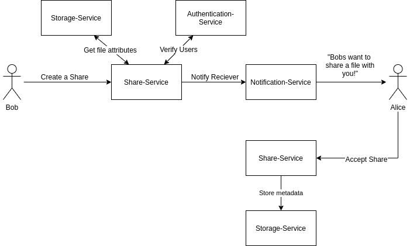

# share-service

This service implements the share functionality for the SDUCloud file system. It
gives the user the ability to share files and directories with other users of
the file system. 

A share is saved in the underlying database. To remove the possibility of having
duplicate shares of one single file, the share-service uses the `FileId` of a
any given file which is provided by the [storage-service](../storage-service).

A share can be in four different states:
- REQUEST_SENT   
  The share request has been sent and is awaiting acceptance or denial.
- ACCEPTED   
  The share has been accepted and is an active share.
- UPDATING   
  This is a transition state. While the actions needed for a share to be 
  completely accepted or removed are in progress, the share is in the updating 
  state. 
- FAILURE   
  If a share has failed to be properly shared with the other user, it gets the 
  FAILURE state.

By using the events created by storage-service, when files are moved or 
deleted, are we able to update the shares accordingly. If a file is deleted, 
the Share-Service will also make sure that the related share also is removed. 
If a file is moved the link to the shared file is updated to the new position. 