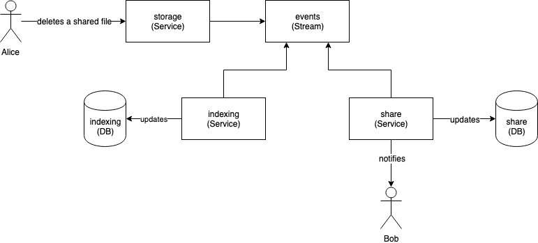

# Storage Events

Events are emitted to the event stream service every time a file change
occurs. This is done to allow for other systems to react to events in the
system. The events are emitted on a best-effort practice and are emitted
_after_ the event has taken place in the file system.

The table below summarizes the different event types:

| Type                 | Description                                                                                               |
|----------------------|-----------------------------------------------------------------------------------------------------------|
| `CreatedOrRefreshed` | Produced when a file has been updated.                                                                    |
| `SensitivityUpdated` | Produced when the sensitivity of a file changes.                                                          |
| `Deleted`            | Produced when a file is deleted from the system. This does not trigger when a file is moved to the trash. |
| `Moved`              | Produced when a file is moved/renamed.                                                                    |
| `Invalidated`        | Produced to indicate that a file should no longer be considered valid.                                    |

## Usage Example

In the diagram below `Alice` has just deleted a file she has shared with
`Bob`. This deletion triggers an event from the `storage-service` which other
services can consume.

In this example the [`indexing-service`](../../indexing-service) listens for
and receives the `Deleted` event. The job of the `indexing-service` is to
maintain an up-to-date index of the entire file system. This deletion has
brought the file index out of sync with the real file system. As a result the
`indexing-service` must update its own database.

Similarly, the [`share-service`](../../share-service) listens for events. It
checks if the file being deleted is a shared file. In this case the
`share-service` should invalidate the shares in its own database and
potentially notify the users who it was shared with.

## Event Guarantees

Events are sent asynchronously and there are no guarantees that any given
event is sent. To improve on these guarantees the
[`indexing-service`](../../indexing-service) regularly compares its view of
the system with the `storage-service`. If differences are found corrections
are emitted on the same stream. This allows for most services to not care
about these edge-cases.
